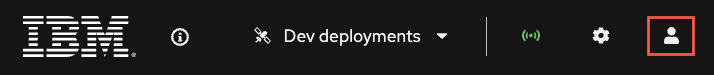
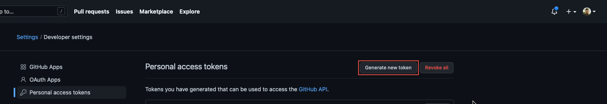
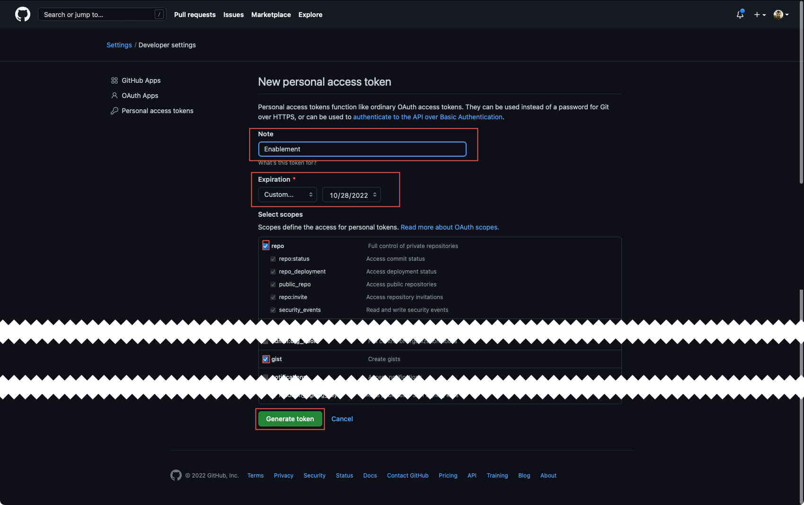
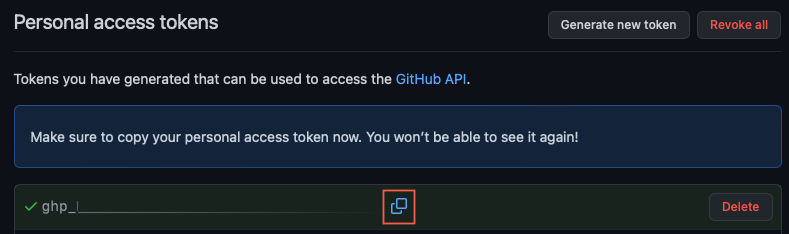

## Link {{ product.canvas }} to your GitHub account and create a project in GitHub using {{ product.extended }}

When using {{product.canvas}} you can start from the decision or process model creation and work top-down to deliver your business automation work. This is a feature that will enable you to create your models and publish a sample project to your Git provider. From here the project can be deployed in your traditional means .To do this, you need to make sure your connection to GitHub is active with the token and from there you can jump right in!

### Link GitHub to your {{ product.canvas }}

In this section we will link your GitHub account to the {{ product.canvas }} so we can easily synchronize changes in DMN with GitHub and our tooling, in this case {{ product.canvas }}.

1. First click the User icon to connect your public GitHub account to the {{ product.canvas }}.

    

1. Click the **Connect to an account** button to add a new Git provider

    

2. Select the card for GitHub

    
    

3. Click _Generate new token_ to create a new token that will be used by {{ product.canvas }}

    

4. You can use similar properties to the token created below in the screenshot, but the main 2 to have right now are _repo_ and _gist_ - the others can be beneficial if you reuse this token for other purposes too, but are not required nor needed. You can change the date to never expiring or be as short as you want. Once the token is generated though, that is the only time you will see the actual token value.

    - _Name_: Name your token a unique name from any previously created
    - _Expiration_: This can either be a set time period, up to 1 year or never expiring
    - The checkboxes you need are **repo** and **gist** to get the full benefit of {{ product.canvas }}

    

5. Use the copy button that's created with the Token to use in {{ product.canvas }}.

    

6. Return to {{ product.canvas }} and insert the Token into the wizard.

    

7. When your token is pasted, the {{ product.canvas }} will return a similar screen to below towards your GitHub account signifying you've connected, your GitHub user ID and some extra details.

    
