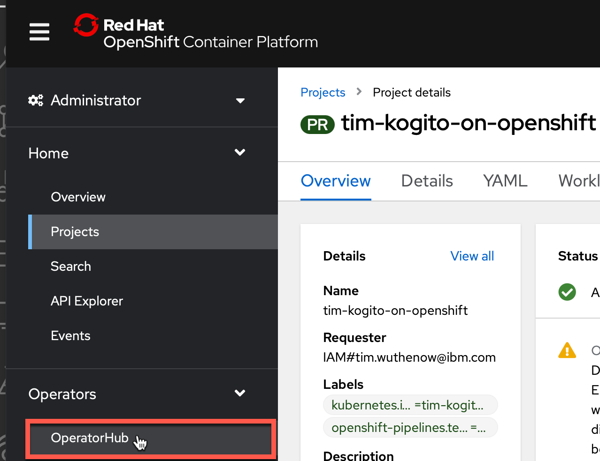
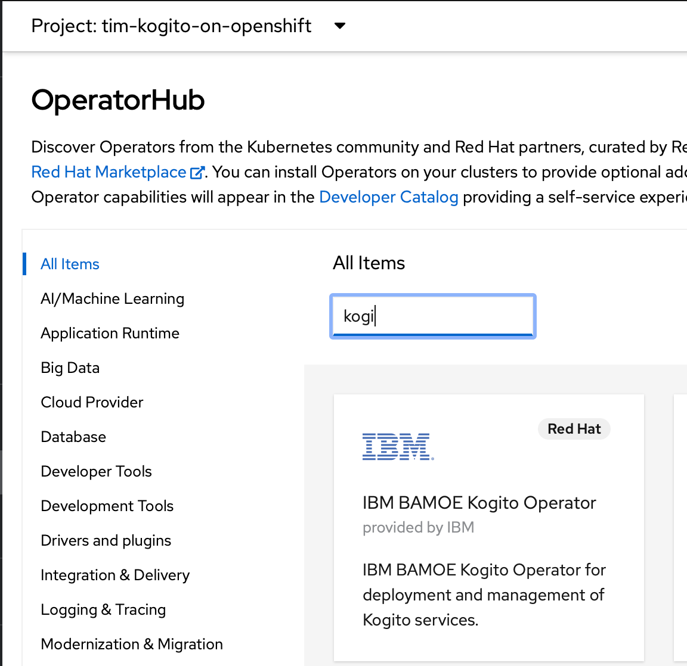

# Under construction

This content will be completed soon!

## Deploying your service to OpenShift as a Kogito Quarkus Service

Now that we have seen a little of the DMN Decision, let's use the combined power of Quarkus ([Learn more here about the Kubernetes-native Java Stack that is the best place for Kogito to run!](https://developers.redhat.com/learn/quarkus)) and Kogito to quickly build and deploy the service to OpenShift. If you have already done the deploy locally, you will be able to skip some of these steps and start at [Getting Ready for OpenShift Deployment](#OpenShiftDeployment).

When deploying to OpenShift you will need to take the following things into account:

- The application with your Kogito microservices is in a Git repository that is reachable from your OpenShift environment.
- You have access to the OpenShift web console with the necessary permissions to create and edit KogitoBuild and KogitoRuntime.
- If implementing Quarkus, update the pom.xml file of your project contains the following dependency for the Quarkus smallrye-health extension. This extension enables the liveness and readiness probes that are required for Quarkus-based projects on OpenShift. If you created the project like in [01_walk_through.md](Project Walk through and creation), you will already have this extension added to your deployment.

## Deploying the Kogito Operator <a name="OpenShiftDeployment">

1. First create a namespace for this to deployed into from the OpenShift console. For example `tim-kogito-on-openshift`.

    

1. Next, we need to install the Kogito Operator from the OperatorHub. To do this, login to the OpenShift Cluster console and login as an admin. From here, go to `Operator` ==> `OperatorHub` to open the OperatorHub.

    

1. Search for Kogito and click the `IBM BAMOE Kogito Operator` tile.

    

1. From the Operator Form, click `Install` at the top left to install the Operator.

    

1. Install it to your namespace you created earlier. This way if there's a version already installed, you're not colliding with it and it is contained to just your namespace. The drawback is that it is limited to this namespace.

    

1. The installation may take a few minutes, but once it is completed, you will be ready to deploy your service. Click **View Operator**

    [Success](../99_images/business_automation/introduction/operator-successful-install.png)

### Deploying your first Kogito Application on OpenShift

Now that we've got the Operator installed, we're going to see how it works. This lab will walk through the deployment of a Quarkus deployment of the Kogito Service. There will be a collapsed section to refer to if the service was a Spring Boot service instead so there's a reference to it to show how easy it both types of deployments are utilizing the operator.

1. Once the operator is installed, you will click the Kebab icon and `Create KogitoBuild` to create the build.

    

1. Since we're developing in Quarkus, our implemetation details handled in yaml are fairly minimal. We will point to a git repository where the service is deployed. In the previous section you created a repository, e.g. `github.com/timwuthenow/quick-openshift-kogito`.

