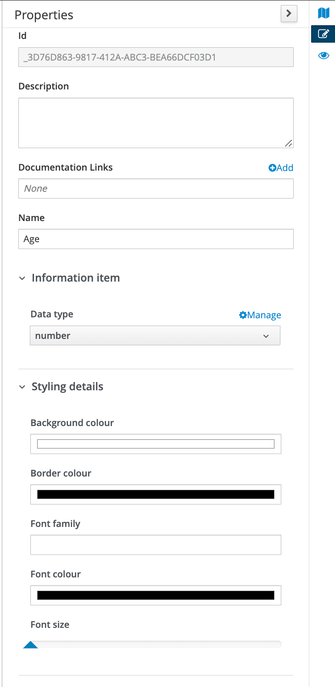
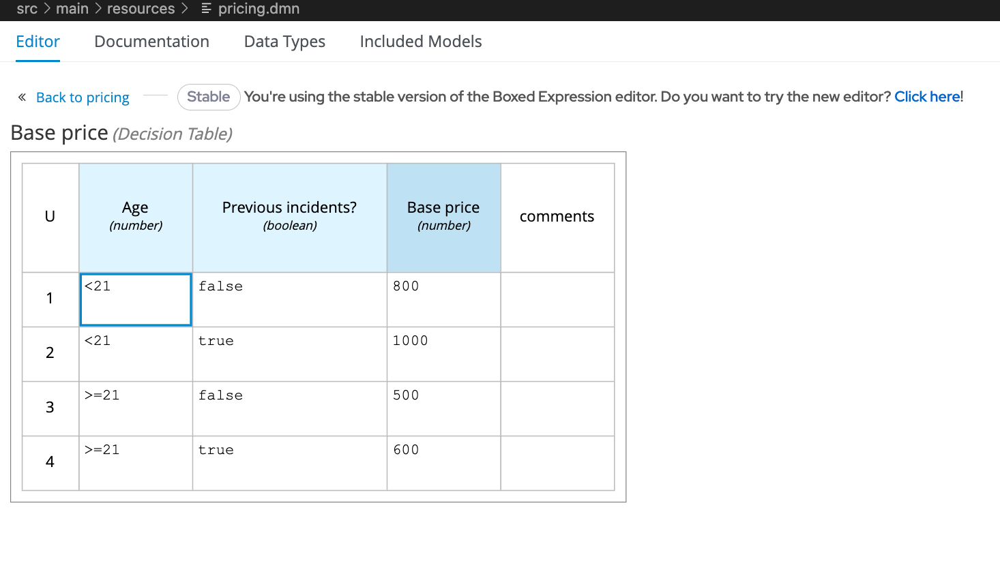

# Using Maven to create the project workspace

In the previous section, you setup Maven locally in your environment, so you should now have access to all of the `mvn` commands that are associated with running it. The first thing we're going to create is a project using the proceeding steps:

1. We're going to create the service in Quarkus with the Maven commands below, this will create a Quarkus project called `quick-kogito` that will be versioned `1.0.0-SNAPSHOT` including the extensions `kogito-quarkus, dmn, resteasy-reactive-jackson, quarkus-smallrye-openapi` which will create a Quarkus DMN project with the openapi components to get the OpenAPI end points easily.

    ~~~ shell
    mvn io.quarkus:quarkus-maven-plugin:create \
        -DprojectGroupId=com.ibm.sample -DprojectArtifactId=quick-kogito \
        -DprojectVersion=1.0.0-SNAPSHOT -Dextensions=kogito-quarkus,dmn,resteasy-reactive-jackson,quarkus-smallrye-openapi
    ~~~

2. When you create this project you should get a bunch of Maven artifacts start to stream in your console that are being pulled and ultimately are left with a console message like the below:

    ~~~ console
    [INFO]
    [INFO] ========================================================================================
    [INFO] Your new application has been created in /Users/developer/quick-kogito
    [INFO] Navigate into this directory and launch your application with mvn quarkus:dev
    [INFO] Your application will be accessible on http://localhost:8080
    [INFO] ========================================================================================
    [INFO]
    [INFO] ------------------------------------------------------------------------
    [INFO] BUILD SUCCESS
    [INFO] ------------------------------------------------------------------------
    [INFO] Total time:  24.548 s
    [INFO] Finished at: 2022-09-27T10:22:31-04:00
    [INFO] ------------------------------------------------------------------------
    ~~~

3. If you installed VSCode to your PATH variables, you can open the workspace by doing the below command, otherwise open VSCode and navigate to where you ran the command for quick-kogito to be created at:

    ~~~ shell
    cd quick-kogito
    code .
    ~~~

4. From here we can see the workspace's contents and if we expand the contents of `/src/main` you will see the creation of several artifacts. Within `java` you will have a `GreetingResource.java` and within `resources` you will have an `application.properties` and `pricing.dmn` file. These are sample files that can be later modified or deleted, but we will be explore them first in this section, but will do more in later labs around the various end points.

    

5. Let's first click the `pricing.dmn` file to open it. When you do so you may be greeted with a message similar to `This diagram does not have layout information. Click 'Yes' to compute optimal layout, it takes time according to the diagram size. Click 'No' to proceed without layuot. Please save the layout changes once diagram is opened.` - if so click `Yes` to automap the DMN locations.

    

6. When the diagram opens you will see something similar to below, so we will start exploring it. The DMN is made up of two inputs *Age* and *Previous incidents?*, which are used to make the decision, *Base price*. 

    

7. If you click *Age* and then click the *Properties* icon on the right, you will open a pane for the input.

    {:width="50%", :height="25%"}

8. Within this pane, you can see information about the input *Age*, this includes that it is a number and what the input name is. More can be changed around this object, including changing the color of the node, font size, etc.

    {:width="40%", :height="30%"}

9. To view the Decision, click the square decision node and select the `Edit` button to enter the decision for *Base Price*.

    {:width="50%", :height="25%"}

10. From here you will see the Decision Table that is associated with the Base Price decision. From here you will see two (2) input columns (`Age` and `Previous Incidents`), as well as one output column (`Base price`) all with their types below them. These types are controlled from the properties panel similarly to how they were opened when looking at `Age` a few steps ago. This decision has 4 different rows that could fire, with a Hit Policy of `UNIQUE` signified by the **U** in the top left corner of the table. A decision writer could make any comments they want to the table and have them saved towards the decision here

    
