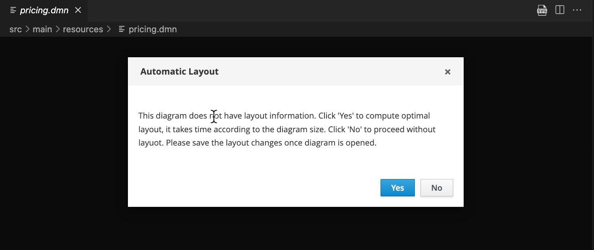
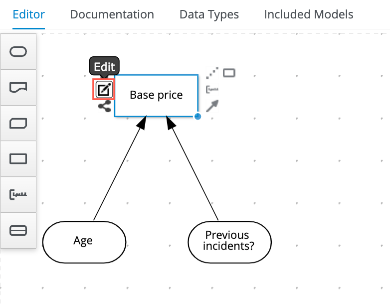

# Introduction

This section will focus on how to setup your first Kogito projects from scratch. The method we're going to use for this is through the use of Maven to create it from an empty workspace, produce a DMN model and make it available both locally and how to use deploy it to OpenShift.

## Using Maven to create the project workspace

In the previous section, you setup Maven locally in your environment, so you should now have access to all of the `mvn` commands that are associated with running it. The first thing we're going to create is a project using the proceeding steps:

1. We're going to create the service in Quarkus because the lower :

    ~~~ shell
    mvn io.quarkus:quarkus-maven-plugin:create \
        -DprojectGroupId=com.ibm.sample -DprojectArtifactId=quick-kogito \
        -DprojectVersion=1.0.0-SNAPSHOT -Dextensions=kogito-quarkus,dmn,resteasy-reactive-jackson,quarkus-smallrye-openapi
    ~~~

1. When you create this project you should get a bunch of Maven artifacts start to stream in your console that are being pulled and ultimately are left with a console message like the below:

    ~~~ console
    [INFO]
    [INFO] ========================================================================================
    [INFO] Your new application has been created in /Users/developer/quick-kogito
    [INFO] Navigate into this directory and launch your application with mvn quarkus:dev
    [INFO] Your application will be accessible on http://localhost:8080
    [INFO] ========================================================================================
    [INFO]
    [INFO] ------------------------------------------------------------------------
    [INFO] BUILD SUCCESS
    [INFO] ------------------------------------------------------------------------
    [INFO] Total time:  24.548 s
    [INFO] Finished at: 2022-09-27T10:22:31-04:00
    [INFO] ------------------------------------------------------------------------
    ~~~

1. If you installed VSCode to your PATH variables, you can open the workspace by doing the following:

    ~~~ shell
    cd quick-kogito
    code .
    ~~~

1. From here we can see the workspace's contents and if we expand the contents of `/src/main` you will see the creation of several artifacts. Within `java` you will have a `GreetingResource.java` and within `resources` you will have an `application.properties` and `pricing.dmn` file. These are sample files that can be later modified or deleted, but we will be explore them first.

    

2. Let's first click the `pricing.dmn` file to open it. When you do so you may be greeted with a message similar to `This diagram does not have layout information. Click 'Yes' to compute optimal layout, it takes time according to the diagram size. Click 'No' to proceed without layuot. Please save the layout changes once diagram is opened.` - if so click `Yes` to automap the DMN locations.

    

3. When the diagram opens you will see something similar to below, so we will start exploring it. The DMN is made up of two inputs *Age* and *Previous incidents?*, which are used to make the decision, *Base price*. 

    

4. If you click *Age* and then click the *Properties* icon on the right, you will open a pane for the input. 

    

5. Within this pane, you can see information about the input *Age*, this includes that it is a number and what the input name is. More can be changed around this object, including changing the color of the node, font size, etc.
    
    
    
6. To view the Decision, click the square decision node and select the `Edit` button to enter the decision for *Base Price*.
    
    
    
7. From here you will see the Decision Table that is associated with the Base Price decision. From here you will see two (2) input columns (`Age` and `Previous Incidents`), as well as one output column (`Base price`) all with their types below them. These types are controlled from the properties panel similarly to how they were opened when looking at `Age` a few steps ago. This decision has 4 different rows that could fire, with a Hit Policy of `UNIQUE` signified by the **U** in the top left corner of the table. A decision writer could make any comments they want to the table and have them saved towards the decision here
    
    
    

## Deploying the Project locally as a Quarkus runtime

Now that we have seen a little of the DMN Decision, let's use the combined power of Quarkus ([Learn more here about the Kubernetes-native Java Stack that is the best place for Kogito to run!](https://developers.redhat.com/learn/quarkus)) and Kogito to quickly build and deploy the service using Maven commands and also having the option to deploy it to OpenShift as well.

1. The first thing we're going to do is open a terminal (either in VSCode or whatever method you prefer) and validate that you have Maven and Java installed.
    
    ~~~bash
    java -version
    ~~~

    *Expected output should be similar to*

    ~~~console
    openjdk version "11.0.11" 2021-04-20
    OpenJDK Runtime Environment AdoptOpenJDK-11.0.11+9 (build 11.0.11+9)
    OpenJDK 64-Bit Server VM AdoptOpenJDK-11.0.11+9 (build 11.0.11+9, mixed mode)
    ~~~

    ~~~bash
    mvn -version
    ~~~

    *Expected output should be similar to:*

    ~~~console
    Apache Maven 3.8.6 (84538c9988a25aec085021c365c560670ad80f63)
    Java version: 18.0.2, vendor: Homebrew, runtime: /opt/homebrew/Cellar/openjdk/18.0.2/libexec/openjdk.jdk/Contents/Home
    Maven home: /opt/homebrew/Cellar/maven/3.8.6/libexec
    Default locale: en_US, platform encoding: UTF-8
    OS name: "mac os x", version: "12.6", arch: "aarch64", family: "mac"
    ~~~

2. Now that our environment is has the appropriate resources, let's build and run the service locally. Quarkus does this very simply with the command `mvn quarkus:dev` which will operate the container in development mode. By default it will run on 2 ports when running this command, `8080` and `5005`. These ports can be maintained in the `application.properties` file in `src/main/resources/` or you can modify the `mvn quarkus:dev` command to load those properties from the command line. If you want to do the command line, you can do `mvn quarkus:dev -Dquarkus.http.port=8085 -Ddebug=7007` which would setup your application to run off of port `8085` and be able to attach a remote debugger at `7007`. To change the default host in application.properties add the following line.

    ~~~java
    quarkus.http.port=8085
    ~~~
