# Exploring the Features of BAMOE Canvas

In this section, you will explore the base samples of both a DMN model and a BPMN model and some of the features found within them. BAMOE Canvas is a lightweight client-side tool that can be used to maintain business process and decision models for our Business Automation projects.

## Getting Started with BAMOE Canvas

1. On your workstation, open Chrome.

2. Click the bookmark for BAMOE Canvas or navigate to http://localhost:9090 to open without the bookmark. All instances of BAMOE Canvas for this lab are deployed locally using a docker compose that builds the local environment.

    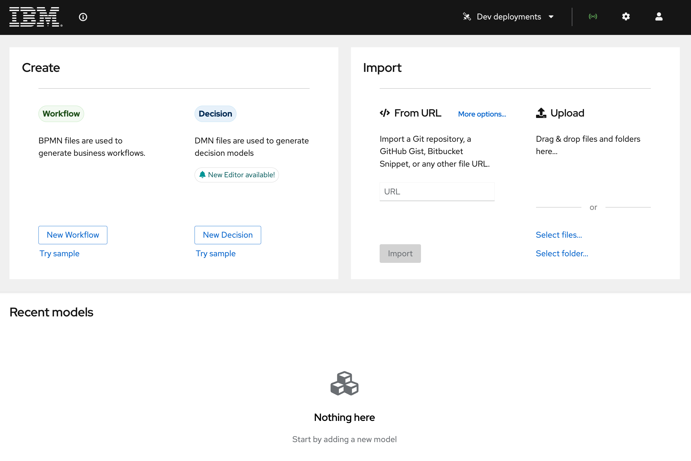

3. At the welcome screen, you will see several areas:

    - The top two tiles are for creation and importing of projects.
    - The top bar has 4 areas: Dev deployments, Extended Services connection, Settings, and Profile configuration.
    - The lower section displays your locally imported projects/models.

    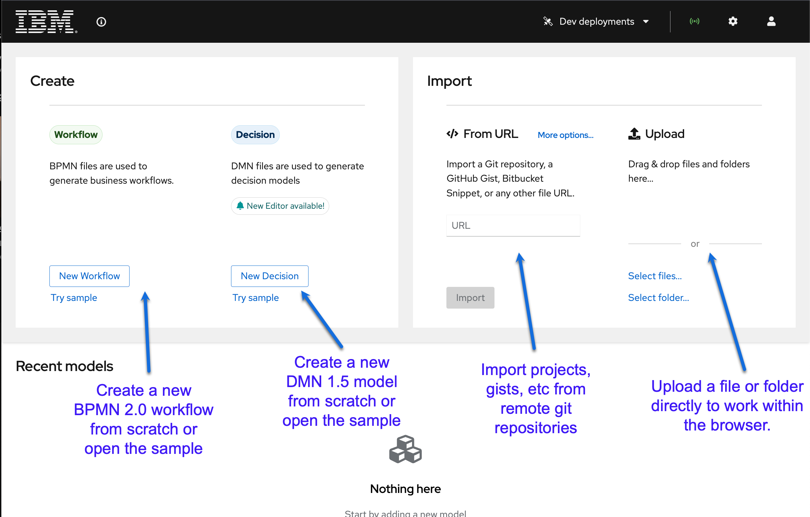

4. The top bar has 4 areas: 

    - Dev deployments – any sample deployment done by this instance of Canvas to a connected Kubernetes or OpenShift cluster
    - The radar logo is the connection to Extended Services which provides the DMN model runner for sample execution
    - The gear ⚙️ logo provides settings for your Canvas instance, including the version of DMN modeling you use (Classic in DMN 1.2 for releases 9.0 and before, DMN 1.5 is the default for 9.1 going forward). The location of the CORS proxy so that your Canvas instance can interact with your Git provider. Lastly, the location of the Extended Services service.
    - Lastly, the human logo is for configuring your connected profiles for the Canvas environment. This will be for both Git providers and Kubernetes/OpenShift environments. We will work with this more in the lab later. 

    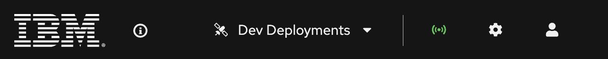

5. The lower section is where your locally imported projects/models will be displayed, not your neighbor in the lab or co-workers. Everything is isolated to your instance. This makes it so that the only projects present are the ones you import. If skeptical, click Try Sample for Workflow and then open an incognito window and go to Canvas and you will see no models in the Recent model section.

    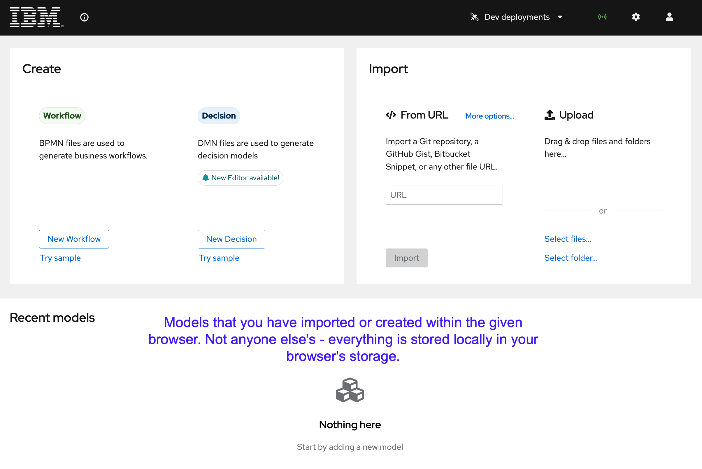

## Exploring Canvas with Decisions

In this section, we are briefly going to touch on some of the features of the Canvas editors for Workflow and DMN. The first thing we're going to do is look at the DMN sample and get a quick introduction to it.
NOTE: Last year's TechXchange lab focused on DMN, refer to the https://bamoe.university website, guided exercises for TechXchange 1717, to learn more about decision automation with DMN. 

1. Click **Try sample** to open the sample DMN model.

    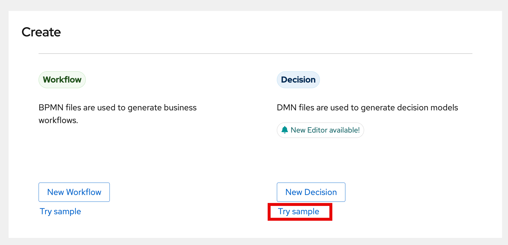

1. When you open the Sample, you will see a DMN 1.5 model for Loan Pre-qualification.

    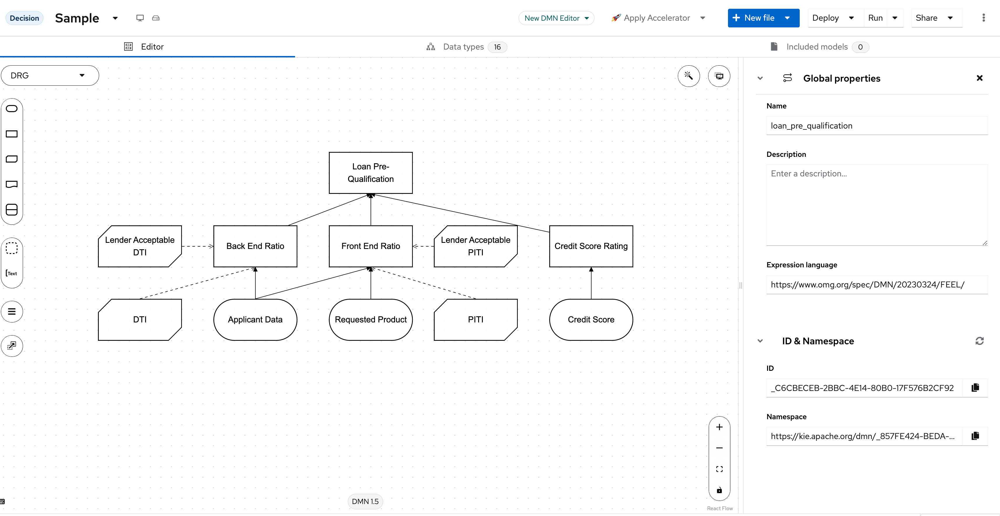

1. Explore the different elements of the DMN diagram:

    - Input Nodes: "Applicant Data" and "Credit Score"
    - Decision Nodes: "Loan Pre-Qualification"
    - Business Knowledge Model Nodes (BKM)

1. Click on the "Credit Score Rating" square and then click the Edit button to visualize the logic in the Credit Score Rating decision.

    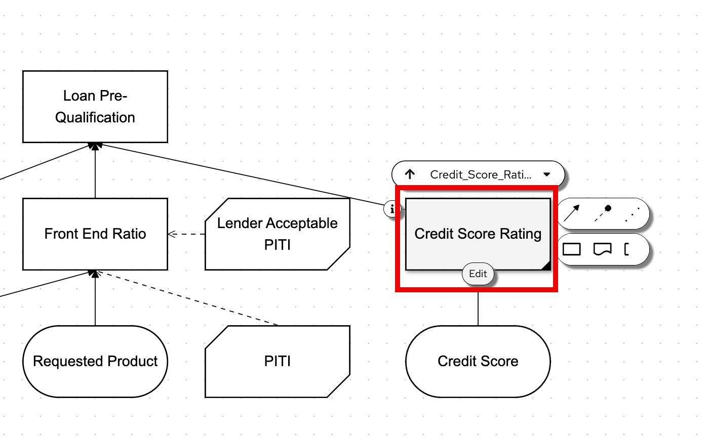

1. In the decision node, observe the inputs and outputs, as well as the logic required to define the Credit Score and the rating. 

1. Let us see this decision in action. On the menu bar, at the right-hand side of the screen, click on the button Run. An automatically generated form allows you to try out the DMN model's inputs (Applicant Data, Requested Product and Credit Score) and do a live evaluation the result of the decision. 

1. Let us try evaluating one of the decisions in the diagram. We will check the Credit Score Rating decision, which only requires one input - the Credit Score. Fill in a credit score, having in mind the values in the decision table, and observe at the right side the output of the decision as you type. This capability allows you to work on your DMN, for example by changing the decision table and, without any deployments, being able to readily evaluate the outcomes on using the values of your preference. 

1. Let's do a change on the decision table to observe this feature in Canvas: under Credit Score's FICO input, write a number in between 700 and 750.

    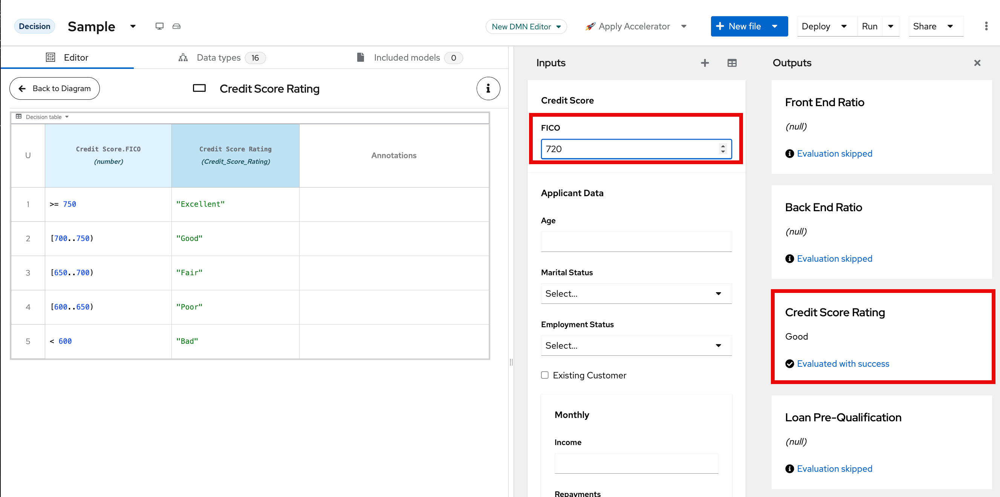

1. If you change the value in the second column for the score between 700 and 750 from "Good" to "Excellent" or "Fair", observe that after you update the cells, the decision Credit Score Rating output will reflect the change immediately. 

    

## Exploring the BPMN Sample

1. Return to the BAMOE Canvas home screen by clicking the IBM logo in the top left corner.

    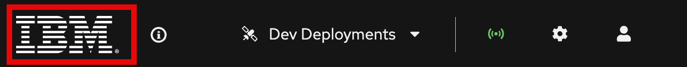

1. Click on the "Try sample" option under the BPMN section.

    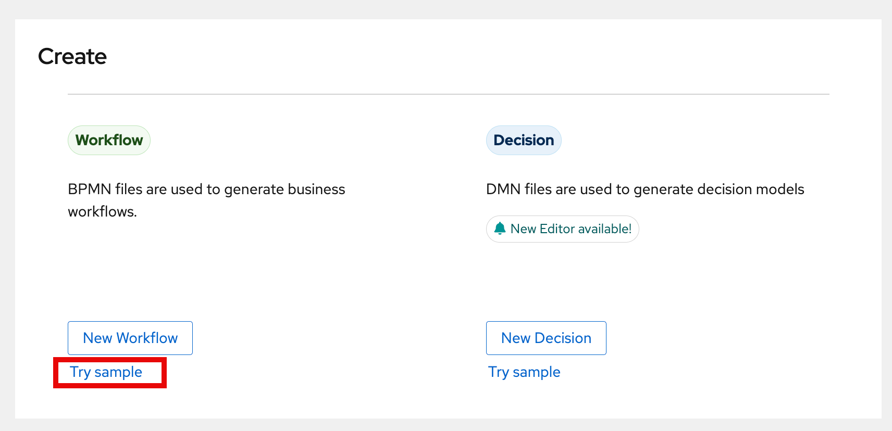

1. Explore the sample BPMN process, which goes through a simplified hiring process.

    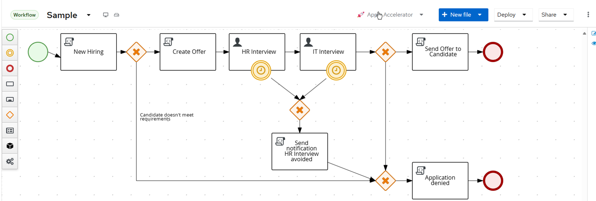

1. Observe the following actions: at the start an automated evaluation of the candidate (in this case, through a script task) immediately determines if a candidate is eligible; afterwards, a base offer gets created based on the inputs with the candidate's background. At this point, the offer is internal to the process and not visible to the candidate. Next, there are two user tasks: an HR interview and IT interview. Both have boundary timer events that adds an SLA for automatically denying the hiring due to interviews not occurring in time.

1. Explore the various nodes and their settings by clicking on a node and using the properties panel. To open the properties panel, clicking on the pencil and paper icon on the right side of the screen. For example, click on HR Interview and then click the pencil/paper icon: 

    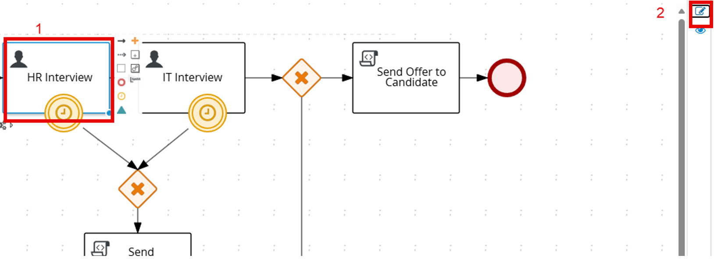

1. In the panel, identify the potential owners of the task and the data assignments (input/output variables) associated with this Human Task. The HR Interview task is assigned to the actor jdoe and has 5 data inputs and 4 data outputs.

    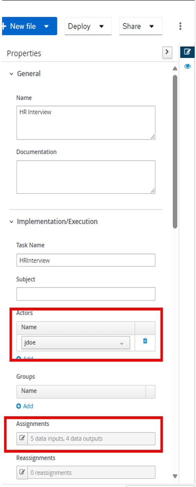

    

1. At this point, this project in Canvas consists only of a BPMN file sitting in the storage of the browser, meaning that any changes can be lost if the local storage in the browser is cleared for some reason (e.g. a browser window in incognito mode does not show the same files you have in your current environment). So, it is important to work with projects and have them synchronizing it with our Git provider. Let us now create a new project using the Accelerator and assure it is versioned in GitHub. 

