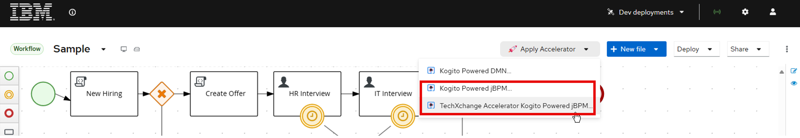
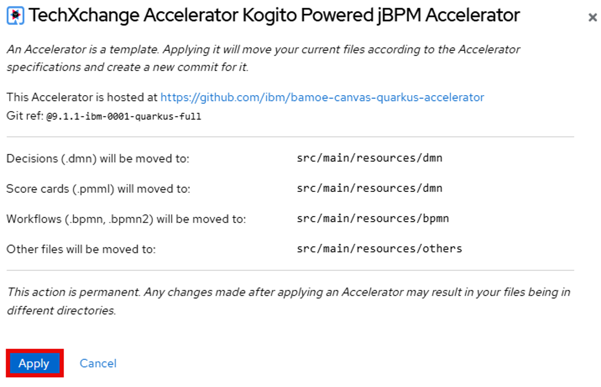
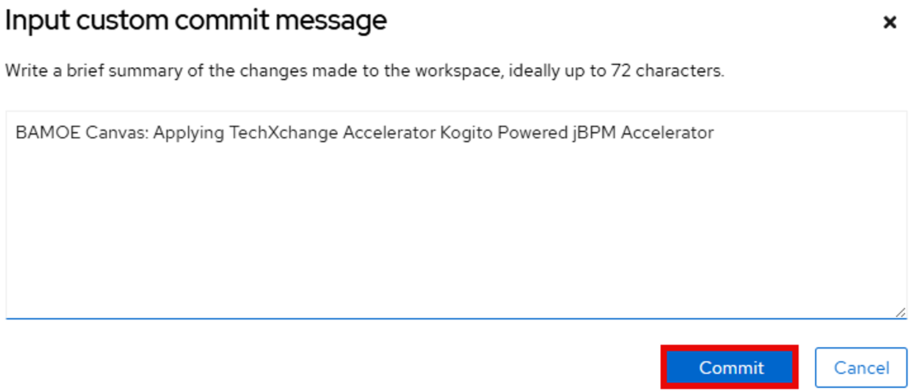
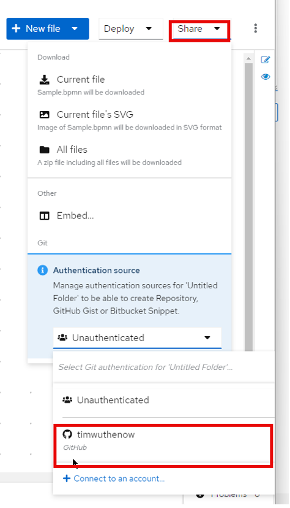
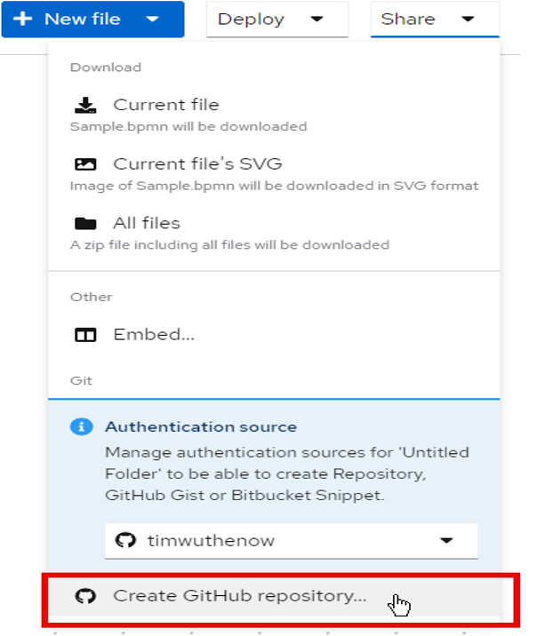
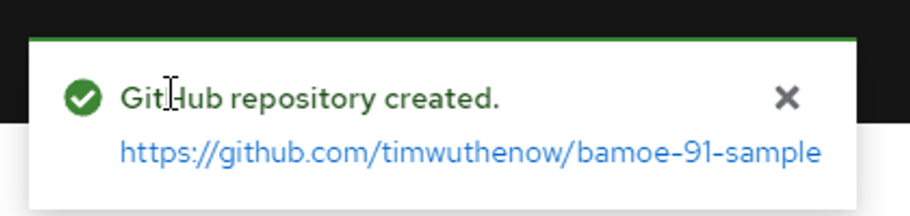

# Creating and Versioning Business Services: Customized Accelerators and Git Synchronization

In this section, we'll create a new project using the Accelerator and synchronize it with our Git provider.

## Applying the Accelerator

1. The first thing we're going to do is apply the accelerator to create an in-browser storage project that can utilize the Kogito architecture. You can apply either of the bottom accelerators to work with the process engine.

    

2. This will open a modal asking you to confirm that you want to apply the accelerator. Click **Apply**.

    

3. This will also create an initial git commit within the file system, so it will ask for an initial commit message. Change it if you want and click **Commit**.

    

4. Afterwards, at the top banner you will see a message stating "Successfully applied TechXchange Accelerator Kogito Powered jBPM Accelerator" or a similar message.

## Synchronizing with Git

5. To synchronize your project with GitHub, click the **Share** button, then at the bottom there is a pull down for *Authentication Source*, choose your Git user.

    

6. After selecting your user, click **Create GitHub repository...**

7. Change the name of the repository to something meaningful for you and then click **Create**.

    

8. BAMOE Canvas now synchronizes your project with your Git provider, at the repository you created. This action creates a new project in the repository, following the permissions you chose for it (private or public).

Note: A private repository can only be accessed by the owner or others with authorization configured in GitHub - in this case, only you would be able to access it. Access to your private repositories can be controlled using the possibilities of the git provider being used.

It's important to note that all operations are being tracked by git as being made by your user (the token user, retrieved from GitHub); This means that all changes on the project in this browser session from now on are tracked by the commits executed by your user. No custom security is needed - we are just relying on the solid authorization capabilities that are already there for us to take advantage of!

   

