# Running on OpenShift using the Canvas Dev Deployment

The dev deployment is a feature in Canvas that allows developers to quickly run their business assets and business services on OpenShift, as a fast and efficient approach for using or sharing the service APIs with other team members for evaluation. Some benefits of this capabilities are:

-	Deploy with a click: Easily deploy your business service to a local or remote Kubernetes or OpenShift environment directly from the Canvas web tool.

-	Real-time updates: See changes to your project reflected immediately in the running application, for faster iteration and testing.

-	Simplified development: Streamline your development process by eliminating the need for complex deployment procedures.
Have in mind that this capability is not intended as a strategy for production-grade deployment. For production deployments, consider using proper deployment strategies for your Kubernetes / OpenShift environment.


By default, Canvas offers options of template application and images for the Dev Deployment. Having in mind the flexibility, users who do not want to rely on the default assets for Dev Deployments, can benefit from the Canvas capability that allows using your own customized image and template projects, but is not designed to replace a proper production release and should not be treated as such.


## Configuring OpenShift Integration

1. Log in to OpenShift with the command line. The easiest way is to use the [OpenShift token bookmark](https://ibm.biz/bamoe-ocp-token) and click keycloak and use your student## with password ibmrhocp (e.g. student01:ibmrhocp)

2. Copy the oc login command from the requested token to login, e.g.
   ```
   oc login --token=sha~bd17d73178ecf020bc7138509f620cb4f6fdbd15 --server=https://api.a_real_openshift.io:6443
   ```

    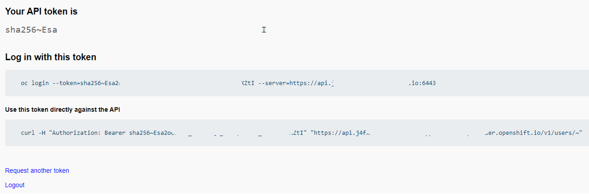

3. In Canvas, open the connection settings by clicking on the user icon (top right corner) to open the *Connected accounts* modal.

    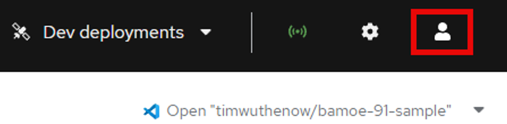

4. Click the **+ Add** link to add our OpenShift environment.

    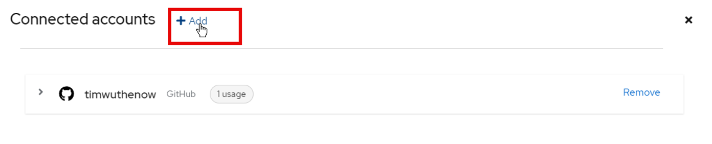

5. For authenticating with OpenShift, use the Token and Host from Step 1, and the namespace will be either student##-namespace if using the dedicated OpenShift cluster or if using the Red Hat OpenShift Developer Sandbox will be *yourRedHatUser-dev* (e.g. timothywuthenow-dev).

    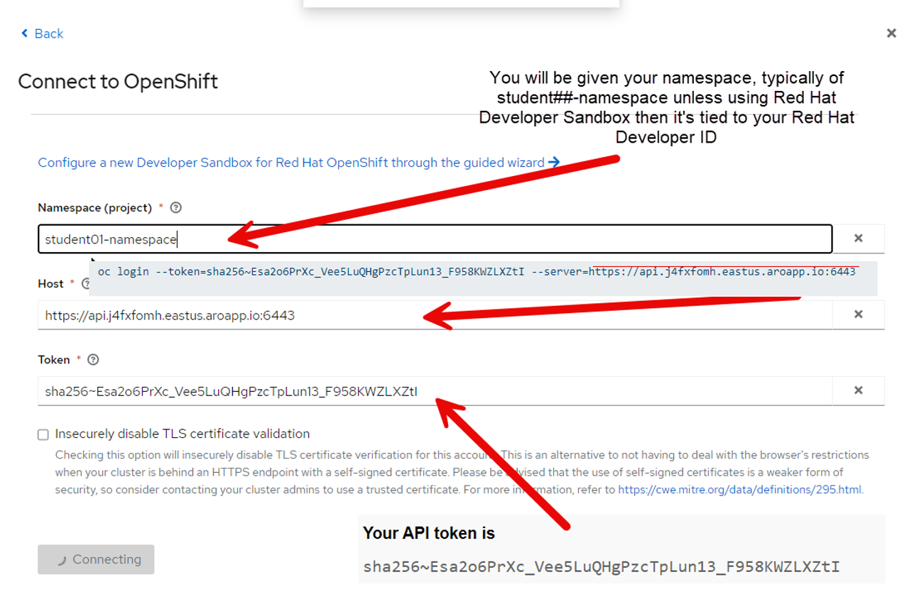

1. Validate a successful connection to your chosen environment. A message like the one below is similar to what you want to see.

    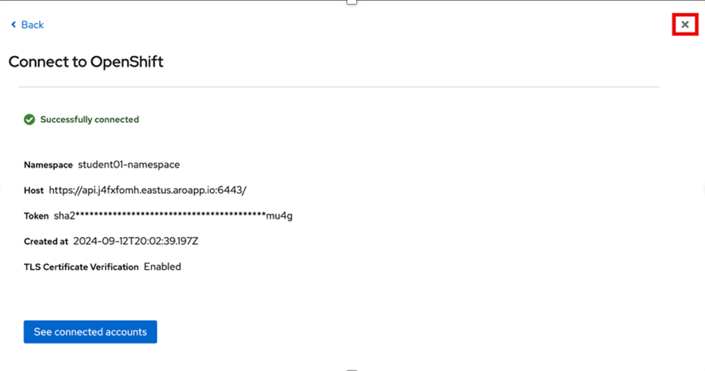

## Deploying the Service

6. Now from your model’s screen, you can deploy a very developer-oriented service of the process. This would deploy a Quarkus service running the jBPM powered by Kogito engine with the rest endpoints if you use the blank image. There will be no persistence, task or management consoles, but you will be able to test how the process works a bit from a Rest/Swagger perspective. To do this, click Deploy.

    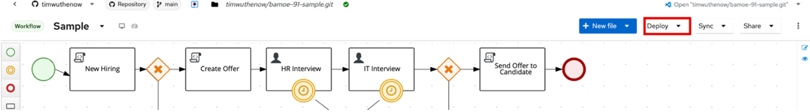

7. Select your project's name and click **Deploy "[your-project-name]"**.

    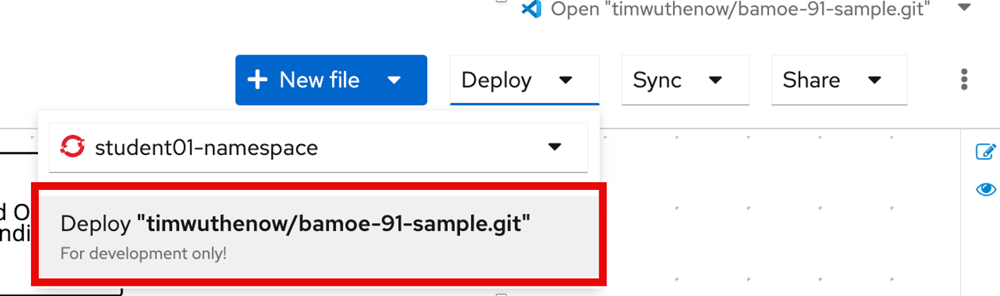

8. On the modal that opens up, click **Confirm** to deploy your sample service.

    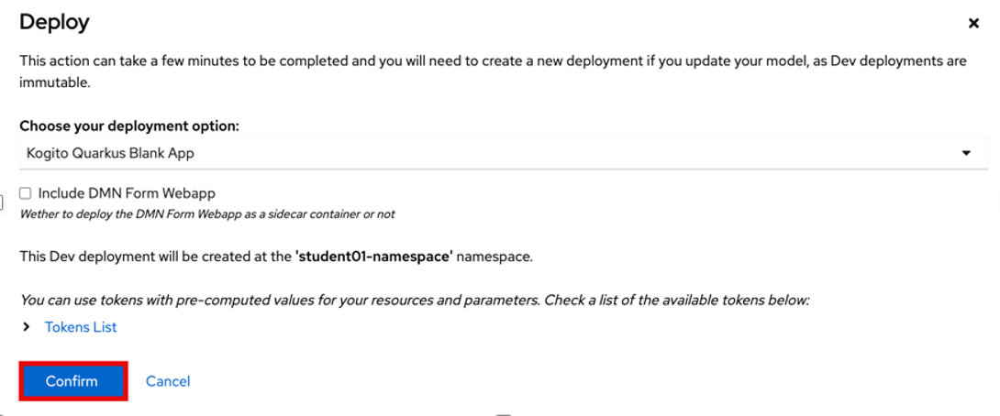

9. Deployment can take about 30 seconds to over a minute depending on how many things are on-going on the console. You can monitor it from the OpenShift console. The Developer view from the console allows for the most visual representation of the pod being deployed and coming up. To access it go to https://ibm.biz/dev-ocp and select your namespace (1) and then click Topology (2) on the left hand side of the OpenShift console screen.

    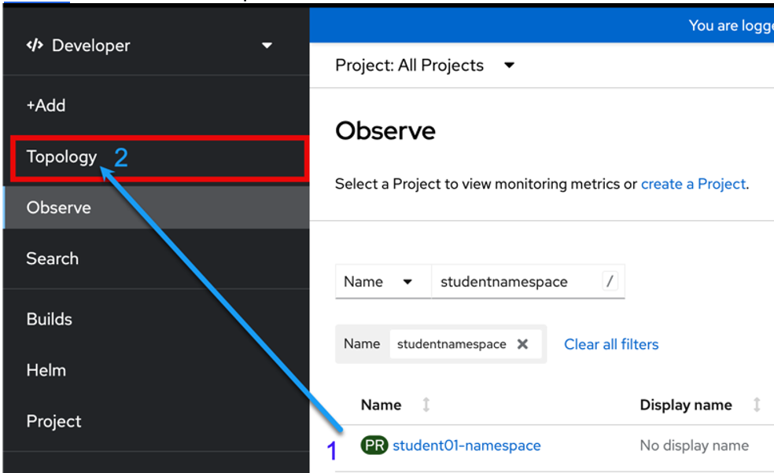

10. When deployed, you will see the Topology evolve, adding a new pod to your namespace. Click on the pod and then click on **View logs**.

    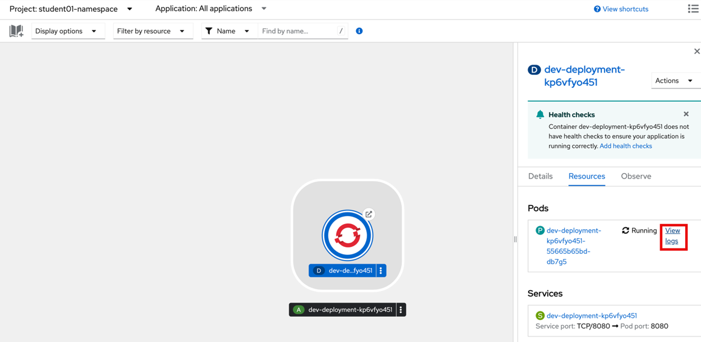

1. Look at the logs and see if your service is deployed. You want to see a message similar to the below

    ~~~log
    INFO: Profile dev activated
    INFO: Installed features: [cdi, kogito-decisions,kogito-processes, kogito-rules]
    ~~~

    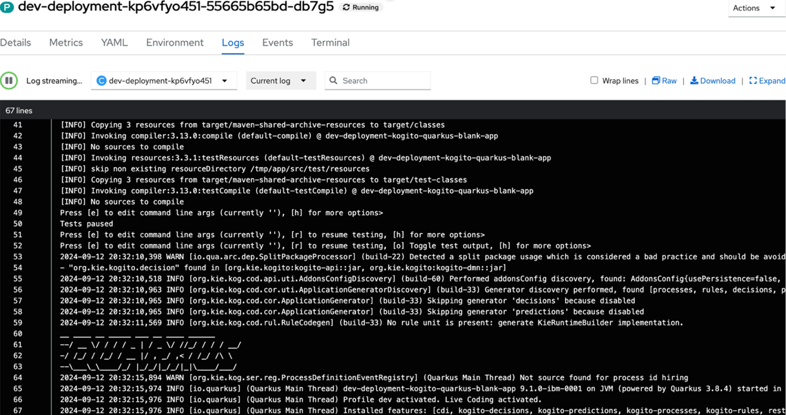

11. Return back to Canvas, and if it's no longer visible, click **Dev Deployments** to access your service.

    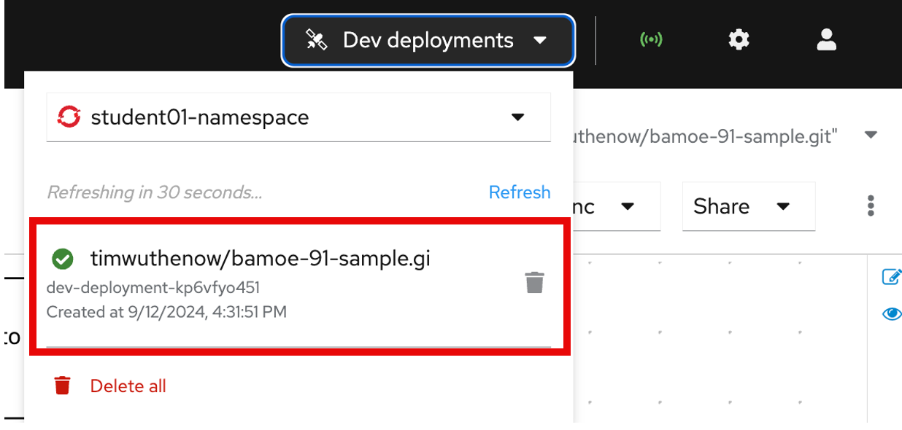

21.	This will take you to a Swagger-UI endpoint of your service, which as previously mentioned is quite standalone, but is great for a quick test or seeing expected behaviors. Click on Post /hiring which is the second generated endpoint – all of this was done and created from a BPMN diagram and the Kogito and jBPM projects worked together to create a domain specific end point that we can quickly try out. You will see that this has a sample input with 3 process variables (skills, candidate, experience). Click on **Post /hiring** which is the second generated endpoint. 

    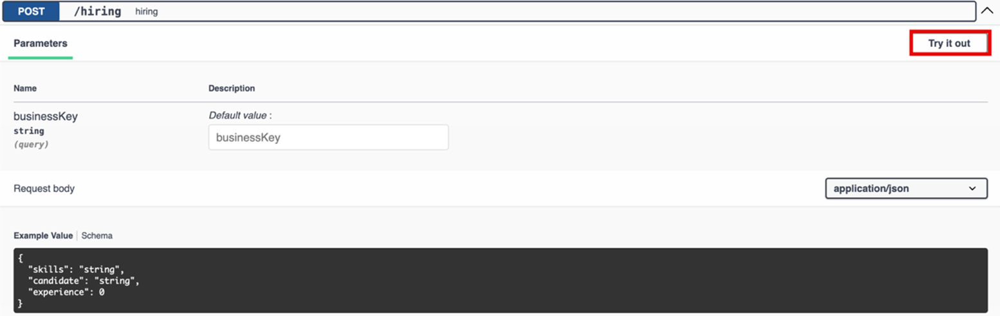
 
22. Put in sample data, and click the Execute button. Sample data can include, a skill of Java, a candidate name of any and experience set to an integer, like 1 or 2.

    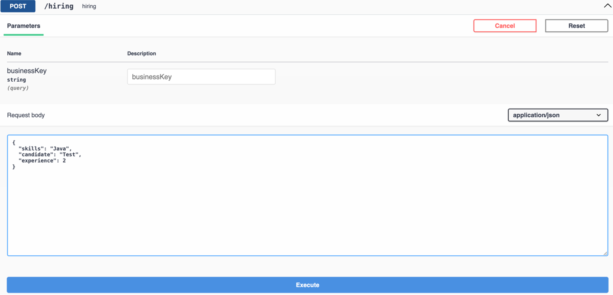

    An Example is below:

    ~~~json
    {
      "candidate": "Tim",
      "experience": 2,
      "skills": "Java"
    }
    ~~~
 
23.	When you do this, you will get a return similar to the one below in the screenshot kicking off the process. You can explore more with the Swagger-UI using the process-id that gets generated to find the tasks and use the user jdoe to do the tasks, but we will see more of that in the next section.

    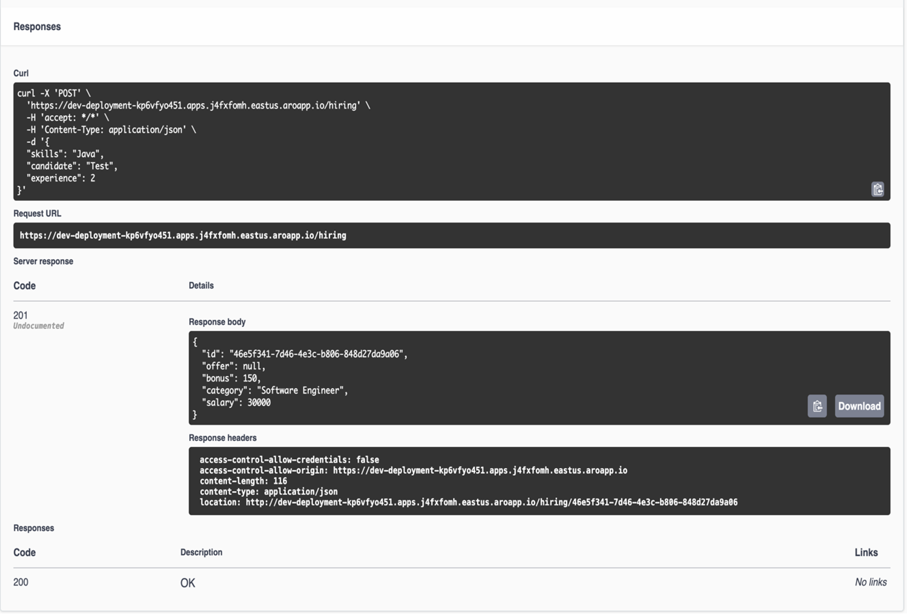
 
24.	Before closing out this section, return to Canvas to quickly explore the process model once more now that you’ve interacted with the process and can learn a little more how the evolution of IBM Business Automation Manager Open Editions 9 has evolved to making process runtimes with the Kogito architecture smarter and easier to use. Make sure you are not clicked any where on the process diagram and then click the properties icon shown by the pencil and paper icon.

    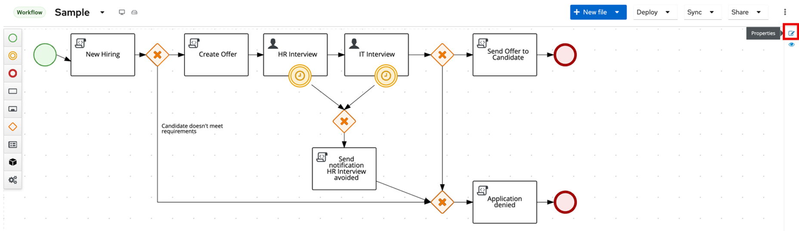
 
25.	Scroll down and click Process Data to expand where the process variables are defined. On them you will see a new feature to the BPMN editor called Tags. Tags specify how the data for the process variable will be used, is it an input or output, is it internal, is it read-only, etc. These are used for many of the features for generating the process’s Swagger-UI domain specific endpoints, and also what gets returned based on selection and each variable can have multiple tags if necessary. This makes interacting with your process right away so much easier since you can start building top-down for your process design and get it deployed rapidly!

    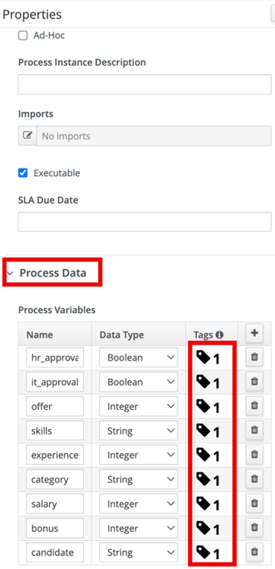
  
26.	Explore the tags and see if you can figure out why skills, experience and candidate were all a part of the example schema for the start process end point. In the next section we will go into more detail of using and interacting with the process.

