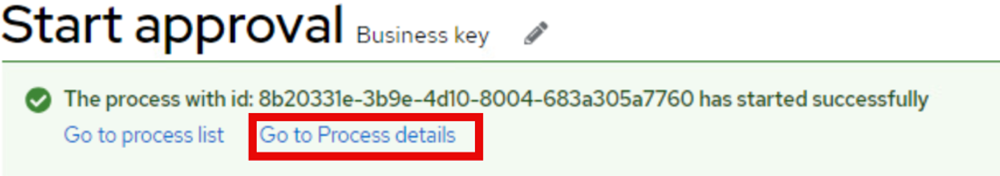

# Exploring the Dev-UI Console in More Detail

The biggest change from previous versions of the jBPM runtime is that everything used to have to be built in KIE Server and Business Central required a build, deploy and multiple user changes to validate a process. Now with the assistance of Kogito and Quarkus, we can combine a more developer-focused improvement to the pattern of delivering and testing processes while we are building them.

## Setting Up the Development Environment

1. Open a terminal from the desktop.

    

2. Clone the following repository using the terminal:
   ```
   git clone https://github.com/kmacedovarela/cc-application-approval-starter
   ```

3. Navigate to the folder and open Visual Studio Code:
   ```
   cd cc-application-approval-starter
   code .
   ```

4. When Visual Studio Code opens, you will have the workspace and a terminal. In the terminal within VS Code, type:
   ```
   mvn quarkus:dev
   ```

5. Open the Browser and navigate to http://localhost:8080/q/dev-ui. This will feature all of the extensions and capabilities that are on the current process project.

    

## Exploring the Dev-UI

6. Locate and click on **Process Instances** in the jBPM Quarkus Dev UI add-on.

    

7. To start a new process to test, click the **Process Definitions** tab and then click the cc_application_approval's play button.

    

8. A form is autogenerated. Fill in sample data and click **Start**.

    |Tag   |  Value |
    |------|--------|
    |Age	 | 20 |
    |Annual Income |	20000 |
    |Credit Score |	300 |
    |Is student? |	Checked |
    |Name |	Angelito |
    
    

9. After submitting, a green banner will be opened allowing you to go to the **Process Details**. Open the process details, and check the process instance progress, and the variable values.

    

10. Here you will be able to see what was done in the process, a very simple straight through process that ran a bunch of script tasks. In the next section we’re going to improve this!

    

11. For now, close the browser that you've navigated to the dev-ui as we're going to do more work on it in VS Code and then look at it again when we finish. This is very important for now if you leave `mvn quarkus:dev` up as changes and the active connection will currently break the live coding. However, reaccessing is very quick!

