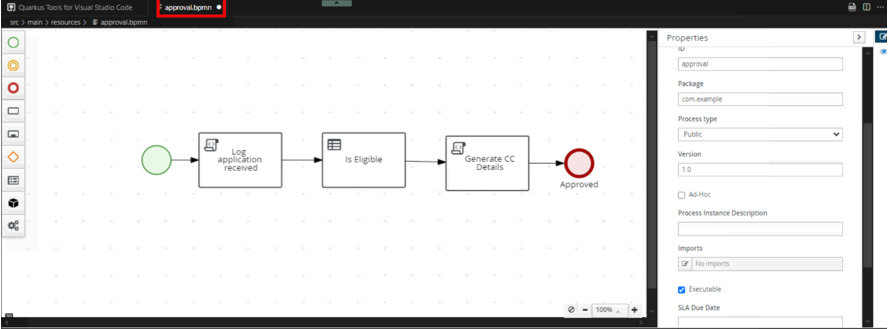
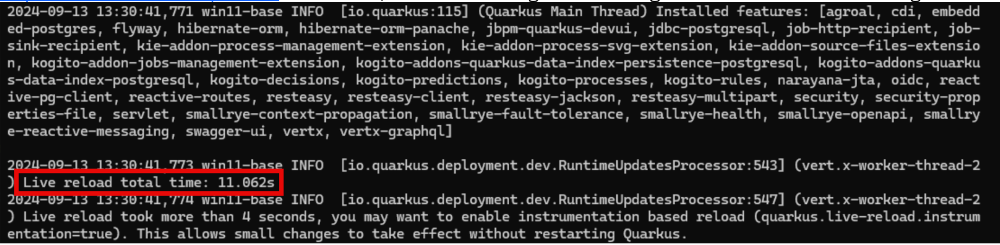
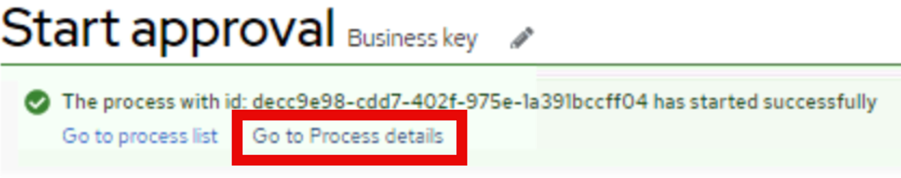
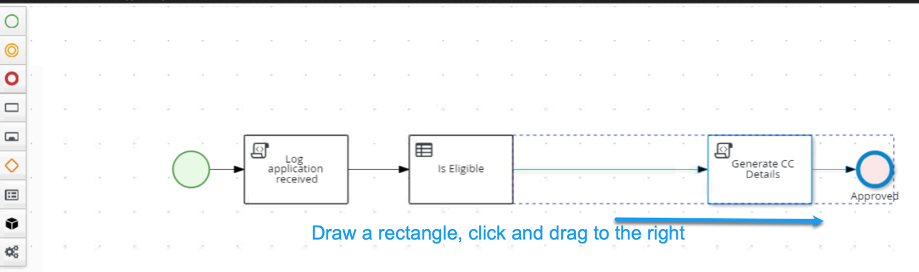
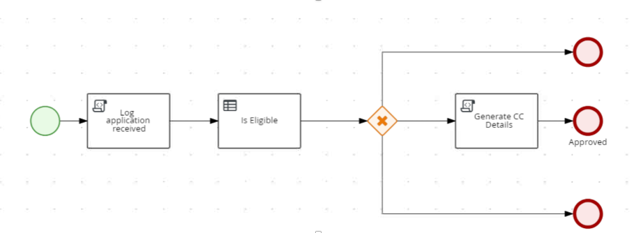
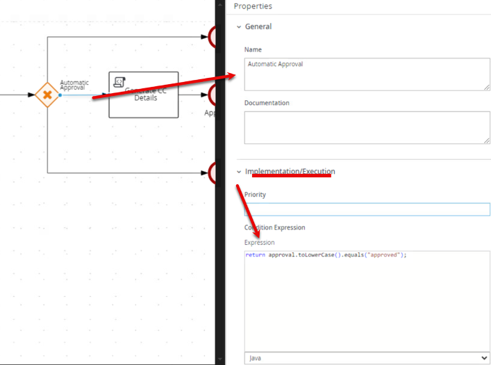
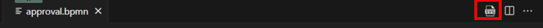
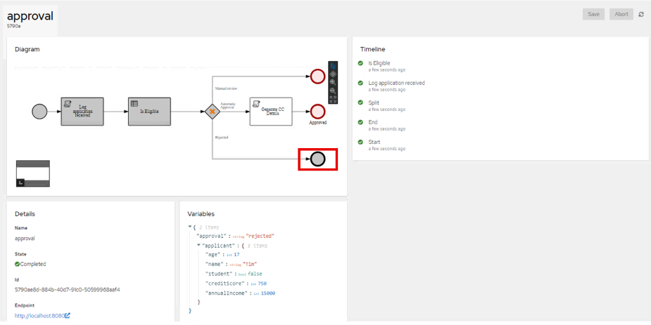

# Using DMN in Processes

In this section, we'll modify our process to incorporate a decision that we have in the project.

## Modifying the Process

1. In VSCode, open the process approval.bpmn, which is located at **src/main/resources**/approval.bpmn.

    

    

2. Find the Check Card Eligibility scipt task. This one we are going to modify to incorporate a decision that we have. You can delete the task by using the trashcan icon (or pressing backspace/delete key on your keyboard). and delete the script task named Check Card Eligibility. This can be done by clicking on it and clicking the backspace/delete key on your keyboard or clicking the trashcan icon. To save a step though, you can also convert this task to a Business Rule task by clicking the icon and clicking the gears icon below the task and clicking the one that looks like a spreadsheet to add a decision node. If you don’t convert it, you can use the BPMN panel on the left where you can right click the empty square icon and selecting Business Rule and drag from the name onto the line between Log application received and Generate CC Details.

    

3. Add a new **business rules task** to the process diagram, named **Is Eligible**.

    

4. In the next section we will fully change the settings to work with the DMN model from the workspace. Since the DMN plugin for the VSCode workspace at authoring was not yet updated to do the DMN 1.5 specification, if you want to view the DMN model. Import the project into BAMOE Canvas. To do this, go to your browser and navigate to the BAMOE Canvas bookmark.

    

5. In the section titled Import under the From URL, paste the URL that you cloned earlier, https://github.com/kmacedovarela/cc-application-approval-starter and click Clone.

    

6. Click the arrow on the workspace that opens up that is next to cc-application-approval and click on CreditCardEligibility to open the DMN model for the Eligibility rule.

    

7.	Click the circle icon with the “i” in it to open the properties of the model. These will be auto-populated in VS-Code from the decision since they’re in the same workspace, but this provides a way of understanding how the decisions are mapped.

    

8. On the properties panel you will see the following that will be used to help populate the BPMN diagram to connect the DMN decision to the process model.

    

9. Now that you have a basic understanding of what the model looks like and some of the properties, we will see in the next section how to tie it in.

## Configuring the Business Rules Task

6.	Return back to Visual Studio Code and configure the business rules task to consume the decision model. You can find and double check the information below, in the DMN file CreditCardEligibility.dmn available in your project. Click the Is Eligible node and go to the properties. Change the values in the properties window to match the table below. Most values will be autopopulated as you select the model/decision. When you change the Rule Language to DMN, the filename will be selectable and the other data will start getting populated automatically:

    | Value | Input |
    |-------|-------|
    | Rule Language | 	DMN |
    | Filename |	CreditCardEligibility.dmn |
    | Namespace	| https://kie.org/dmn/_639D6115-E08E-439D-8D29-45750C32DB28 |
    | Decision Name	| IsEligible (select IsEligible from the pulldown) |
    | DMN Model Name |	Credit Card Eligibility Validation |

    

6. Configure the inputs and outputs of the task by clicking on **Assignments** and using the following info. Note the I is capitalized in the IsEligible.
    **Input**

    | Name | Data Type | Source |
    |-------|-------|------|
    | Applicant |	Applicant[org.acme.cc_approval.model] |	applicant |

   **Output**: 
   - Applicant: Applicant[org.acme.cc_approval.model]

   **Output**:
   | Name | Data Type | Source |
    |-------|-------|------|
    | IsEligible |	String |	approval |

   

7. Your BPMN should now look like the one in the screenshot below. As long as it does, Press Control + S to save your diagram changes (you may have to do it two or three times, make sure the dot next to approval.bpmn disappears.

    

## Running the Process with DMN Automation

8. As long as you left the http://localhost:8080/q/dev-ui closed from the previous lab, re-open it . If mvn quarkus:dev is running, it will hot reload as we change our process and project as long as the browser currently isn't engaged with the service.

    

9. After this is reloaded from the saves, open the Dev UI, navigate to http://localhost:8080/q/dev-ui and go to Process Instances.

    

10. From here, click on **Process Definitions** and click the arrow again on the approval process to start a new process instance from the process definition.

    

11. Test with different data that will result in different outcomes in the decision.

    
    |Scenario	| Is Student |Annual Income |Credit Score | Age |
    |-----|-------|-------|-------|-------|
    |Automatic Approval | 	false |	15000 |	750 |	25 |
    |Automatic Rejection |	false |	15000 |	750 |	17 |
    |Manual Review |	false |	30000	| 600| 	20 |

12. After you submit any of the test scenarios, you can navigate to the green banner's to check the process details.

    

13. Check Process Variables: Verify the variables of the completed instance to ensure the DMN decision was executed correctly.

1.	You can stop Quarkus, but at minimum, you must close the Dev-UI in your browser for further updates in the next sections. This is very important in the current release of BAMOE 9.1 with the live application trying to maintain contact with the mvn quarkus:dev and can cause issues.

## Configuring the process to handle different outcomes
Now, with the process working, let's add the gateways to handle the three possible scenarios: Automatic approval, Automatic rejection, Manual Approval. To do this we will continue to modify the approval process.

1.	We need to add an exclusive gateway after the decision node by changing the diagram a little. You will be moving some the last task and end node first to create some room. Click and draw a square around the two nodes and drag to the right to make them further away from the Is Eligible decision.

    
 
2.	Now let’s configure the process to have an exclusive gateway. To do this, click the gateway icon (orange diamond on the palette) and click and drag Exclusive Gateway onto the line separating Is Eligible and Generate CC details. If placed correctly, the gateway will turn the line blue and you will have new arrows form. Otherwise, just reconnect the arrows between the two existing nodes.

3.	 From the gateway you can now click it and click the Red End Node twice to create two extra pathways. You can adjust the lines how you want, to put right angles on them double click the line to create the bend.

    
 
4.	Now let’s configure the various pathways. To do this you will click each pathway and use the properties window to specify the condition. Let's configure the possible outcomes:

    

    -	Automatic Approval: - For the sequence flow leading to the approval end event, click the arrow going to Generate CC Details and type the name as Automatic Approval and expand Implementation/Execution and use the condition:

    ~~~java
    return approval.toLowerCase().equals("approved");
    ~~~
 
    -	Repeat the process for Manual Approval: - For the sequence flow leading to the manual review end event, now using  the condition:

    ~~~java
    return approval.toLowerCase().equals("manual");
    ~~~
    
    -	Lastly, set Automatic Rejection: - For the sequence flow leading to the rejection end event, use the condition:
    
    ~~~java
    return approval.toLowerCase().equals("rejected");
    ~~~

8.	Add three different paths from the gateway, each leading to an end event.
 
9.	Save your diagram and then repeat the process from earlier to generate the SVG diagram in VSCode to visualize the process. This can be done by clicking the SVG icon above the BPMN diagram editor.

    
 
10.	Make sure there are no active connections to the local Quarkus service and then return to the terminal and run: mvn quarkus:dev if you have stopped it to restart Quarkus in development mode. Return to the http://localhost:8080/q/dev-ui environment and go back to the jBPM Quarkus Dev UI and click Process Instances.

    
 
11.	Start a new process instance and test the three different scenarios (approved, manual, rejected). Using the data from earlier:

    |Scenario	| Is Student |Annual Income |Credit Score | Age |
    |-----|-------|-------|-------|-------|
    |Automatic Approval | 	false |	15000 |	750 |	25 |
    |Automatic Rejection |	false |	15000 |	750 |	17 |
    |Manual Review |	false |	30000	| 600| 	20 |

12.	Notice if you do the Automatic Rejection scenario, you get the path that exits the bottom of the exclusive gateway as seen in the instance details.

    
 
13.	Close the browser for Dev-UI window to continue to the next section.
 

