# Using DMN in Processes

In this section, we'll modify our process to incorporate a decision that we have in the project.

## Modifying the Process

1. In VSCode, open the process approval.bpmn, which is located at **src/main/resources**/approval.bpmn.

    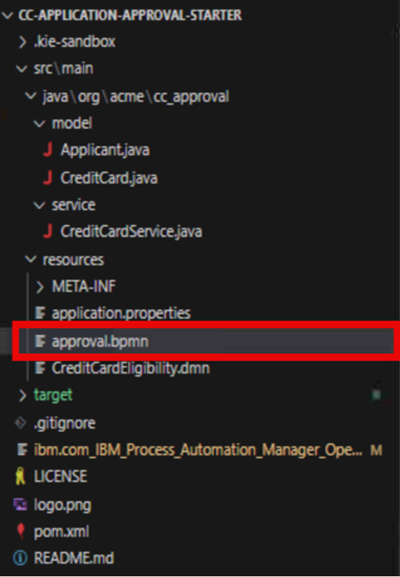

    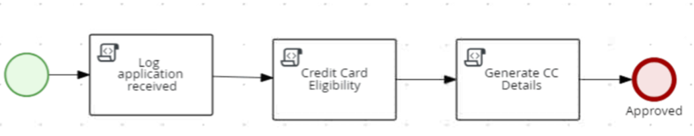

2. Find the Check Card Eligibility scipt task. This one we are going to modify to incorporate a decision that we have. You can delete the task by using the trashcan icon (or pressing backspace/delete key on your keyboard). and delete the script task named Check Card Eligibility. This can be done by clicking on it and clicking the backspace/delete key on your keyboard or clicking the trashcan icon. To save a step though, you can also convert this task to a Business Rule task by clicking the icon and clicking the gears icon below the task and clicking the one that looks like a spreadsheet to add a decision node. If you don’t convert it, you can use the BPMN panel on the left where you can right click the empty square icon and selecting Business Rule and drag from the name onto the line between Log application received and Generate CC Details.

    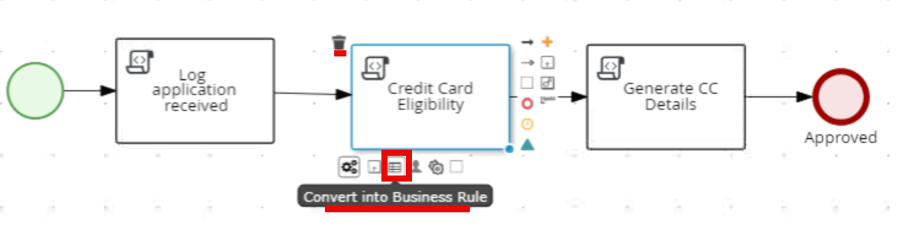

3. Add a new **business rules task** to the process diagram, named **Is Eligible**.

    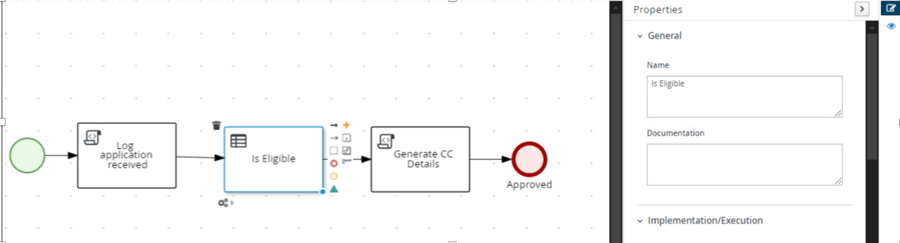

4. In the next section we will fully change the settings to work with the DMN model from the workspace. Since the DMN plugin for the VSCode workspace at authoring was not yet updated to do the DMN 1.5 specification, if you want to view the DMN model. Import the project into BAMOE Canvas. To do this, go to your browser and navigate to the BAMOE Canvas bookmark.

    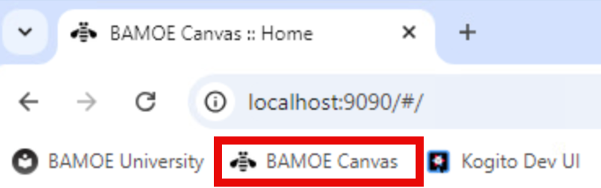

5. In the section titled Import under the From URL, paste the URL that you cloned earlier, https://github.com/kmacedovarela/cc-application-approval-starter and click Clone.

    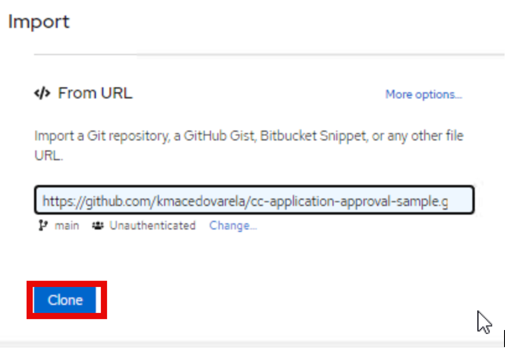

6. Click the arrow on the workspace that opens up that is next to cc-application-approval and click on CreditCardEligibility to open the DMN model for the Eligibility rule.

    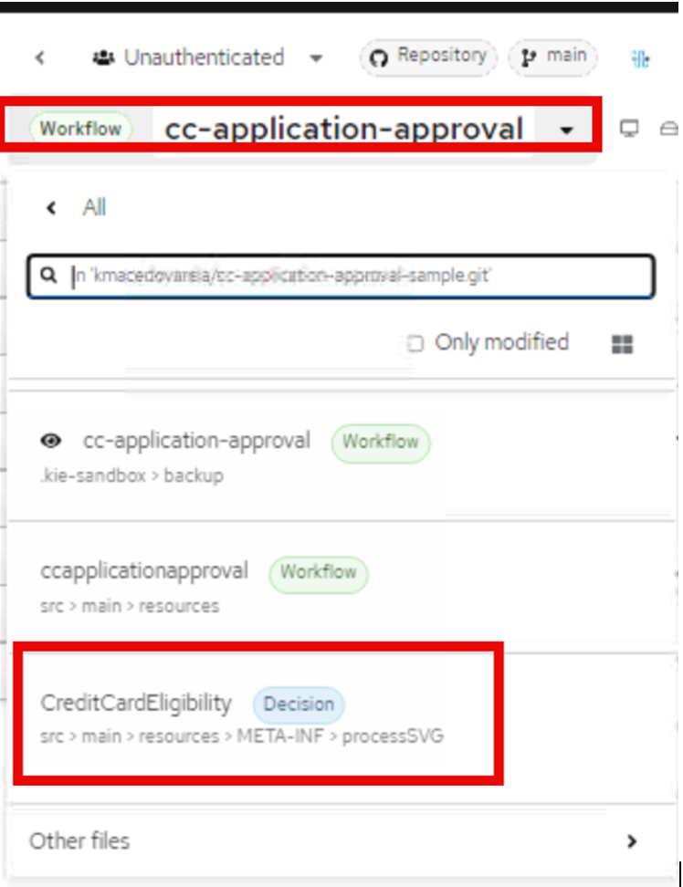

7.	Click the circle icon with the “i” in it to open the properties of the model. These will be auto-populated in VS-Code from the decision since they’re in the same workspace, but this provides a way of understanding how the decisions are mapped.

    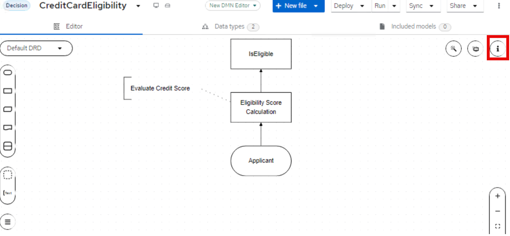

8. On the properties panel you will see the following that will be used to help populate the BPMN diagram to connect the DMN decision to the process model.

    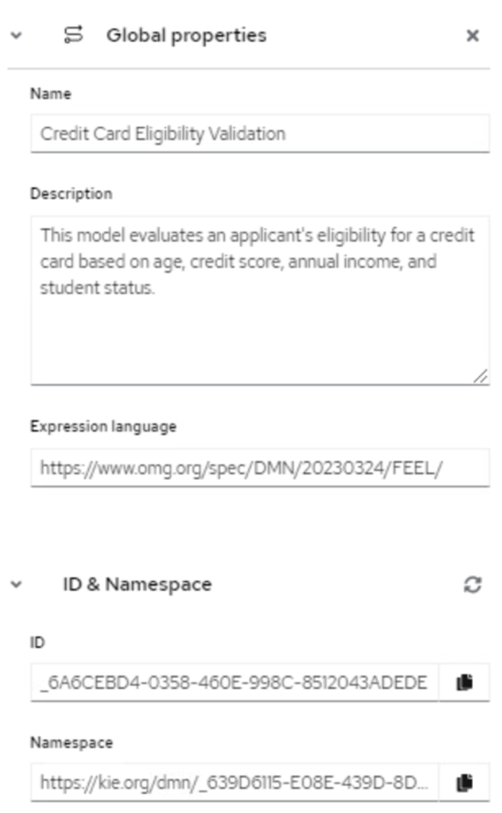

9. Now that you have a basic understanding of what the model looks like and some of the properties, we will see in the next section how to tie it in.

## Configuring the Business Rules Task

6.	Return back to Visual Studio Code and configure the business rules task to consume the decision model. You can find and double check the information below, in the DMN file CreditCardEligibility.dmn available in your project. Click the Is Eligible node and go to the properties. Change the values in the properties window to match the table below. Most values will be autopopulated as you select the model/decision. When you change the Rule Language to DMN, the filename will be selectable and the other data will start getting populated automatically:

    | Value | Input |
    |-------|-------|
    | Rule Language | 	DMN |
    | Filename |	CreditCardEligibility.dmn |
    | Namespace	| https://kie.org/dmn/_639D6115-E08E-439D-8D29-45750C32DB28 |
    | Decision Name	| IsEligible (select IsEligible from the pulldown) |
    | DMN Model Name |	Credit Card Eligibility Validation |

    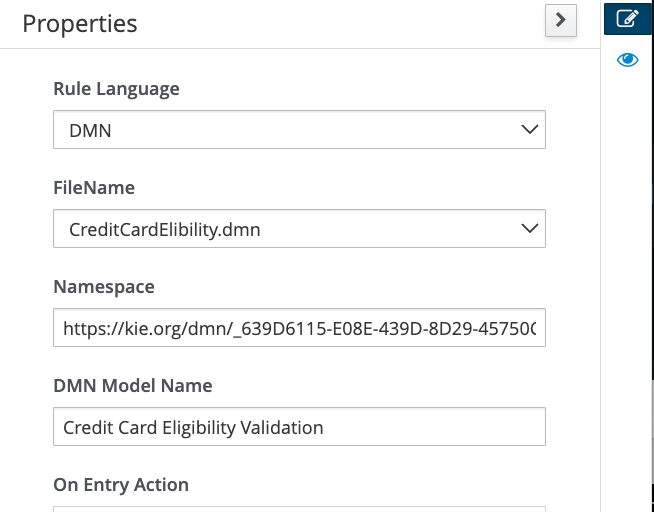

6. Configure the inputs and outputs of the task by clicking on **Assignments** and using the following info. Note the I is capitalized in the IsEligible.
    **Input**

    | Name | Data Type | Source |
    |-------|-------|------|
    | Applicant |	Applicant[org.acme.cc_approval.model] |	applicant |

   **Output**: 
   - Applicant: Applicant[org.acme.cc_approval.model]

   **Output**:
   | Name | Data Type | Source |
    |-------|-------|------|
    | IsEligible |	String |	approval |

   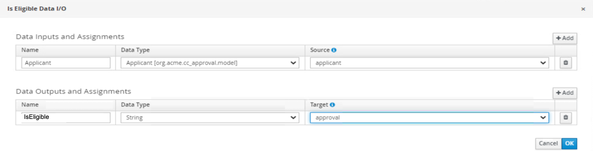

7. Make sure to save your diagram changes.

## Running the Process with DMN Automation

8. As long as you left the http://localhost:8080/q/dev-ui closed from the previous lab, open it up again. If mvn quarkus:dev is running, it will hot reload as we change our process and project.

9. After this is reloaded from the saves, open the Dev UI, navigate to http://localhost:8080/q/dev-ui and go to Process Instances.

10. From here, click on **Process Definitions** and click the arrow again on the approval process to start a new process instance from the process definition.

11. Test with different data that will result in different outcomes in the decision.

12. After you submit any of the test scenarios, you can navigate to the green banner's to check the process details.

13. Check Process Variables: Verify the variables of the completed instance to ensure the DMN decision was executed correctly.

