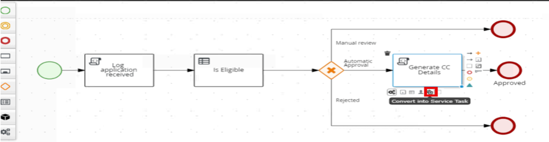
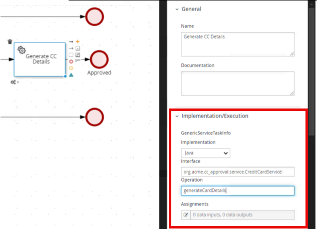
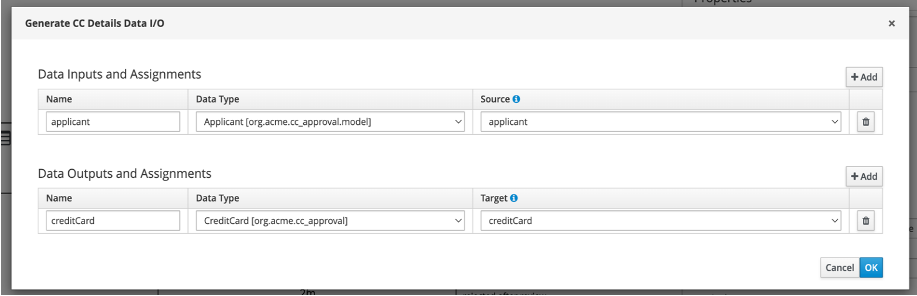
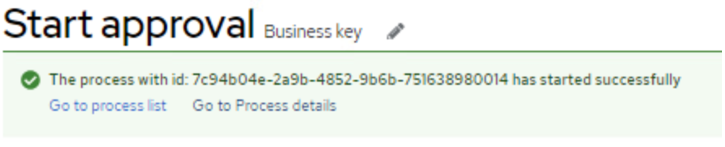
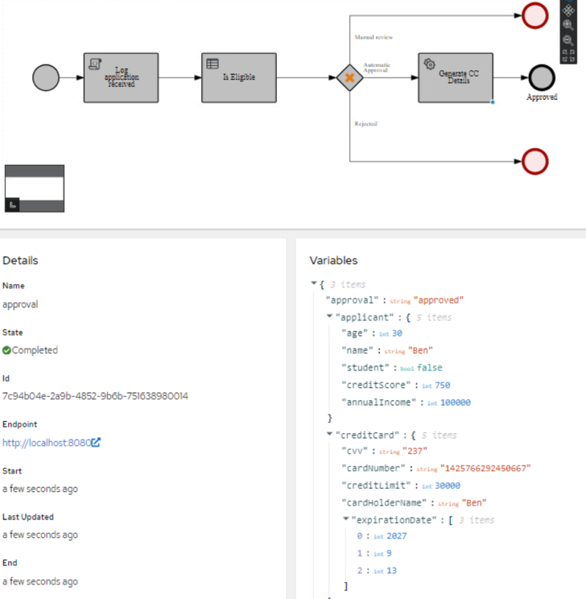

# Adding a Service Task for Credit Card Generation

When a credit card application is approved, we need to generate the credit card details. This can be done a lot of different ways, for this lab we are going to start with a Service Task that will invoke a Java method, but this could easily be a call to a different existing service. This is the power of the flexibility that the jBPM runtime can provide with running Java services in a multitude of ways. 

## Understanding the Service Class to be implemented

There is a Java class that has already been created to do the credit card details for the approved account. This can be opened by navigating to src/main/java/org/acme/service/CreditCardService.java.

~~~java
@ApplicationScoped
public class CreditCardService {

    public CreditCard generateCreditCardDetails(Applicant applicant) {

        double creditLimit = applicant.getAnnualIncome() * 0.3;

        return new CreditCard(applicant.getName(), creditLimit);
    }
}

~~~

## Adding the Service Task to Your BPMN

1. Return to the approval process in VSCode so we can change the Generate CC Details to a service task on the approved path.

2. Click the Generate CC Details script task and click the three-gear icon followed by the two-gear icon to *Convert into Service Task*.

    

3. Configure the service task with these attributes in the properties panel:

   - Implementation: Java
   - Interface: org.acme.cc_approval.service.CreditCardService
   - Operation: generateCreditCardDetails

    

4. Set the *Assignments*. Click the paper and pencil icon to open the editor.

5. For the **Data Inputs and Assignments**, add:

    - Name: applicant
    - Data Type: Applicant [org.acme.cc_approval.model]
    - Source: applicant

6. For the **Data Outputs and Assignments**, add: 
 
    - Name: creditCard
    - Data Type: CreditCard[org.acme.cc_approval
    - Target: creditCard

    

7. After making changes, test the newly updated process with the addition of the autogenerated credit card details. Make sure your diagram is saved and you press the generate SVG button to regenerate the image.

8. Open the Quarkus Dev UI in your browser by going to to http://localhost:8080/q/dev-ui 

7.	Start a new process instance with an approved application to see that now the response that gets returned generates the card details in the instance data. 

    |Scenario	| Is Student |Annual Income |Credit Score | Age |
    |-----|-------|-------|-------|-------|
    |Automatic Approval | 	false |	15000 |	750 |	25 |

8.	After starting the instance go to the Process details link.

    
 
9.	Examine the process instance details, paying particular attention to the generated credit card values.

    
 
10.	Now that we have the Credit Card details implemented, it is time to add the human task to round out this process. Close the Dev UI.
