# Adding a Human Task

The long-awaited addition of Human Tasks when using Kogito and the jBPM engine together is a part of the Technical Preview for the 9.1 release. This section will focus on adding them to the process.

## Modifying the manual approval to incorporate human tasks

When the decision outcome indicates the need of a manual approval, the flow should move forward to a user task. Let's add this manual step in the process and see it in action! The process changes we are going to implement are going to focus on when an application requires manual review, it now goes to the "Review Application" task. For now, these are going to be assigned to the user, jdoe. They will review the application and decides to approve or reject it. - Based on the decision (stored in the approval variable), the process takes one of two paths: if approved, it proceeds to generate credit card details; if rejected, it ends the process immediately.

## Implement the Manual approval 

1. Add a new user task on your process, on the "manual approval" path. To do this from the palette, click the blank square and click and drag User to the manual approval path of the process.

    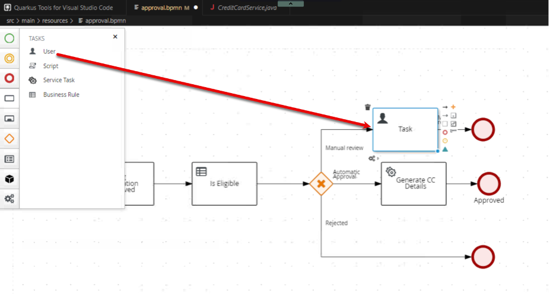

2. Open the properties of the Human Task, by clicking it and then the Pencil/Paper icon. Change the human task name to "Review Application".

3. Expand Implementation/Execution so we can set the task name to reviewApplication. Set the task name to reviewApplication.

    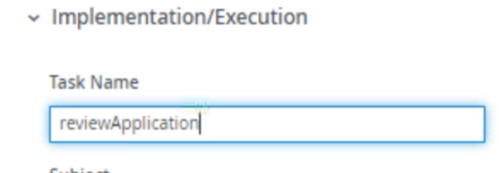

4.	Scroll down if necessary and now we need to set the actor to jdoe. To do this, first under Actors click Add, then click the pulldown box.

    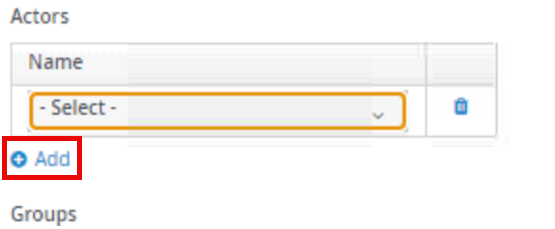
 
5.	Click New to create a new user.

    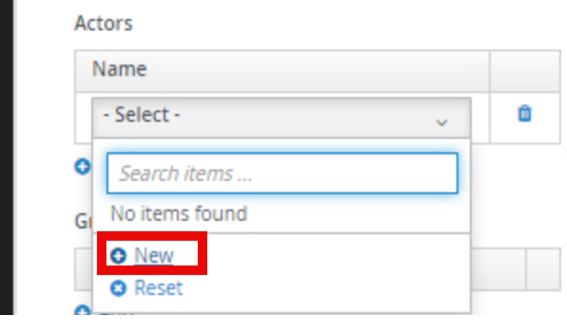
 
6.	Type the actor name as jdoe and be sure to click the checkbox to save the id. 

    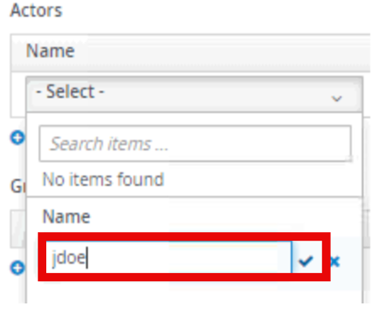
 
7.	After clicking the checkbox, be sure to click your new user jdoe.

    
 

5. Set the data assignments for the task, open the Assignments on the task.

    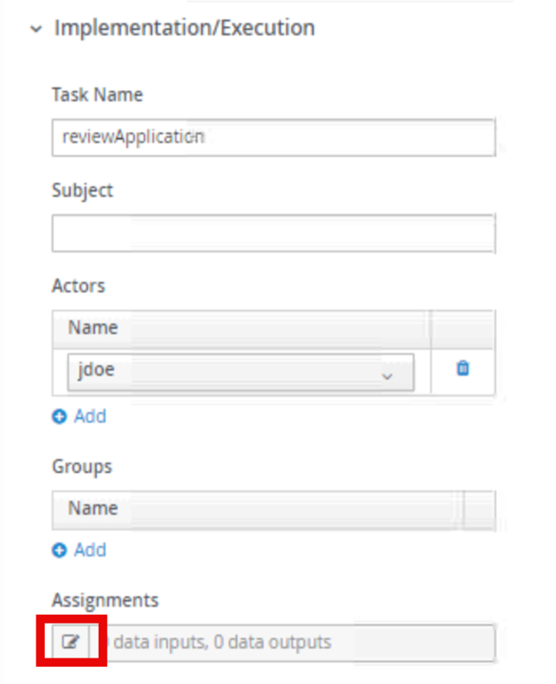

6. Set the assignments as below:

    **Input Assignment:**
    - Name: Applicant
    - Data Type: Applicant[org.acme.cc_approval.model]
    - Source: applicant

    **Output Assignment:**
    - Name: approval
    - Data Type: String
    - Source: approval

    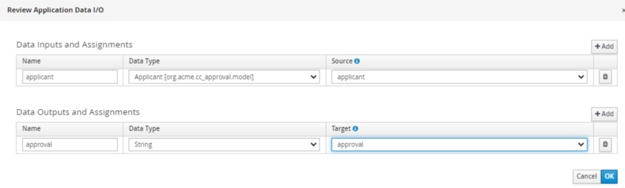

7. The final properties view of the human task should look like the below screenshot.

    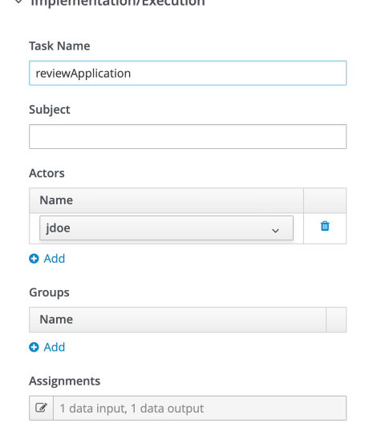

## Cleaning up and finalizing the process 

The process diagram after the Review Application Human task can be configured many different ways, below is just an example of a possible solution, you do not have to have all of the exclusive gateways coming together to simplify if you choose not to. That is ultimately your choice! Below is just a sample of how the rerouting can look like.

1.	You can configure the sequence flows after the human task such as:

    - For the "approved" path: - Set the condition to: 
    ~~~java
    return approval.toLowerCase().equals("approved");
    ~~~
   
    - For the "rejected" path, you can set it to be the default path after the manual approval so that if it doesn’t explicitly say approved, the process will proceed to the rejected applications path. If you create an exclusive gateway after the Review Application human task, you can select the default route under Implementation/Execution to be Rejected Requests or you can set the exact condition if you’d prefer. 
    
    To manually set the condition it would need to be set to : 
    
    ~~~java
    return approval.toLowerCase().equals("rejected");
    ~~~

7. Once completed, save the diagram, and regenerate the SVG associated with this process.

## Testing the Updated Process 

8. If the process is still in `mvn quarkus:dev` then proceed to http://localhost:8080/q/dev-ui otherwise run the command to restart the application.

9. Start a new process instance that would route to manual review.

    |Scenario	| Is Student |Annual Income |Credit Score | Age |
    |-----|-------|-------|-------|-------|
    |Manual Review |	false |	30000	| 600| 	20 |

10. After submitting the process, review the process details to see how the changes impacted the process.

    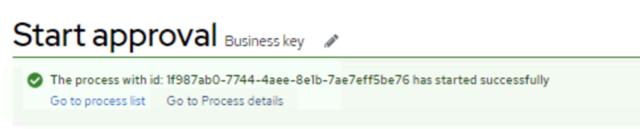

1. From here, we can see that there is a Review Application task as the process has a Red Square on the node. So, now what do we do, we’re in a development UI, but we’re not jdoe, right? Well in the Dev-UI, you can be who you need to be as long as the profile is configured for it. To do this, we’re going to go to the Tasks Console within the Dev-UI environment.

    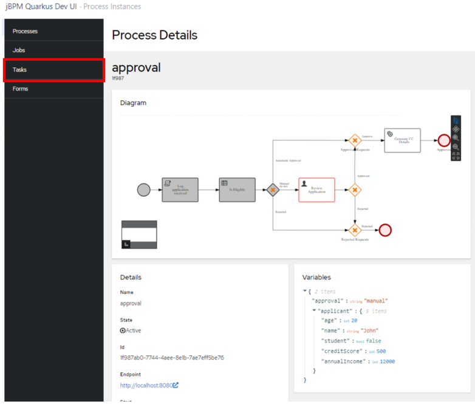

11. When we open the Task Inbox in Dev-UI, we notice that there are currently no tasks, what’s going on? If you notice in the top right of the screen shot there is a pull down for the user and it’s on admin, so the console is correct, admin has no tasks, but we assigned the task to jdoe, let’s see what’s going on!

    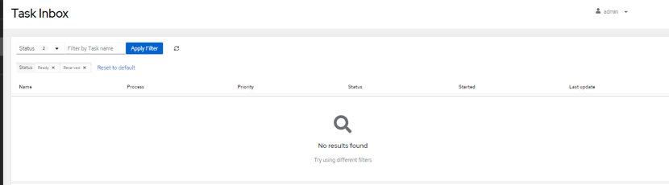

12. Now we’ve morphed into jdoe and are able to do any tasks in the development environment for jdoe. In this case we have one task, Review Application, click the Review Application link.

    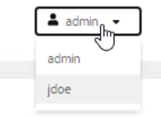

13. Click the Review Application link to open the task.

    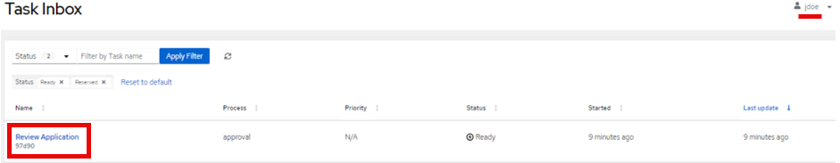

14. You will see that when we open this task, a form was autogenerated that is built to handle this task. Now we know based on our process we either need to set the approval to approved (any capitalization will work here because it’s converted to lowercase) to approve the request, otherwise anything else will reject the application. Let’s give John, the 20 year with 12,000 annual income a credit card to start building a credit history!

    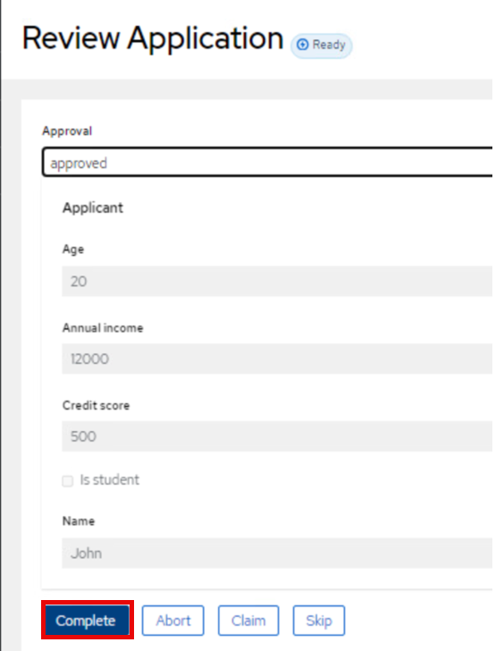

15. Return to the Processes view and check the completed instance details.

    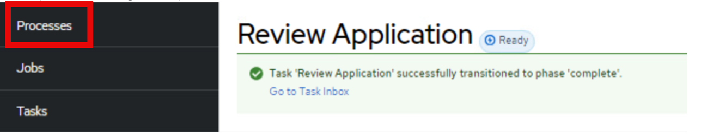

16. By default, the Process Instances view will only show active processes, since we approved this instance, it is completed. You can modify the filter on the status to include completed instances by clicking Status and adding the checkbox for Completed. 

    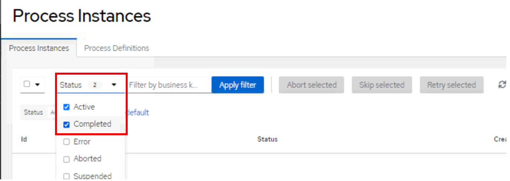

11.	Click Apply Filter to active the filter.

    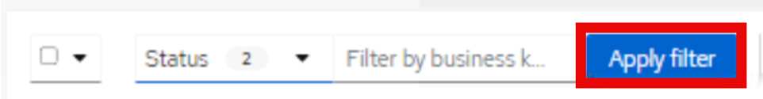
 
12.	There’s our last ran process! Click approval to review the process details.

    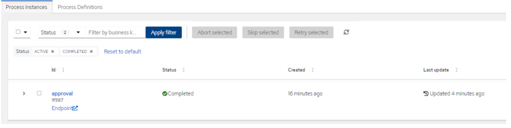
 
13.	Now we can see that the process took the approval path and is completed generating a new credit card for John!

    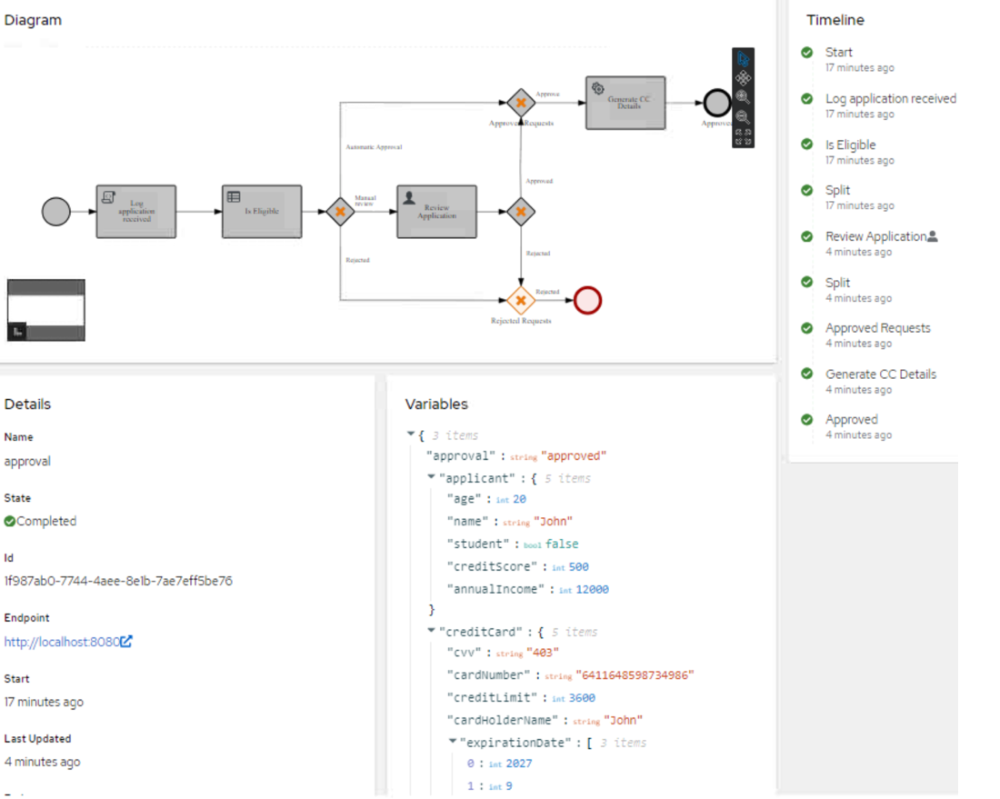

## Optional challenge

Now this process right now is assigned to just jdoe, ideally we would do a group, but for now in development for this lab we’re going to attach this to a new user. Let’s say instead of jdoe, the tasks will now go to mscott. We need to make some changes for the Dev-UI to work with this.

1.	Before proceeding be sure to close the Chrome instance of the Dev-UI console!

2.	Repeat the new actor method that was used for creating jdoe to have your user mscott – once again be sure to check the checkbox! Then change the actor from jdoe to mscott.
 
3.	If you were to access the Dev-UI now and repeated the steps from last section, you would see a task was created, but there is not an actor mscott in the Dev-UI to be used, so how do we get that there? Very easily, a quick properties change will allow it to be added to the Dev-UI console. In VSCode open src/main/resources/application.properties

 
4.	If you notice on line 22 there is a property that says %dev.jbpm.devui.users.jdoe.groups=admin,HR,IT – we can copy this line, changing jdoe to mscott and now mscott will have the same groups as jdoe, but since the task is assigned to mscott now, we can complete it!

    ~~~java
    %dev.bpm.devui.users.jdoe.groups=admin,HR,IT
    %dev.jbpm.devui.users.mscott.groups=admin,HR,IT
    ~~~
 
5.	Save the file and then reopen the Dev-UI by going to http://localhost:8080/q/dev-ui and create a manual approval task and see if it is now assigned to mscott and make your path. Now much easier to manage multiple users, groups, etc in an environment to test the workflow and it is ready in seconds!
 
6.	Now we have our task assigned to mscott! 

