# Authoring the decisioning for the Call Center

With this lab, it is highly recommended to use {{ product.runner }} and while you're building your model and the various custom data types to have the example right next to you. Taking advantage of the tools at hand will make your decision design much smoother and faster!

The problem statement describes a number of different inputs to our decision:

- **Call**: the incoming call into the call-center

- **Employees**: the employees of certain office.

- **Office**: an office to which the call could potentially be routed.

Furthermore, the problem statement describes that phone numbers could be banned. So, also **banned numbers** can be regarded as an input to our model (although we will not implement it as an input in this lab).

With the given input, we need to make the following decisions:

- **Accept Call**: the final decision we need to make is whether the given office will accept the call.
- **Can Handle Call**: whether the office can actually accept the call. As defined in the problem statement, this depends on:
  - whether the phone number has been banned;
  - the purpose of the phone call (“help” or “objection”).

## . Accept Call Decision Structure

- **Accept Call**: the final decision we need to make is whether the given office will accept the call.

    1. Add a **Decision** node to the diagram by clicking on the **Decision** node icon and placing it in the DRD. 

        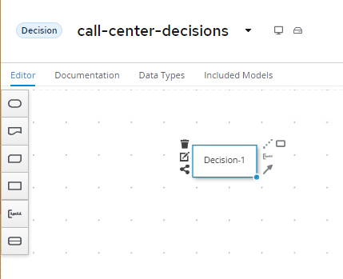{:width="800px"}

    1. Double-click on the node to set the name. We will name this node `Accept Call`.

        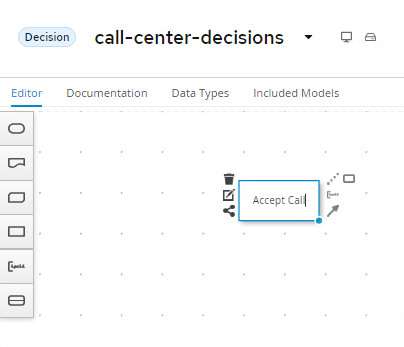

    1. With the `Accept Call` node selected, open the property panel. Set the **Output data type** to `boolean`.

        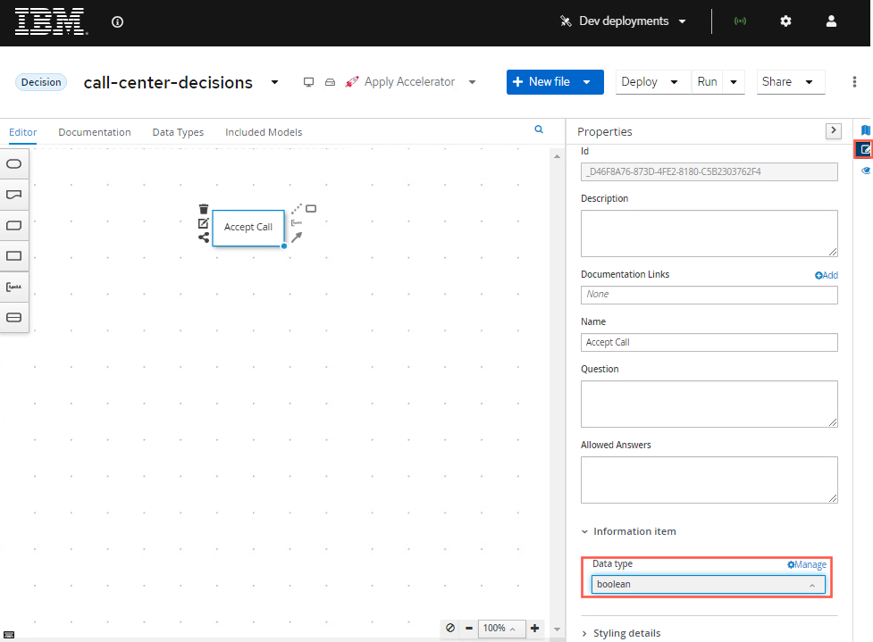{:width="800px"}

    1. The input of this decision is the **incoming call**, **office** and **employee**. Create these 3 input nodes and connect them to the **Accept Call** decision.

        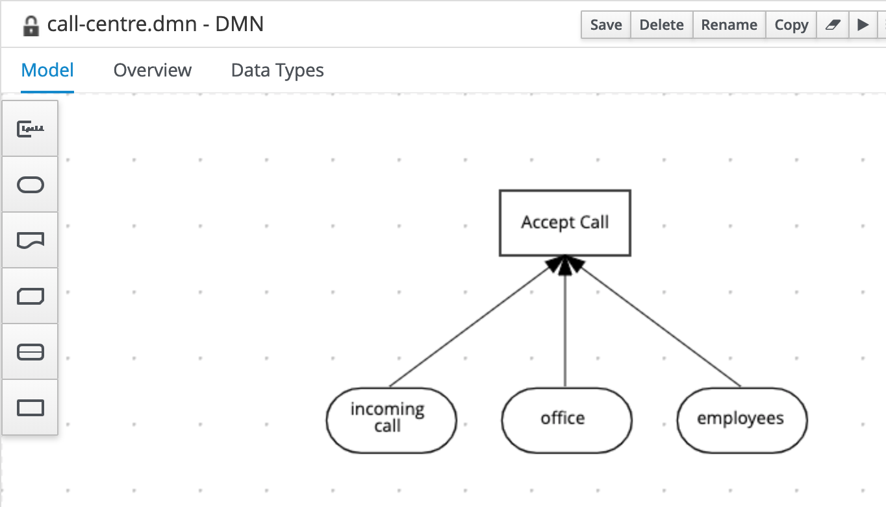{:width="600px"}

    1. We can now set data types of our input nodes.

        1. Click on the `incoming call` node, open the property panel and in the **Output data type** section and click on the **Manage** button. This will open the **Custom Data Types** window.

            

        1. In the **Custom Data Types** window, click on the **+ Add** button.

            

        1. Define the data type `Phone Number` as a structure and be sure to press the blue checkmark.

            {:width="400px"}

        2. When you click the blue checkmark, a new row will open for the next type, for the first element, call it `phone number` with type `string` and then press the blue checkmark.

            

        1. Now to create one more item, press the plus sign in the circle that appears where the checkmark was.

            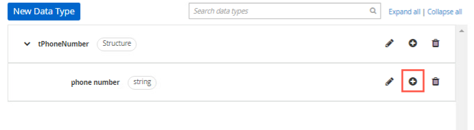
        
        1. For this data type call it `country prefix` with a type `string`. You can add a constraint to the limited values if you want, but not required, the example will use "+421" and "+420". These are more used for the forms rendering than anything else at this time. Make sure you check the blue checkmark when you're finished.

            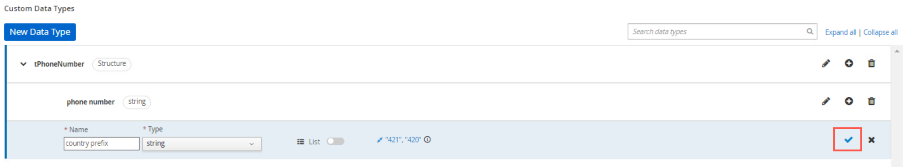

        2. Define another data type `tCall` as a **Structure** which will contain both the `tPhoneNumber` structure and an additional field `purpose` of type `string`:

            {:width="400px"}

        3. When you’ve created the `tCall` type, go back to the DRD by clicking on the **Editor** tab.

            

        4. Select the `incoming call` node, and in the property panel, under **Information item**, set the node’s **Output data type** to `tCall`

            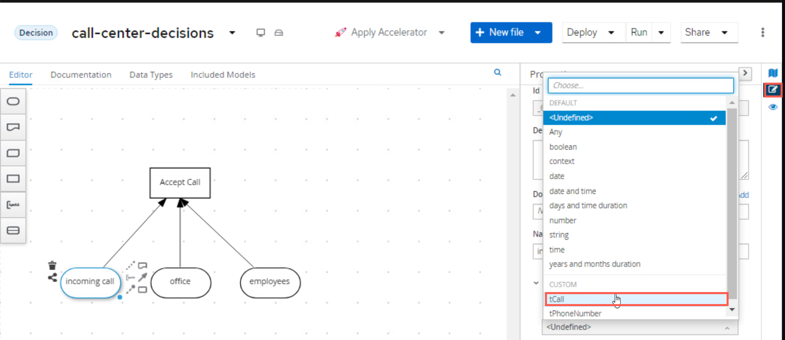{:width="800px"}

    2. Next, define the following data type similar to `tCall` called `tOffice` with a field `location` and set it as the **Output data type** of the `office` input as such:

        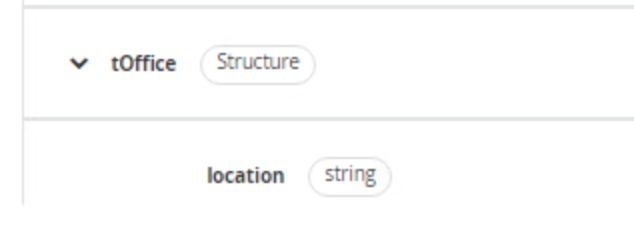{:width="350px"}

    3. Define the data type for `employees` as follows. Note that we’ve first defined the type `tEmployee`, and afterwards we’ve defined `tEmployees` as a `List` of `tEmployee`.

        {:width="800px"}

## Decision Service

With the main structure defined, we can now look at the requirements of the decision whether the office can actually accept the call. As defined in the problem statement, this depends on:

- whether the phone number has been banned.

- the purpose of the phone call ("help" or "objection").

We will model this decision as a DMN **Decision Service** that can be called by our main decision `Accept Call`.

1. First, model the **Decision Service** in the DRD and give it the name `Can Handle Call`. Set it’s **Output data type** to `boolean`.

    {:width="800px"}

2. Add a **Decision Node** to the **Decision Service**. Name it `Call Can Be Handled` and set it’s **Output data type** to `boolean`.

    {:width="800px"}

3. Add 2 additional **Decision Nodes** and name them `Is Banned` and `Call Purpose Accepted`. Both should have an **Output data type** of type `boolean`. These will be put "below the bar" on the Decision Service node, so the decisions will be evaluated, but the results will not be passed back from final service by default.

4. Connect the 2 **Decision Nodes** to the `Call Can Be Handled` node.

    
{:width="800px"}

5. The input to both the `Is Banned` and `Call Purpose Accepted` decisions is going to be a separate item called `call`. You will create the input node called `call` with data type `tCall`. While it will look like you're creating a separate call item here (and that is definitely how it looks), this decision service could be called independently of the whole service, which is why this call object can be used. Later in the lab, you will see how this ultimately works!

    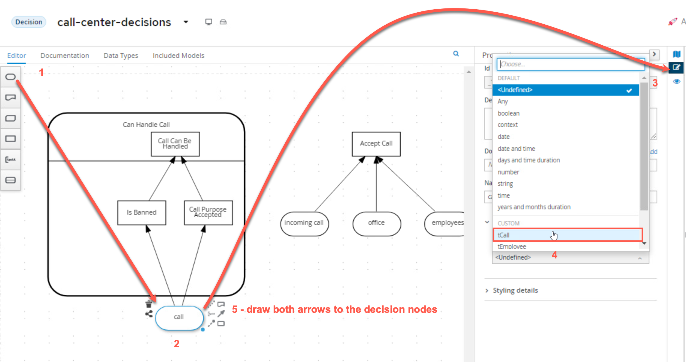{:width="800px"}

6. The `Is Banned` decision also needs a collection of banned phone numbers. Instead of implementing this as an **Input** node, we will implement this as a DMN **Relation Decision**.

    1. Create a new **Decision Node** and name it `Banned Phone Numbers`. Connect it to the `Is Banned` decision node.

        {:width="400px"}

    2. The **Ouput data type** of this nodes is a new custom data type, which is a list of `tPhoneNumber`. We’ll name this type `tPhoneNumbers`, similar to how `tEmployees` was setup before:

        {:width="400px"}

    3. Click on the **Edit** button of the `Banned Phone Numbers` node. Set the **logic type** of the decision to `Relation`. Create the following table, you will need to add one extra column and use the headers as shown of `country prefix` with type `string` and `phone number` with type `string`:

        {:width="500px"}

7. We can now implement the logic of the `Is Banned` decision. Click on the **Edit** button of the decision node. We will implement the logic as a **Literal Expression**. Define the following FEEL expression as below showing that we're going to take the Relational List from `Banned Phone Numbers` and comparing it to `call.phone` which is using the tCall's phone number input:

    ~~~java
      list contains(Banned Phone Numbers, call.phone) 
    ~~~

    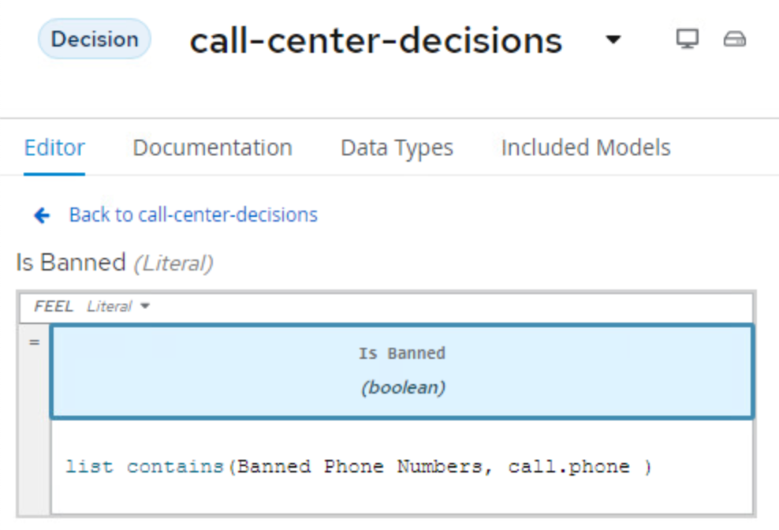

8. The next node for which we want to implement the decision logic is `Call Purpose Accepted`. Click on the node, and click on the **Edit** button. 

    

9. Implement the following logic as a **Decision Table**:

    {:width="600px"}

11. Click on the `Call Can Be Handled` node and click on the node’s **Edit** button. 

    {:width="600px"}

12. In the decision editor, click the **Select expression** to **Decision Table** and implement the following table:

    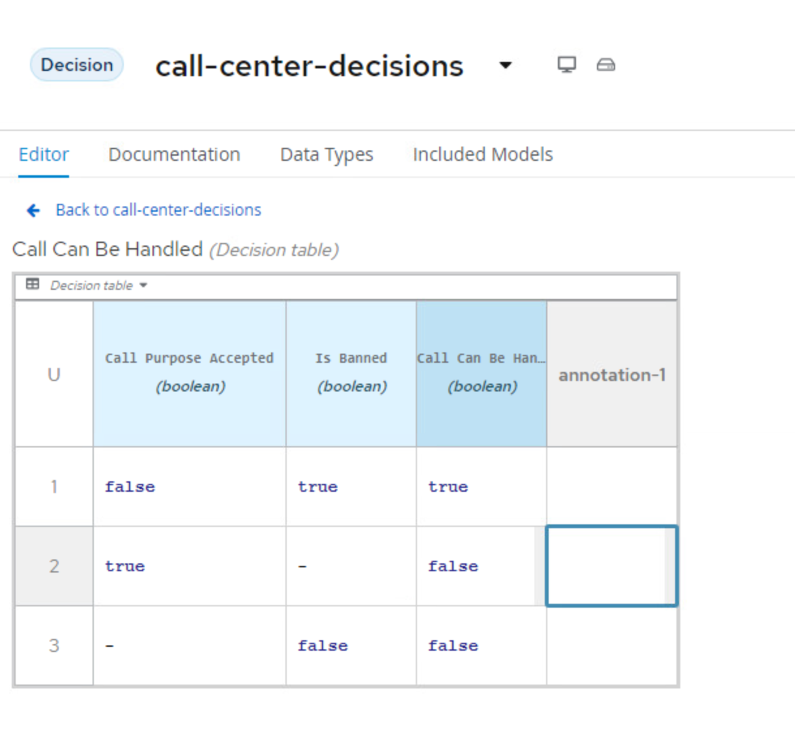{:width="600px"}

13. We can now implement the decision of `Accept Call Decision`. To do this we need to link the Decision Service to the `Accept Call`, to do this, you will click the outside of the Decision Service node and use the `Create DMN Knowledge Requirement` to connect the Decision Service to the `Accept Call`.

    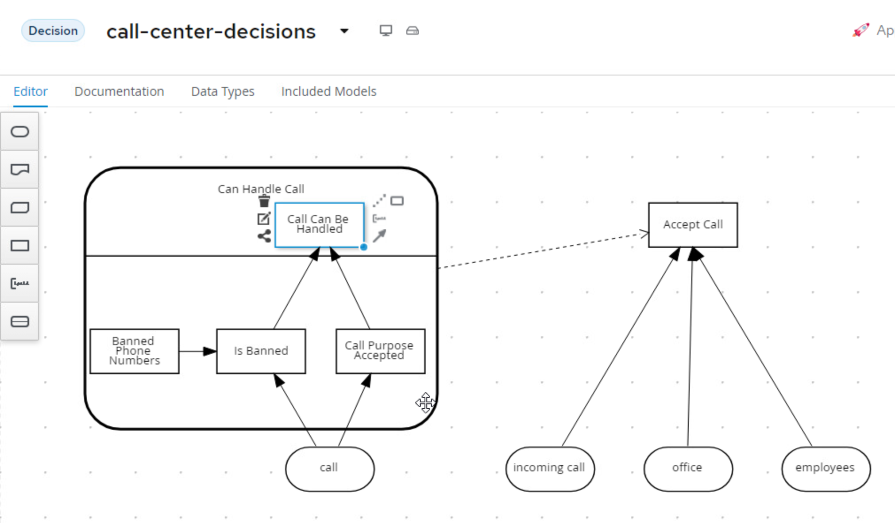{:width="800px"}

##  "Accept Call" Decision Logic

1. Finally we need to Implement the `Accept Call` decision. This is going to be built as a `Context` since this can be built as a boxed expression that will have multiple steps yielding the final decision to either Accept or Deny the call!

    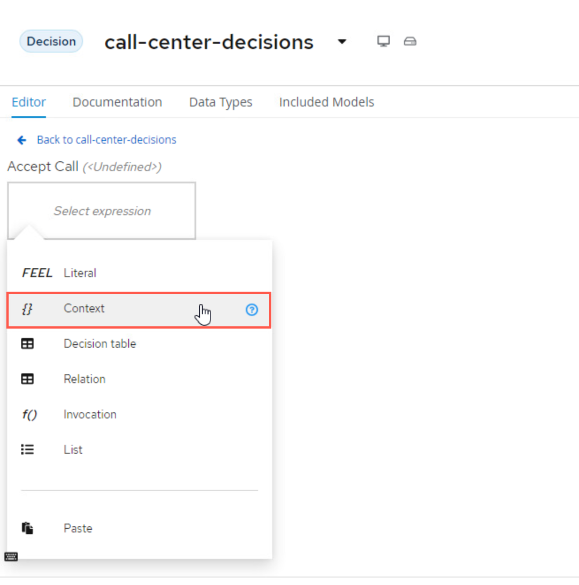{:width="800px"}

1. With the Context now the Decision Type. The first row is going to be `Call can be handled` with type `boolean`.

    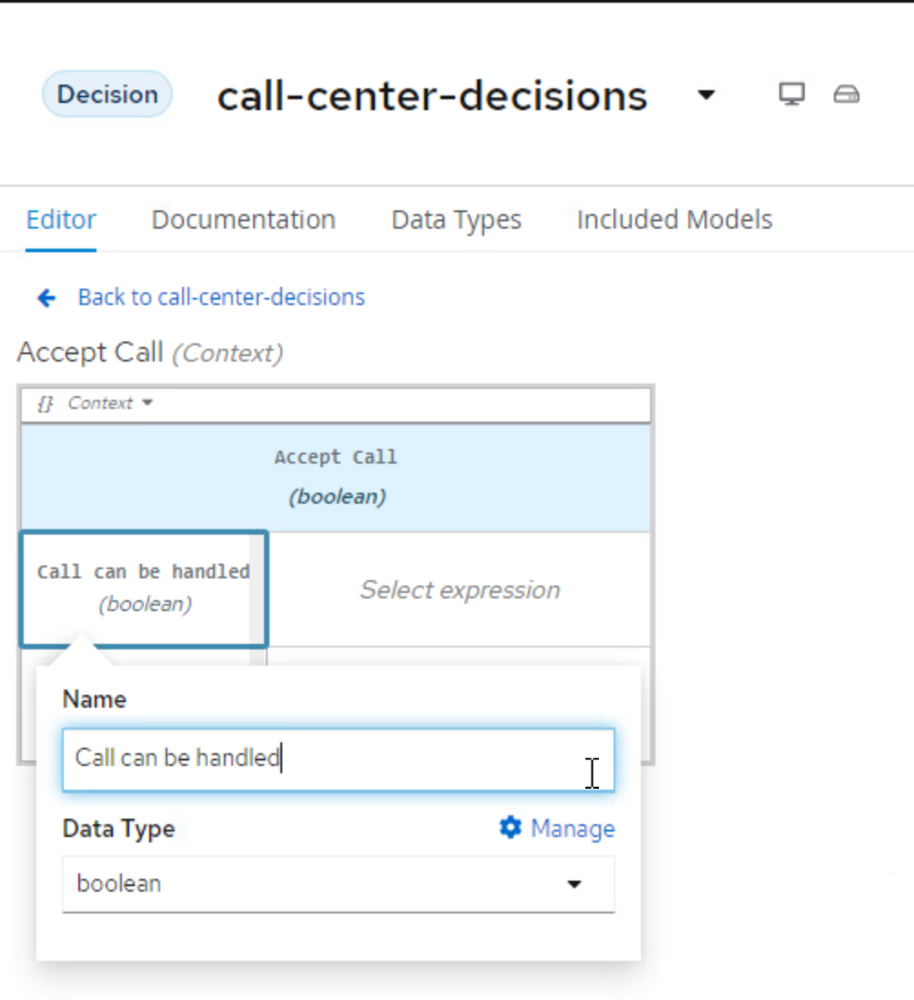

1. Now we need to set the expression for the first row, this is going to be of type `Invocation`.

    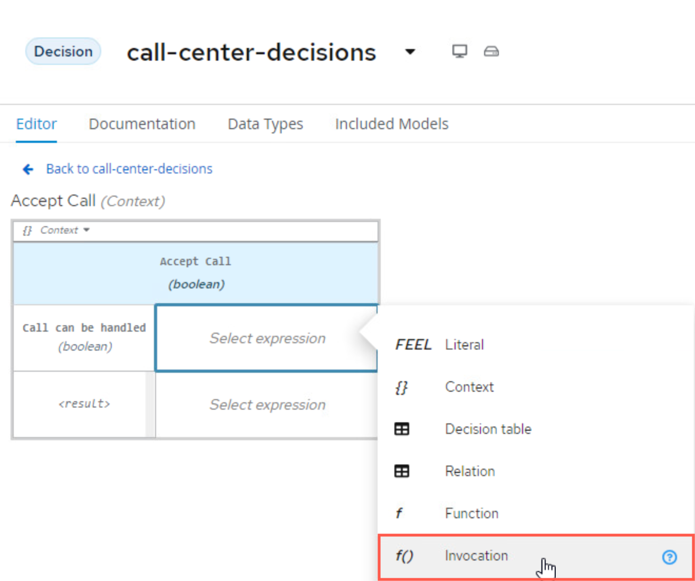

1. For the invocation, we need to use it to call the Decision Service that was created. 

2. 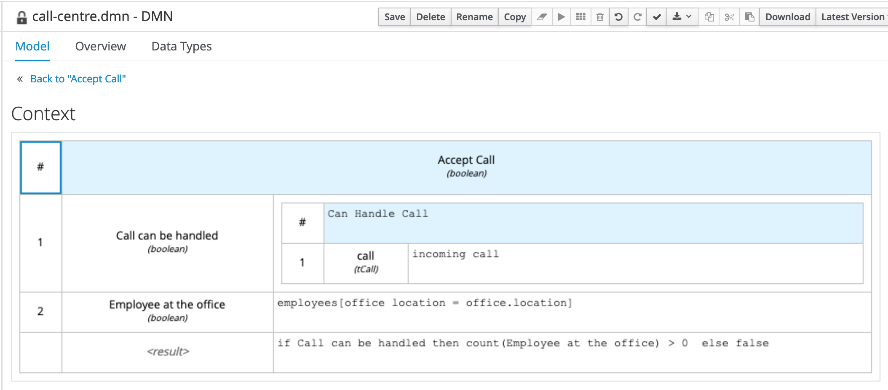{:width="800px"}

Notice that the line 1 is the invocation of the decision service "Can Handle Call". This is an **Invocation** of the `Can Handle Call` service, passing the `incoming call` input as the variable `call`. The output of this invocation will be the `boolean` variable `Call can be handled`. This will be done using a Literal FEEL function to do this.

1. Next create a new line with a data type `Employee at the Office` with data type `boolean`. Set the expression as another Literal expression. In this function, you will be mapping the Office locations of the employees who are working to the location of the office location. Since this is a list, you're essentially getting a collection of the employees office location and the location of the office that the call is coming from and trying to map them. 

    ~~~sh
    employees[office location = office.location]
    ~~~

1. After this is set, the last row, `<result>` can be set with a `Literal` expression again with the following:

    ~~~sh
    if Call can be handled then count(Employee at the Office) > 0 else false
    ~~~

The `Call can be handled` variable as then used to validate the decision result in the last line.

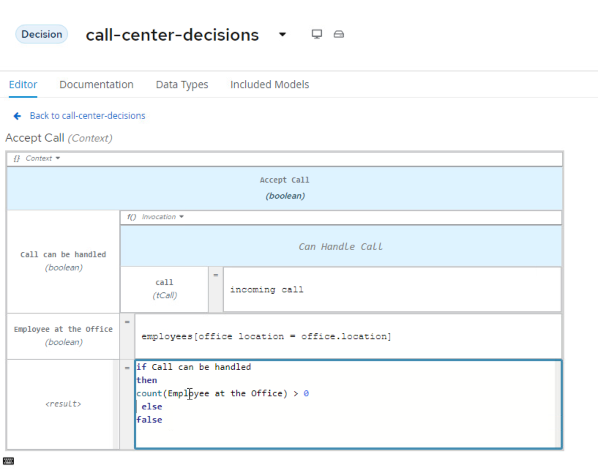

## Next steps

Next, we should deploy the project in OpenShift as a sample service.
