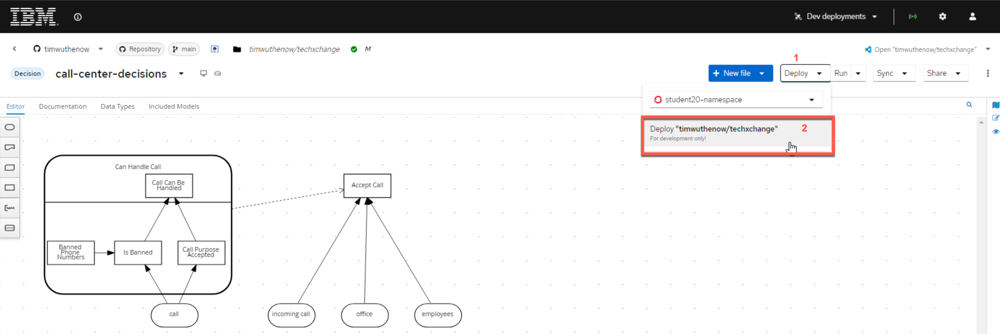

# Deploying and testing the Decision Service

With our decision model completed, we can now package our DMN model in a Kogito service. This can be done using the Accelerators included with {{ product.canvas }}. These accelerators will quickly take the DMN file and start building the basis of the project as a {{ product.name }} compatible decision service.

## Applying the Accelerator

To take this decision service from a standalone DMN model to a full Kogito architected decision, you will use the accelerator by clickig the button at the top of the screen. To do so follow the instructions and then we will synchronize the project to your GitHub account and also be capable being deployed as an OpenShift service.

1. At the top of the DMN model page for `call-center-decisions`, click the button `Apply Accelerator` and select **Quarkus...**.
  
    

1. If you want to learn more about the accelerator, you can click the GitHub link and change the branch to the `9.0.0-quarkus-full` to learn more about it. Afterwards just click **Apply** to restructure your project into a Kogito service.

    

1. The wizard will come with a pop-up asking for a commit message for the change since this will create a Git project. You can use the default message or put whatever you would like, to do so press **Commit**.

    

1. To create the project in Git, click **Share**, use your GitHub tokened ID.

    

1. Once you select your ID, a new option **Create GitHub repository...** is now available, select this.

    
    
2. The repository you create, can be anything you want, for the purposes of this lab, it will be called **techxchange-call-center**.

    

3. When you create the repository, a message will open at the top with a link to the Git repository that was created. In the case of the example it is at [this example repository](https://github.com/timwuthenow/techxchange-call-center).

    

## Deploying to OpenShift

Now that this repository is created, you can work on it locally or deploy it to OpenShift. For this lab, we will choose OpenShift since we have a cluster ready to use for TechXchange or you can use the [Red Hat OpenShift Sandbox](https://developers.redhat.com/developer-sandbox) to provision a small environment to try it out on your own.

1. Login to get an OpenShift Token using the bookmark on Chrome. This will be used to connect {{ product.canvas }} to OpenShift and deploy a sample development environment of the decision service.

    

1. In the login screen use your username and password - this will be some combination of `student01` to `student20` with password `Passw0rd`. The username is all lowercase. This will

    

1. Click the **Display Token** link and switch back to the tab with {{ product.canvas }} open on it. You will use the token contents from the OpenShift token page shortly by clicking on **Dev deployments** and then selecting the pull down **Select authentication** and then **Connect to an account**.

    

1. On the next wizard, select the **OpenShift Tile** to connect to an OpenShift instance.

    

1. From here you will use the information from the OpenShift token page. Your namespace will be your `student##-namespace`, so if your username is student07, then you would connect to *student07-namespace*. The token and the console locations are both a part of the token as well. You will see a checkbox to Insecurely disable TLS validation, check it as this is a self contained environment with certificates not present. Press **Connect** when the form is completed.

    

1. As long as it was successful to connect, you will be greeted with a Connect to OpenShift successful modal, click **Continue**.

    

1. Now you can press the **Deploy** button and have the capability to select the namespace that you connected to and deploy a sample of your service to it.

    

1. From here a modal will pop up explaining that the deployment can take a few minutes and it is only intended for development, etc. Click **Confirm** on this modal and your service will be deployed.

    

1. This process will take several minutes to complete.

    

1. The pulldown with deploy will refresh every 30 seconds, when the service is available, it will reflect as such. The way that the deployments from these services work are is that they are completely immutable and unaware of one another, so you could have all versions deployed as you make changes to validate how you want to eventually promote your DMN model to later environments. So if you were to deploy it again, there would be multiple different versions of it deployed. Canvas can manage these deployment samples, which can later be removed when you're done with them if you choose. If you click the green check marked box, it will take you to the service.

    

1. When you access the service with a form similar to the one you had in {{ product.canvas }} and from that page you can explore it more using the kebab icon in the top right to access the Swagger-UI page to get access to the auto-generated DMN service's API page. The first post can be used to execute the decision itself.

    

1. This completes this lab as you can see how the deployment to OpenShit works with {{ product.canvas }}!