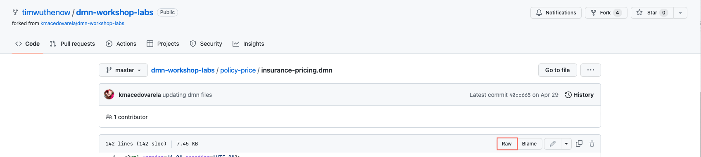

# Getting Started with Decision Model and Notation

This lab introduces you to the deployment of an existing Decision Model and Notation (DMN) and validation of it's decisions.

- Explore an existing DMN file created using {{ product.canvas }}
- Test the DMN using {{ product.canvas}}'s {{ product.extended }}
- Deploy the existing DMN project to OpenShift
- Test the deployed DMN

## Examine Existing DMN Diagram

The following example describes an insurance price calculator based on an applicant’s age and accident history. This is a simple decision process based on the following decision table:

|  {:width="600px"}  |
| :--:|
|  **DMN Decision Table**|

The decision table was designed with using a DMN editor, this could be done in {{ product.canvas }}, VSCode, Business Central or realistically any DMN compatible design tool. With how {{product.name}} utilizes the DMN specification, we're easily able to import this diagram seamlessly in the tool that makes the most sense for our end user.

Notice that: 

- The DMN decision table includes a *hit policy*, *inputs*, and *outputs*.

- Unlike the classic Drools Rules Language (DRL) based decision tables that can be created in Business Central, input and output names in DMN decision tables accept spaces. This allows for more clarity in your decisions aligning more to a business acumen.

- The conditions for the `Age` input is defined using the Friendly Enough Expression Language (FEEL).

The decision can also be represented by the following decision requirements diagram:

{:width="600px"}

In this decision requirements diagram, you may note that the applicant’s age and accident history are found in squared ovals, these indicate that these are the required inputs for the decision table "Insurance Total Price".

You can find the DMN component in the [DMN GitHub repository](https://github.com/timwuthenow/dmn-workshop-labs).

## Import the DMN File into {{ product.canvas }}

In this section, you can import the GitHub repository to {{ product.canvas }} directly from the file or clone the repository, if you do the direct file.

1. Open {{product.canvas}} by navigating to your instance of it (within the lab environments these are at {{ sandbox.production}}. From here, you will copy the URL to the gist of the _Insurance Pricing_ DMN located at [this repository location](https://github.com/timwuthenow/dmn-workshop-labs/blob/master/policy-price/insurance-pricing.dmn).

    

    ~~~bash
    https://raw.githubusercontent.com/timwuthenow/dmn-workshop-labs/master/policy-price/insurance-pricing.dmn
    ~~~

2. With this link navigate to the [{{ product.canvas }}]({{ sandbox.production }}) and under **Import </> From URL** paste the link from the previous step and click **Import**.

    

3. When the project is imported, you will see the DMN Editor with the **insurance-pricing** DMN model displayed. If you instead of pointing to a particular DMN, pointed to an entire project, any DMN/BPMN models associated with it would be able to viewed/edited within {{ product.canvas }}.

    

4. You can then click the **Run** button to get a local copy of this DMN running within the browser session itself. The best part about the DMN specification is that it is both a modeling specification, but also has an execution specification which allows for it to be as portable as it is.

    

5. This will have a section of the browser turn into a form and you can run the model right there. Modifying the checkbox based on the boolean of `had previous incidents` and set an `Age` based on the data type being a number.

    !!! INFO 
    
        Within this form you may see that if you just put an age in that the result returns _(null)_. This is because the way that a typical form works when generated is that a non-checked box assumes _null_, which the rules by default do not check for null. To quickly get around this from the form you can check and uncheck the checkbox and move forward with your testing. This initializes the value, this is because the form when it sends it for initial execution has the boolean value as a null. How would you address this in the rules? _HINT_: since we're checking if the number of incidents has a checkbox or not, you can write it as `? = false or ? = null`. Why the `?`? This is a way that DMN through the Friendly Enough Expression Language uses the column header object that you're testing to simplify checking a variable against a condition!

    

6. This service can be deployed as a sample Quarkus service to OpenShift right away as a sample service that you can invoke immediately. In the next section we will show how this is done from a development point of view.

## Deploying this sample service to OpenShift

If you are using the provided lab environment for TechXchange, the environment itself provides access to a shared cluster for all attendees to login to OpenShift there is a bookmark in Chrome called `OpenShift Token` that will take you to a login page to create an OpenShift login token. Every user for the TechXchange environment has a created namespace to the student id that was given to your workstation at the start of the lab (student01 through student20 with the namespace to that username with `-namespace`). The password for all of these instances is `Passw0rd`.

1. To create the OpenShift token to connect to the console at the bookmarked link **OpenShift Token** from Chrome.

    

2. From here you will login to OpenShift using your username and password created for the lab which is of the format `student01` through `student20` with password `Passw0rd`. If you get security issues with the link, accept them using the *Advanced* option in Chrome to proceed to the login screen.

## Conclusion

Congratulations, you've finished the first part of the DMN exercise. Next, you will have an intermediate level exercise that will guide you through the implementation, deployment and testing of the Vacation Days use case.
