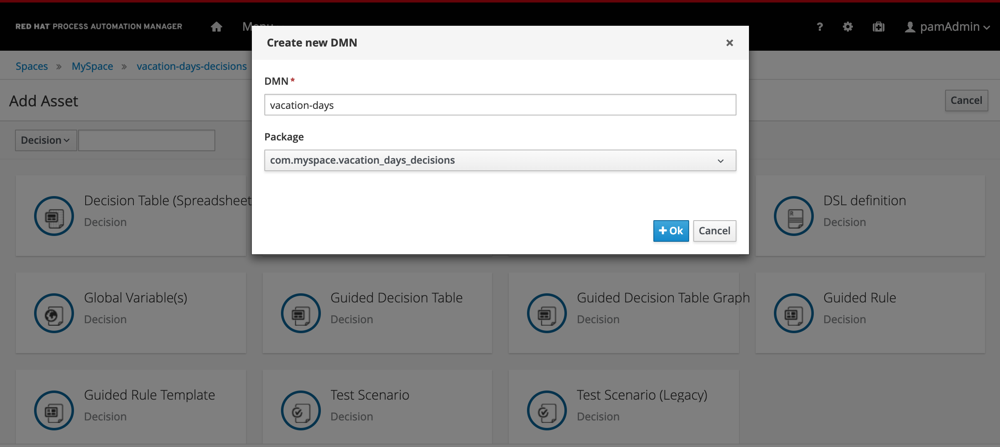

To define and deploy a DMN decision model, we first need to create a new project in which we can store the model. To create a new project:

1. Navigate to [Business Central](http://localhost:8080/business-central)

2. Login to the platform with the provided username and password.

3. Click on **Design** to navigate to the Design perspective.

    {:width="600px"}
4. In the Design perspective, create a new project. If your space is empty, this can be done by clicking on the blue **Add Project** button in the center of the page. If you already have projects in your space, you can click on the blue **Add Project** icon at the top right of the page.

5. Give the project the name `vacation-days-decisions`, and the description "Vacation Days Decisions".

    {:width="600px"}

6. With the project created, we can now create our DMN model. Click on the blue **Add Asset** button.

7. In the **Add Asset** page, select **Decision** in the dropdown filter selector.

    {:width="600px"}

8. Click on the **DMN** tile to create a new DMN model. Give it the name `vacation-days`. This will create the asset and open the DMN editor.

    {:width="600px"}