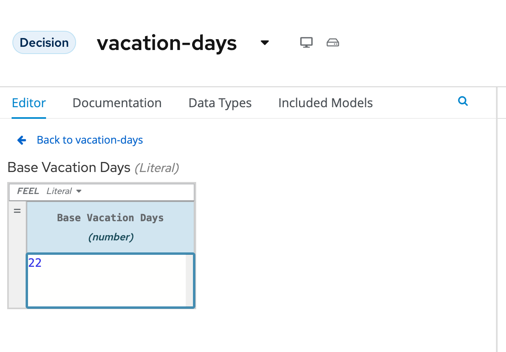

# Vacation Days - Authoring Decisions

Let's get working on the decision model! When writing decisions with {{ product.canvas }}, with DMN, we are able to define, model and create our decision all in one editor.

## Input Nodes

The problem statement describes a number of different inputs to our decision:

- **Age** of the employee

- **Years of Service** of the employee

Therefore, we should create two input nodes, one for each input:

1. Add an **Input** node to the diagram by clicking on the **Input** node icon and placing it in the DRD. 
   
    {:width="600px"}

2. Double-click on the node to set the name. We will name this node `Age`.

3. With the `Age` node selected, open the property panel. Set the **data type** to `number`.

    {:width="600px"}

4. In the same way, create an **Input** node for `Years of Service`. This node should also have its **data type** set to `number`.

    {:width="600px"}

5. The model is constantly saved in browser storage, so you don't have to save it constantly.

## Constants

The problem statement describes that every employee receives at least 22 days. So, if no other decisions apply, an employee receives 22 days. This is can be seen as a constant input value into our decision model. In DMN we can model such constant inputs with a **Decision** node with a **Literal** boxed expression that defines the constant value:

1. Add a **Decision** node to the DRD

    {:width="600px"}

1. Give the node the name `Base Vacation Days`.

2. Click on the node to select it and open the property panel. Set the node’s **data type** to `number`.

    

3. Click on the node and click on the **Edit** icon to open the expression editor.

    {:width="600px"}

4. In the expression editor, click on the box that says **Select expression** and select **Literal expression**.

    {:width="600px"}

5. Simply set the **Literal Expression** to `22`, the number of base vacation days defined in the problem statement. When completed press the link to go **Back to vacation-days** to return to the main DMN diagram.

    {:width="600px"}

## Decisions

The problem statement defines 3 decisions which can cause extra days to be given to employees based on various criteria. Let’s simply call these decision:

- Extra days case 1

- Extra days case 2

- Extra days case 3

Although these decisions could be implemented in a single decision node, we’ve decided, in order to improve maintainability of the solution and visibility of the solution, to define these decisions in 3 separate decision nodes.

1. In your DRD, create 3 decision nodes with these given names. Set their **data types** to `number`. You can start setting one of the Decision nodes if you like as **Extra days case** with the `number` type and use the keyboard short cut with the node highlighted to copy using _Control + C_ or _Command + C_ then using _Control + V_ or _Command + V_ to copy and paste the same node two times. This will take the underlying data from the node and use it to craft your extra nodes. In my case this would produce **Extra days case**, **Extra days case-1** and **Extra days case-2** complete with the `number` data type already selected. You can do it however you feel most comfortable.

    {:width="600px"}

2. We need to attach both input nodes, **Age** and **Years of Service** to all 3 decision nodes. We can do this by clicking on an Input node, clicking on its arrow icon, and attaching the arrow to the Decision node. This tells the Decision node that is has a requirement of both **Age** and **Years of Service** for each respective node it connects. With DMN this explicit linkage is how decisions requirements diagrams (DRD) are crafted.

    {:width="600px"}

3. Select the **Extra days case 1** node and open its expression editor by clicking on the **Edit** button.

    

4. Select the expression **Decision Table** to create a boxed expression implemented as a decision table.

    {:width="600px"}

5. The first case defines 2 decisions which can be modelled with 2 rows in our decision table as such:

    1. employees younger than 18 or at least 60 years will receive 5 extra days, or …

    2. employees with at least 30 years of service will receive 7 extra days

    {:width="600px"}

6. To add new lines to your table, right click the first column and select "Insert below" under _Decision Rule_ or you can click the **Plus Sign** below the 1 under the _U_.

    {:width="600px"}

    {:width="600px"}

7. Note that the **hit-policy** of the decision table is by default set to `U`, which means `Unique`. This implies that only one rule is expected to fire for a given input. In this case however, we would like to set it to `Collect Max`, as, for a given input, multiple decisions might match, but we would like to collect the output from the rule with the highest number of additional vacation days. To do this, click on the `U` in the upper-left corner of the decision table. Now, set the **Hit Policy** to `Collect` and when you click this, it will ask the **Aggregator function** to use, select `MAX` so you pull the largest value from the table.

    {:width="600px"}

8. Finally, we need to set the default result of the decision. This is the result that will be returned when none of the rules match the given input. This is done as follows: 
    1. Select the output/result column of the decision table (_Extra days case-1_).
    2. Open the properties panel on the right-side of the editor. Expand the **Default output** section.
    3. Set the `Default output value` to `0`.

    {:width="600px"}

## Decision Runner

Your model will be saved throughout this process, if you want to see how the decision is starting to execute. You can start to use the {{ product.runner }} (which we could have started from the moment we added input values, but more fun with decisions in place!). To do this click **Run** just below the Black IBM banner.

{:width="600px"}

Now that the {{ product.runner }} is open, you can see that the {{ product.canvas }} created a form based on the inputs you have and is also displaying the results of the various decision nodes that we have. You will see that **Base Vacation Days** is currently displaying _22_ and the rest of the decisions are _(null)_ because we have no input data. If you start adding data, e.g. an Age of 60 with 5 years of service, you will see the result also update to have Extra days case-1 having `5` as the final result. Since DMN is also an execution specification with how it is written, all of the updates we make to our decisions, as we make them will be taken once the cell that was being actively changed is no longer selected. You can try this now or just leave it open while you're creating your other decisions so that you can see how your model is actively behaving based on your inputs.

## Continuining with Decisions for Use Case 2 and Use Case 3

1. The other two decisions can be implemented in the same way. Now, implement the following two decision tables:

    - Case 2:

        {:width="800px"}

    - Case 3:

        {:width="800px"}

> NOTE: If you want to resize the columns, you can double click the lines between them to auto-resize. More auto-resizing to column headers features are coming soon!

1. If you check the {{ product.runner }} if you are using the same `Age: 60` and `Years of Service: 30` will now render a decision for each one in the table and you can adjust to execute other decisions.

    

## Total Vacation Days

The total vacation days needs to be determined from the base vacation days and the decisions taken by our 3 decision nodes. As such, we need to create a new Decision node, which takes the output of our 4 Decision nodes (3 decision tables and a literal expression) as input and determines the final output. To do this, we need to:

1. Create a new Decision node in the model. Give the node the name `Total Vacation Days` and set its **data type** to `number`.

    

2. Connect the 4 existing Decision nodes to the node. This defines that the output of these nodes will be the input of the next node. Without putting a line connecting `Age` or `Years of Service` connected to Total Vacation Days, this data will not be available to this decision, not that they are needed here, but just an overall note of how DMN works!

    {:width="600px"}

3. Click on the `Total Vacation Days` node and click on **Edit** to open the expression editor. Configure the expression as a literal expression.

4. We need to configure the following logic:

    1. Everyone gets the Base Vacation Days.

    2. If both case 1 and case 3 add extra days, only the extra days of one of this decision is added. So, in that case we take the maximum.

    3. If case 2 adds extra days, add them to the total.

5. The above logic can be implemented with the following FEEL expression - note that these are using the values that are produced by the Decision Nodes names and match the case *exactly*:

    {:width="600px"}

    ~~~sh
    Base Vacation Days +
    max( Extra days case-1, Extra days-case3) +
    Extra days case-2
    ~~~

6. Using your {{ product.runner }} you can test your decision exactly as it sits today and return a Total Days based on the sample employee from before or any other changes.

    

7. Your model is now ready for consumption. There are a few ways to explore how to use it which we will cover in the next section!
