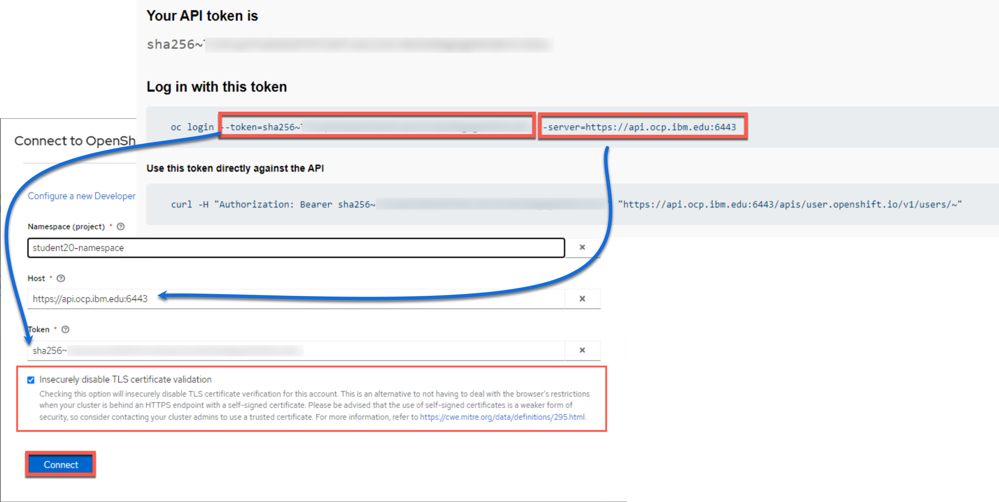
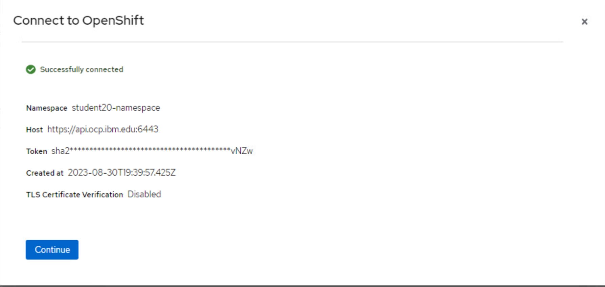

# Vacation Days - Consuming Decisions

There are several ways to consume decisions, but the first way we will explore is through the utilization of the Canvas provided methods, but there will also be methods showing how to do it with {{ product.legacy }} provided as informational and not required for these exercises.

## Deploying and testing the Decision Service

With our decision model completed, we can now package our DMN model in a Kogito service. This can be done using the Accelerators included with {{ product.canvas }}. These accelerators will quickly take the DMN file and start building the basis of the project as a {{ product.name }} compatible decision service.

## Applying the Accelerator

To take this decision service from a standalone DMN model to a full Kogito architected decision, you will use the accelerator by clickig the button at the top of the screen. To do so follow the instructions and then we will synchronize the project to your GitHub account and also be capable being deployed as an OpenShift service.

1. At the top of the DMN model page for `vacation-days`, click the button `Apply Accelerator` and select **Quarkus...**.
  
    

1. If you want to learn more about the accelerator, you can click the GitHub link and change the branch to the `9.0.0-quarkus-full` to learn more about it. Afterwards just click **Apply** to restructure your project into a Kogito service.

    

1. The wizard will come with a pop-up asking for a commit message for the change since this will create a Git project. You can use the default message or put whatever you would like, to do so press **Commit**.

    

1. To create the project in Git, click **Share**, use your GitHub tokened ID.

    

1. Once you select your ID, a new option **Create GitHub repository...** is now available, select this.

    
    
2. The repository you create, can be anything you want, for the purposes of this lab, it will be called **techxchange-vacation-days**.

    

3. When you create the repository, a message will open at the top with a link to the Git repository that was created. In the case of the example it is at [this example repository](https://github.com/timwuthenow/techxchange-vacation-days).

    

## Deploying to OpenShift

Now that this repository is created, you can work on it locally or deploy it to OpenShift. For this lab, we will choose OpenShift since we have a cluster ready to use for TechXchange or you can use the [Red Hat OpenShift Sandbox](https://developers.redhat.com/developer-sandbox) to provision a small environment to try it out on your own.

1. Login to get an OpenShift Token using the bookmark on Chrome. This will be used to connect {{ product.canvas }} to OpenShift and deploy a sample development environment of the decision service.

    

1. In the login screen use your username and password - this will be some combination of `student01` to `student20` with password `Passw0rd`. The username is all lowercase. This will

    

1. Click the **Display Token** link and switch back to the tab with {{ product.canvas }} open on it. You will use the token contents from the OpenShift token page shortly by clicking on **Dev deployments** and then selecting the pull down **Select authentication** and then **Connect to an account**.

    

1. On the next wizard, select the **OpenShift Tile** to connect to an OpenShift instance.

    

1. From here you will use the information from the OpenShift token page. Your namespace will be your `student##-namespace`, so if your username is student07, then you would connect to *student07-namespace*. The token and the console locations are both a part of the token as well. You will see a checkbox to Insecurely disable TLS validation, check it as this is a self contained environment with certificates not present. Press **Connect** when the form is completed.

    

1. As long as it was successful to connect, you will be greeted with a Connect to OpenShift successful modal, click **Continue**.

    

1. Now you can press the **Deploy** button and have the capability to select the namespace that you connected to and deploy a sample of your service to it.

    

1. From here a modal will pop up explaining that the deployment can take a few minutes and it is only intended for development, etc. Click **Confirm** on this modal and your service will be deployed.

    

1. This process will take several minutes to complete.

    

1. The pulldown with deploy will refresh every 30 seconds, when the service is available, it will reflect as such. The way that the deployments from these services work are is that they are completely immutable and unaware of one another, so you could have all versions deployed as you make changes to validate how you want to eventually promote your DMN model to later environments. So if you were to deploy it again, there would be multiple different versions of it deployed. Canvas can manage these deployment samples, which can later be removed when you're done with them if you choose. If you click the green check marked box, it will take you to the service.

    

1. When you access the service with a form similar to the one you had in {{ product.canvas }} and from that page you can explore it more using the kebab icon in the top right to access the Swagger-UI page to get access to the auto-generated DMN service's API page. The first post can be used to execute the decision itself.

    

1. This completes this lab as you can see how the deployment to OpenShit works with {{ product.canvas }}!

## Deploying the Decision Service in KIE Server (Not for TechXchange)

This section is not needed for TechXchange, but is just to provide some extra ways to showcase now you can deploy your decision. With our decision model completed, we can now package our DMN model in a Deployment Unit (KJAR) and deploy it on the Execution Server. To do this:

1. In the bread-crumb navigation in the upper-left corner, click on `vacation-days-decisions` to go back to the project’s Library View.

1. Click on the **Deploy** button in the upper-right corner of the screen. This will package our DMN mode in a Deployment Unit (KJAR) and deploy it onto the Execution Server (KIE-Server).

1. Go to the **Execution Servers** perspective by clicking on "Menu → Deploy → Execution Servers". You will see the **Deployment Unit** deployed on the Execution Server.

## Testing DMN Solution

In this section, you will test the DMN solution with Execution Server’s Swagger interface and via Java KIE Client API.

## Testing the solution via REST API

In this section, you will test the DMN solution with KIE Server’s Swagger interface.

The Swagger interface provides the description and documentation of the Execution Server’s RESTful API. At the same time, it allows the APIs to be called from the UI. This enables developers and users to quickly test, in this case, a deployed DMN Service.

1. Navigate to [KIE Server](http://localhost:8080/kie-server/docs)

1. Locate the **DMN Models** section. The DMN API provides the DMN model as a RESTful resources, which accepts 2 operations:

    1. `GET`: Retrieves the DMN model.

    1. `POST`: Evaluates the decisions for a given input.

1. Expand the `GET` operation by clicking on it.

1. Click on the **Try it out** button.

1. Set the **containerId** field to `vacation-days-decisions` and set the **Response content type** to `application/json` and click on **Execute** {:width="600px"}

1. If requested, provide the username and password of your **Business Central** and **KIE-Server** user.

1. The response will be the model-description of your DMN model.

Next, we will evaluate our model with some input data. We need to provide our model with the **age** of an employee and the number of **years of service**. Let’s try a number of different values to test our deicions.

1. Expand the `POST` operation and click on the **Try it out** button

1. Set the **containerId** field to `vacation-days-decisions`. Set the **Parameter content type** and **Response content type** fields to `application/json`.

1. Pass the following request to lookup the number of vacation days for an employee of 16 years old with 1 year of service (note that the namespace of your model is probably different as it is generated. You can lookup the namespace of your model in the response/result of the `GET` operation you executed ealier, which returned the model description).

   ~~~json
        { "dmn-context":{ "Age":16, "Years of Service":1 } }
   ~~~

1. Click on **Execute**. The result value of the `Total Vacation Days` should be 27.

1. Test the service with a number of other values. See the following table for some sample values and expected output.

  <table>
    <colgroup>
      <col style="width: 33%" />
      <col style="width: 33%" />
      <col style="width: 33%" />
    </colgroup>
    <tbody>
      <tr class="odd">
        <td>
          
Age

        </td>
        <td>
          
Years of Service

        </td>
        <td>
          
Total Vacation Days

        </td>
      </tr>
      <tr class="even">
        <td>
          
16

        </td>
        <td>
          
1

        </td>
        <td>
          
27

        </td>
      </tr>
      <tr class="odd">
        <td>
          
25

        </td>
        <td>
          
5

        </td>
        <td>
          
22

        </td>
      </tr>
      <tr class="even">
        <td>
          
44

        </td>
        <td>
          
20

        </td>
        <td>
          
24

        </td>
      </tr>
      <tr class="odd">
        <td>
          
44

        </td>
        <td>
          
30

        </td>
        <td>
          
30

        </td>
      </tr>
      <tr class="even">
        <td>
          
50

        </td>
        <td>
          
20

        </td>
        <td>
          
24

        </td>
      </tr>
      <tr class="odd">
        <td>
          
50

        </td>
        <td>
          
30

        </td>
        <td>
          
30

        </td>
      </tr>
      <tr class="even">
        <td>
          
60

        </td>
        <td>
          
20

        </td>
        <td>
          
30

        </td>
      </tr>
    </tbody>
  </table>

## Using the KIE Java Client (if you were using {{ product.legacy }})

IBM {{ product.legacy }} provides a KIE Java Client API that allows the user to interact with the KIE-Server from a Java client using a higher level API. It abstracts the data marshalling and unmarshalling and the creation and execution of the RESTful commands from the developer, allowing him/her to focus on developing business logic.

In this section we will create a simple Java client for our DMN model.

**IMPORTANT:** If your KIE Server is exposed via https you need to configure the ``javax.net.ssl.trustStore and `javax.net.ssl.trustStorePassword` in the Java client code using the Remote Java API. If not, you may get a `rest.NoEndpointFoundException`. For more information check [this solution](https://access.redhat.com/solutions/5424601) Red Hat's knowledge base.

1. Create a new Maven Java JAR project in your favourite IDE (e.g. IntelliJ, Eclipse, Visual Studio Code).

1. Add the following dependency to your project:

   ~~~xml
     <dependency> 
       <groupId>org.kie.server</groupId> 
       <artifactId>kie-server-client</artifactId> 
       <version>{{ product.legacygav }}</version> 
       <scope>compile</scope> 
     </dependency>
   ~~~

1. Create a Java package in your `src/main/java` folder with the name `org.kie.dmn.lab`.

1. In the package you’ve just created, create a Java class called `Main.java`.

1. Add a `public static void main(String[] args)` method to your main class.

1. Before we implement our method, we first define a number of constants that we will need when implementing our method (note that the values of your constants can be different depending on your environment, model namespace, etc.):

    ~~~java
     private static final String KIE_SERVER_URL = "http://localhost:8080/kie-server/services/rest/server"; 
     private static final String CONTAINER_ID = "vacation-days-decisions"; 
     private static final String USERNAME = "bamAdmin"; 
     private static final String PASSWORD = "ibmpam1!"; 
    ~~~

    !!! 📘 INFO: If you're using the Linux environment on Skytap use the following.

        ~~~java
        private static final String KIE_SERVER_URL = "http://localhost:8080/kie-server/services/rest/server"; 
        private static final String CONTAINER_ID = "vacation-days-decisions"; 
        private static final String USERNAME = "pamadmin"; 
        private static final String PASSWORD = "pamadm1n"; 
        ~~~

1. KIE-Server client API classes can mostly be retrieved from the `KieServicesFactory` class. We first need to create a `KieServicesConfiguration` instance that will hold our credentials and defines how we want our client to communicate with the server:

    ~~~java
    KieServicesConfiguration kieServicesConfig = KieServicesFactory.newRestConfiguration(KIE_SERVER_URL, new EnteredCredentialsProvider(USERNAME, PASSWORD)); 
    ~~~

1. Next, we create the `KieServicesClient`:

    ~~~java
    KieServicesClient kieServicesClient = KieServicesFactory.newKieServicesClient(kieServicesConfig); 
    ~~~

1. From this client we retrieve our DMNServicesClient: 

    ~~~java
    DMNServicesClient dmnServicesClient = kieServicesClient.getServicesClient(DMNServicesClient.class); 
    ~~~

1. To pass the input values to our model to the Execution Server, we need to create a `DMNContext`: 

    ~~~java
    DMNContext dmnContext = dmnServicesClient.newContext();
    dmnContext.set("Age", 16); dmnContext.set("Years of Service", 1);
    ~~~

1. We now have defined all the required instances needed to send a DMN evaluation request to the server: 

    ~~~java
    ServiceResponse<DMNResult> dmnResultResponse = dmnServicesClient.evaluateAll(CONTAINER_ID, dmnContext);
    ~~~

1. Finally we can retrieve the DMN evaluation result and print it in the console:

    ~~~java
    DMNDecisionResult decisionResult = dmnResultResponse.getResult().getDecisionResultByName("Total Vacation Days"); System.out.println("Total vacation days: " + decisionResult.getResult()); 
    ~~~

1. Compile your project and run it. Observe the output in the console, which should say: **Total vacation days: 27**

    The complete project can be found [here](https://github.com/kmacedovarela/dmn-workshop-labs/tree/master/vacation-days-dmn-lab-client)

    ~~~java
    package org.kie.dmn.lab;
    
    import org.kie.api.builder.KieScannerFactoryService;
    import org.kie.api.internal.weaver.KieWeaverService;
    import org.kie.dmn.api.core.DMNContext;
    import org.kie.dmn.api.core.DMNDecisionResult;
    import org.kie.dmn.api.core.DMNResult;
    import org.kie.server.api.model.ServiceResponse;
    import org.kie.server.client.CredentialsProvider;
    import org.kie.server.client.DMNServicesClient;
    import org.kie.server.client.KieServicesClient;
    import org.kie.server.client.KieServicesConfiguration;
    import org.kie.server.client.KieServicesFactory;
    import org.kie.server.client.credentials.EnteredCredentialsProvider;
    
    /**
     * Vacation Days DMN Client
     */
    public class Main {
    
        private static final String KIE_SERVER_URL = "http://localhost:8080/kie-server/services/rest/server";
    
        private static final String CONTAINER_ID = "vacation-days-decisions";
    
        private static final String USERNAME = "bamAdmin";
    
        private static final String PASSWORD = "ibmpam1!";
        // Comment out the above 2 lines if using the Skytap image and uncomment the two below to use those logins
        // private static final String USERNAME = "pamadmin";
        // private static final String PASSWORD = "pamadm1n";
    
        public static void main(String[] args) {
            CredentialsProvider credentialsProvider = new EnteredCredentialsProvider(USERNAME, PASSWORD);
            KieServicesConfiguration kieServicesConfig = KieServicesFactory.newRestConfiguration(KIE_SERVER_URL, credentialsProvider);
            KieServicesClient kieServicesClient = KieServicesFactory.newKieServicesClient(kieServicesConfig);
    
            DMNServicesClient dmnServicesClient = kieServicesClient.getServicesClient(DMNServicesClient.class);
    
            DMNContext dmnContext = dmnServicesClient.newContext();
            dmnContext.set("Age", 16);
            dmnContext.set("Years of Service", 1);
    
            ServiceResponse<DMNResult> dmnResultResponse = dmnServicesClient.evaluateAll(CONTAINER_ID, dmnContext);
    
            DMNDecisionResult decisionResult = dmnResultResponse.getResult().getDecisionResultByName("Total Vacation Days");
            System.out.println("Total vacation days: " + decisionResult.getResult());
        }
    }
    ~~~
