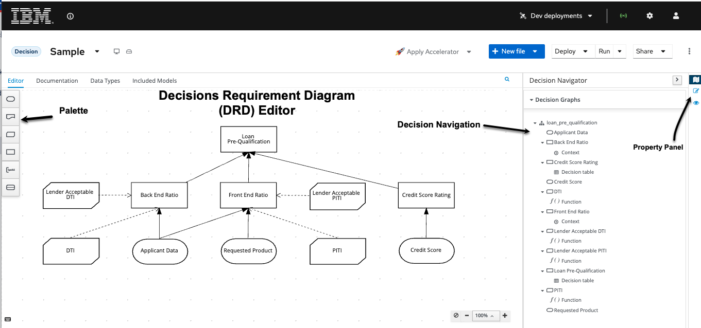
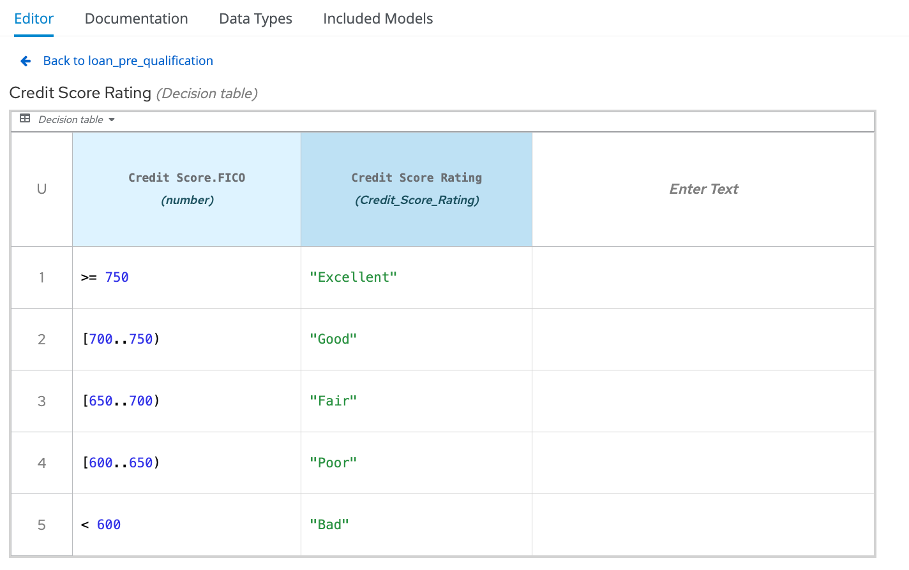
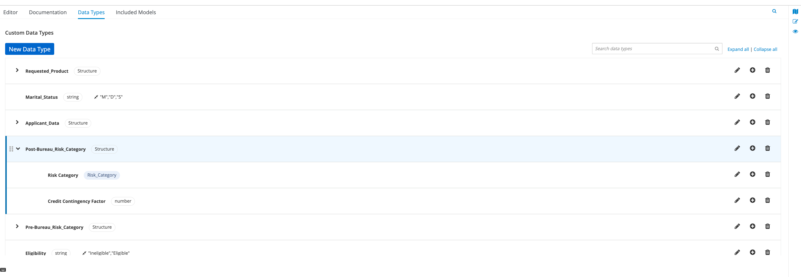
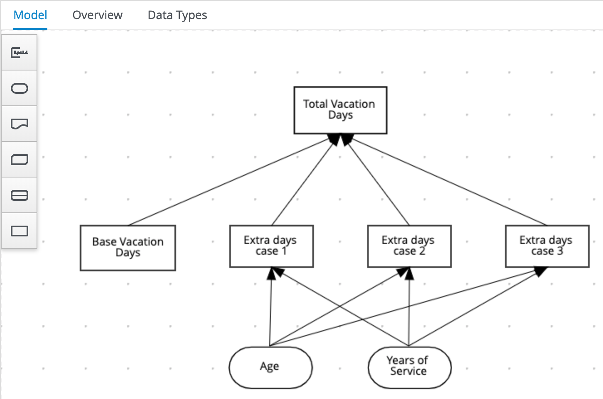
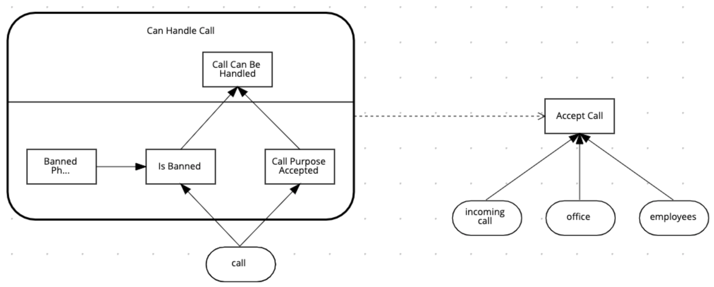

# Introduction

This is a series of guided exercises that will allow you to experiment the authoring of decisions using Decision Model and Notation - DMN. You will be able to experiment decision authoring in Business Central, along with the deployment and consumption of the decisions in the engine, KIE Server.

## What is DMN

Take a look at the explanation of the [DMN](http://omg.org/dmn) standard in the OMG website:

_"DMN is a modeling language and notation for the precise specification of business decisions and business rules. DMN is easily readable by the different types of people involved in decision management. These include: business people who specify the rules and monitor their application; business analysts._

_DMN is designed to work alongside BPMN and/or CMMN, providing a mechanism to model the decision-making associated with processes and cases. While BPMN, CMMN and DMN can be used independently, they were carefully designed to be complementary. Indeed, many organizations require a combination of process models for their prescriptive workflows, case models for their reactive activities, and decision models for their more complex, multi-criteria business rules. Those organizations will benefit from using the three standards in combination, selecting which one is most appropriate to each type of activity modeling. This is why BPMN, CMMN and DMN really constitute the “triple crown” of process improvement standards."_

{{ product.name }} brings a set of graphical tooling that allow you to author decisions using DMN and a lightweight engine that can execute these decisions. The engine and the authoring tooling set are decoupled and you can scale it independently.

## Tooling Set

In {{ product.name }} you can author decisions in multiple ways - all using the exact same editor in different environments:

- [{{ product.canvas }}]( {{ sandbox.production }}){:target="blank"} which is the latest way to easily edit DMN and BPMN models for consumption with {{ product.name }}. This is the highly scalable and lightweight method for maintaining diagrams that the community has moved towards and IBM is embracing and working hard on!
- [Business Automation VSCode Extension](https://marketplace.visualstudio.com/items?itemName=redhat.vscode-extension-red-hat-business-automation-bundle)
  - A developer IDE ([Visual Studio Code](https://code.visualstudio.com/)) extension that allows the visualization and editing of BPMN, DMN and Test Scenarios inside VSCode.
- If you are currently using {{ product.legacy }} and are utilizing things like KIE Server and Business Central, you can also build the DMN model within there. The preference for this lab is to focus on {{ product.name }}, but this option is capable of being done. A core component of {{product.name }} is intercompatability between versions and IBM's heavy emphasis on DMN is that the models produced for varying levels of the product are still compatible across releases. The walkthroughs are going to focus on {{product.canvas}} for the DMN labs.

There are also tools provided by the Community that's are also available for use. Some of these tools below are developed in part by IBM and Red Hat, but are not included in the subscription for support:

- [DMN FEEL Handbook](https://kiegroup.github.io/dmn-feel-handbook/#dmn-feel-handbook)
  - A handbook for the FEEL expression language from the DMN specification, as implemented by the Drools DMN open source engine.
- [Learn DMN in 15 minutes](https://learn-dmn-in-15-minutes.com/)
  - A guided tour in a website through the elements of DMN
- [GitHub Chrome Extension](https://chrome.google.com/webstore/detail/bpmn-dmn-test-scenario-ed/mgkfehibfkdpjkfjbikpchpcfimepckf)
  - A browser extension that allows you to visualize and edit BPMN, DMN and Test Scenario files directly in GitHub.
- [Online Editors](https://kiegroup.github.io/kogito-online/#/)
  - [BPMN.new](http://bpmn.new) - A free online editor for business processes;
  - [DMN.new](http://dmn.new) - A free online editor for decision models;
  - [PMML.new](http://pmml.new) - A free online editor for scorecards;

## The DMN Editor Interfaces

The DMN Editor consists of a number of components:

### Editor Pane

From the Editor pane you can edit and view multiple areas including:

- **Decision Navigator**: shows the nodes used in the Decision Requirements Diagram (DRD, the diagram), and the decisions behind the nodes. Allows for quick navigation through the model.

- **Decision Requirements Diagram Editor**: the canvas in which the model can be created.

- **Palette**: Contains all the DMN constructs that can be used in a DRD, e.g. Input Node, Decision Node, etc.

- **Expression Editor**: Editor in which DMN boxed expressions, like decision tables and literal expressions, can be created.

- **Property Panel**: provides access to the properties of the model (name, namespace, etc), nodes, etc.

{:width="800px" caption="Decisions Requirement Diagram"}

{:width="800px"}

### Data Types Pane

Within the Data Types pane you can define data types that are used for your decision, including complex types.

{:width="800px"}

## Guided Labs

These are the labs you have available in this workshop:

- Insurance Price calculation: a getting started exercise. You will import an existing module, explore it, deploy it and test it using the {{ product.extended }}' DMN Runner feature.

    {:width="600px"}

- Vacation Days: an intermediate level exercise. You will author a model from scratch, use decision tables, work with different hit policies, different FEEL constructs and expressions. Finally, you will deploy it and test it using at least the {{ product.extended }}' DMN Runner feature, but also capable of running it on OpenShift if you decide to do so.

    {:width="600px"}

- Call Center: an advanced level exercise. You will author a model from scratch, create data types, consume DMN decision services from within decision nodes, and more FEEL constructs and expressions. Finally, you will deploy it and test it using at least the {{ product.extended }}' DMN Runner feature, but also capable of running it on OpenShift if you decide to do so.

    {:width="800px"}

These are independent guided exercises and you don't need to implement the previous use case to implement the next one. If you are more comfortable with DMN, you can go to the more advanced labs immediately.
