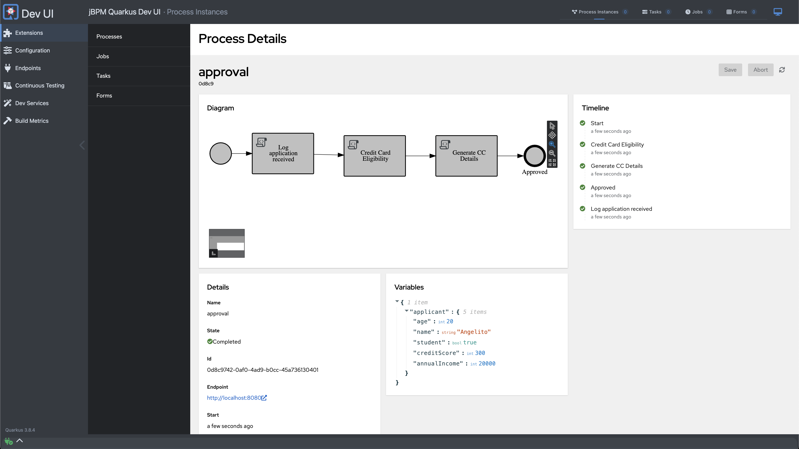

# Running a basic process service

## About BPMN in BAMOE

BPMN nodes provide a variety of functionalities to automate business processes. Here's a quick overview of some key BPMN nodes and their purposes:

| **BPMN Node**  | **Purpose**                                  | **When to Use**                                      | **Example**                                         |
|----------------|----------------------------------------------|------------------------------------------------------|-----------------------------------------------------|
| Script Task    | Execute code within process                  | Quick, simple logic                                  | Calculate a value in JavaScript                     |
| Service Task   | Invoke external services or custom Java code | Integrate with other systems or process custom logic | Call a REST API, or trigger a logic in a java class |
| Human Task     | Involve human interaction                    | Manual input/approval needed                         | Assign approval to manager                          |
| Timer Event    | Time-based events                            | Scheduling, delays, timeouts                         | Wait 24h before reminder                            |
| Gateway        | Control process flow                         | Decision points, parallel processing                 | Route high-value orders differently                 |
| DMN Task       | Execute complex decision logic               | automated decisions                                  | Determine credit eligibility                        |

### Note on Automatic Marshalling

BAMOE auto-maps process variables to DMN inputs/outputs by name and type. Here's a simplified explanation:

**Automatic Marshalling in BAMOE**:

The **basic principle** of this capability relies on BAMOE usage of Java reflection to convert POJOs (Plain Old Java Objects) to DMN data types and vice versa.

It can be seen when:

- When passing data from process to DMN: It maps POJO fields to corresponding DMN input fields.
- When receiving data from DMN to process: DMN output is converted back into the appropriate Java object.

!!! tip

    Matching Criteria: Field names in the POJO should match DMN input/output names. Data types should be compatible (e.g., Java String to DMN string).


This automatic marshalling simplifies data exchange between BAMOE processes and DMN decision services, reducing the need for manual data transformation in many cases.

## Cloning the Project and Running Quarkus Dev Mode

First, let's clone the starter project to your local repository and run it using Quarkus dev mode.

### Steps:

1. **Clone the Repository**:

      ```sh
      git clone https://github.com/kmacedovarela/cc-application-approval-starter
      cd cc-application-approval-starter
      ```

2. Run Maven Quarkus Dev Mode:

     ```sh
     mvn quarkus:dev
     ```

3. Open the Browser and navigate to http://localhost:8080/q/dev-ui.

4. Locate and click on _Process instances_ in the **jBPM Quarkus Dev UI add-on**.
  
    

5. Start a new process from the process definition list.

    

    

7. Open the process details, and check the process instance progress, and the variable values.

    

----

:material-check-circle-outline: _Awesome!! You've successfully cloned the project and started it using Quarkus dev mode. Next, let's explore how to extend the process design with various tasks in {{ product.canvas }}._
