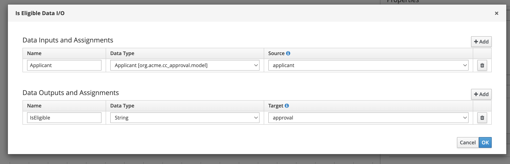
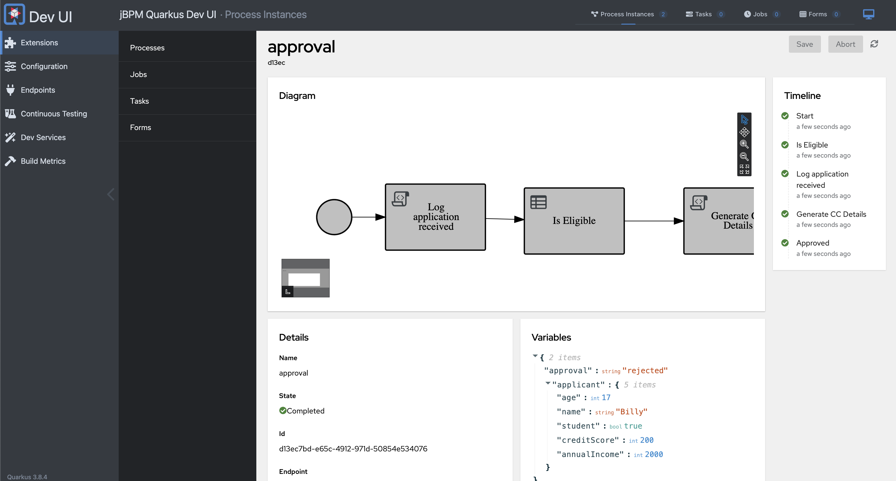
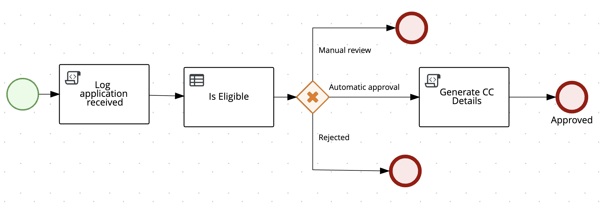

# Using DMN Decisions in Processes

In this section, you will learn how to use DMN-based business rules task to automate decisions in your process, leveraging process variables and data types.

1. In VSCode, open the process `approval.bpmn`, and delete the script task named `Check Card Eligibility`.
2. Add a new **business rules task** to the process diagram, named **Is Eligible**.

     

## Configuring the Business Rules Task

1. Configure the business rules task to consume the decision model. You can find and double check the information below, in the DMN file `CreditCardEligibility.dmn` available in your project: 

    ``` java
    Rule Language: DMN
    Filename: CreditCardEligibility.dmn
    Namespace: https://kie.org/dmn/_639D6115-E08E-439D-8D29-45750C32DB28
    Decision Name: IsEligible
    DMN Model Name: Credit Card Eligibility Validation
    ```
    
     

2. Configure the inputs and outputs of the task, by clicking on **Assignments** and using the following info:

    **Input**: `Applicant`, `org.acme.cc_approval.model.Applicant`, `applicant`
    **Output**: `IsEligible`, `String`, `approval`

     

## Validating the DMN Configuration

1. Open the DMN File and verify that the `Applicant` data type is part of the DMN model and matches the process variable. 
2. Now, open the class `org.acme.cc_approval.model.Applicant` and check the attributes there. See the similarity with the data type?

The process variable `applicant` matches the data type in the DMN model, ensuring seamless data flow between the process and the decision model.

## Running the Process with DMN Automation

1. Start Quarkus in Dev Mode:

     ```sh
     mvn quarkus:dev
     ```

2. Open the Dev UI, navigate to `http://localhost:8080/q/dev-ui`. 
3. Start a new process instance from the approval process definition.
4. Check Process Variables: Verify the variables of the completed instance to ensure the DMN decision was executed correctly.

    

5.    These test scenarios help you validate different outcomes based on the input data for the DMN-based decision automation.  Test with different data that will result on different outcomes in the decision.

      | Scenario              | Is Student | Annual Income | Credit Score | Age |
      |-----------------------|------------|---------------|--------------|-----|
      | Automatic Approval    | false      | 15000         | 750          | 25  |
      | Automatic Rejection   | false      | 15000         | 750          | 17  |
      | Manual Review         | false      | 30000         | 600          | 20  |

6. Stop Quarkus and close the dev ui in your browser.

## Configuring Different Outcomes Based on Automated Decisions

1. Now, with the process working, let's add the gateways to handle the three possible scenarios: **Automatic approval**, **Automatic rejection**, **Manual Approval**.

   2. Add an exclusive gateway after the decision node, and let's configure the possible outcomes:
   
      a. **Automatic Approval**:
         - For the sequence flow leading to the approval end event, use the condition:
           ```javascript
           return approval.toLowerCase().equals("approved");
           ```
   
      b. **Manual Approval**:
         - For the sequence flow leading to the manual review end event, use the condition:
           ```javascript
           return approval.toLowerCase().equals("manual");
           ```
   
      c. **Automatic Rejection**:
         - For the sequence flow leading to the rejection end event, use the condition:
           ```javascript
           return approval.toLowerCase().equals("rejected");
           ```

3. Add three different paths from the gateway, each leading to an end event.

    
   
4. Connect each sequence flow to a respective end event.
5. Generate the SVG diagram in VSCode to visualize the process.
6. Run `mvn quarkus:dev` to start Quarkus in development mode.
7. Start a new process instance and test the three different scenarios (approved, manual, rejected).
8. Verify the instance details for each scenario.
9. Close the dev-ui and stop quarkus.

---

:material-check-circle-outline: _Awesome! You've successfully configured the process to handle different outcomes based on automated decisions. With the exclusive gateway and the conditions set for approval, manual review, and rejection, your process is now more dynamic and responsive. Next, let's proceed with using the service task to further enhance our process automation capabilities._
