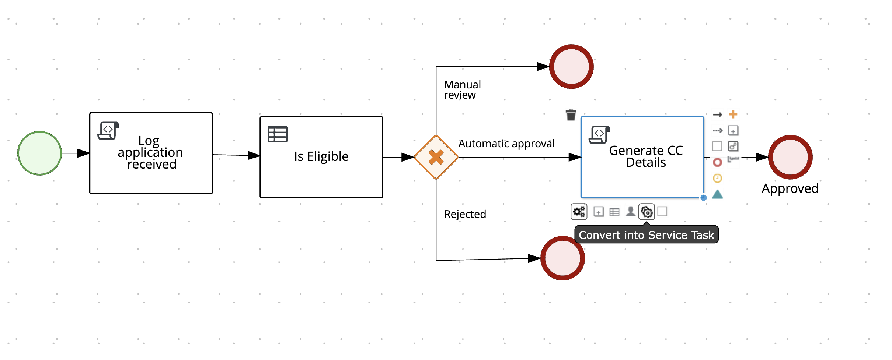
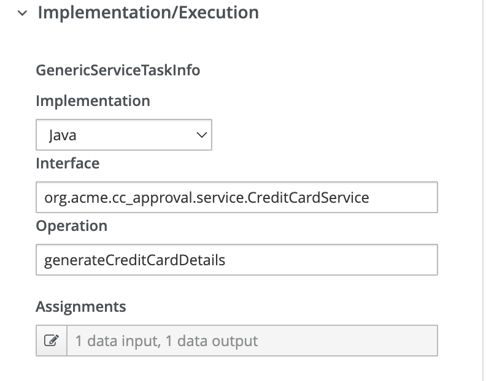
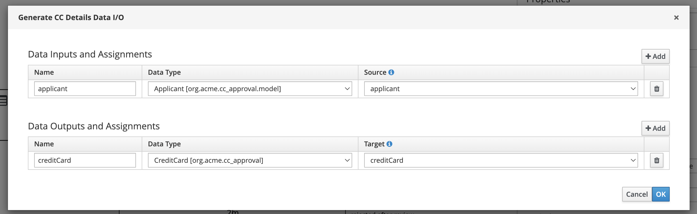
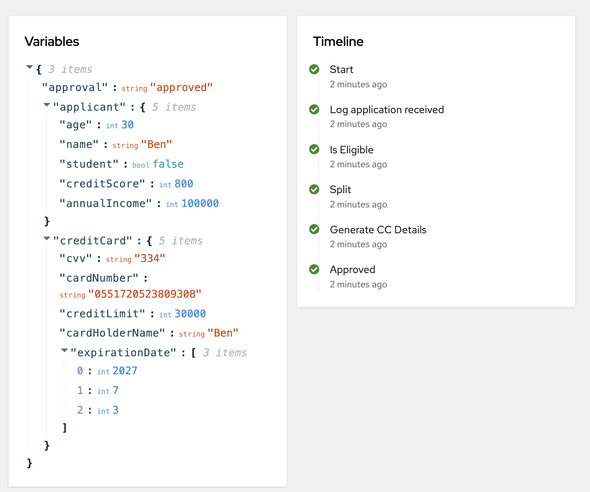

# Custom Logic with Service Tasks

## Adding a Service Task for Credit Card Generation

When a card application is approved, we need to generate the credit card details. We can use Java to process this generation, providing a more flexible and powerful way to create the card information.

### Understanding the Service Class

Open the `CreditCardService` class in your project. This class contains the logic for generating credit card details:

```java
@ApplicationScoped
public class CreditCardService {
    public CreditCard generateCreditCardDetails(Applicant applicant) {
        double creditLimit = applicant.getAnnualIncome() * 0.3;
        return new CreditCard(applicant.getName(), creditLimit);
    }
}
```

This service calculates a credit limit based on 30% of the applicant's annual income and creates a new `CreditCard` object with the applicant's name and the calculated credit limit.

### Adding the Service Task to Your BPMN

You can incorporate custom Java code into your processes using service tasks. Here's how to add and configure a service task for credit card generation:

1. Open the approval process in VSCode.
2. Add a new service task on the approved path, after the existing gateway and before the end node.

   

3. Name the new service task "Generate CC Details".
4. Configure the service task with these attributes:

    - Implementation: `java`
    - Interface: `org.acme.cc_approval.service.CreditCardService`
    - Operation: `generateCreditCardDetails`
   
      
 

The input assignment sends the process data as a parameter to the method, while the output assignment brings the method's return value back to the process and assigns it to a process variable.

Assignments: 
 - Input Assignment:
     - Name: `applicant`
     - Data Type: `Applicant`
     - Source: `applicant`
 - Output Assignment:
     - Name: `creditCard`
     - Data Type: `CreditCard`
     - Target: `creditCard
       
   

### Testing the Updated Process

To test your updated process:

1. Start Quarkus in dev mode using the command line.
2. Open the Quarkus Dev UI in your browser.
3. Start a new process instance with an approved application to see the card details in the instance data.
4. Examine the process instance details, paying particular attention to the generated credit card values.

   

5. After testing, close the Dev UI and stop Quarkus.

---

:material-check-circle-outline: _By following these steps, you've successfully integrated a Java service task into your BPMN process to generate credit card details upon approval. This demonstrates how you can leverage custom Java code to enhance your business processes with complex logic and data manipulation._