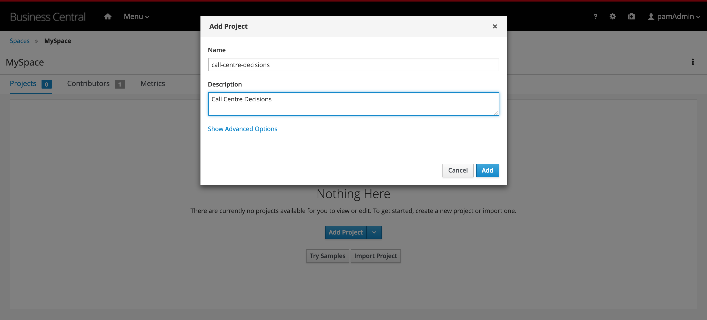

## Create a Decision Project

To define and deploy a DMN decision model, we first need to create a new project in which we can store the model. To create a new project:

1. Navigate to [{{product.canvas}}](https://localhost:8080/business-central)

1. Login to the platform with the provided username and password.

1. Click on **Design** to navigate to the Design perspective.

    {:width="600px"}

1. In the Design perspective, create a new project. If your space is empty, this can be done by clicking on the blue **Add Project** button in the center of the page. If you already have projects in your space, you can click on the blue **Add Project** icon at the top right of the page.

1. Give the project the name `call-centre-decisions`, and the description "Call Centre Decisions".

    {:width="600px"}

1. With the project created, we can now create our DMN model. Click on the blue **Add Asset** button.

1. In the **Add Asset** page, select **Decision** in the dropdown filter selector.

    {:width="600px"}

1. Click on the **DMN** tile to create a new DMN model. Give it the name `call-centre`. This will create the asset and open the DMN editor.

{:width="600px"}

## Next Steps

You can do this lab in 2 ways:

1. If you already have (some) DMN knowledge, we would like to challenge you to build the solution by yourself. After you’ve built solution, you can verify your answer by going to the next module in which we will explain the solution and will deploy it onto the runtime.

1. Follow this step-by-step guide which will guide you through the implementation.
