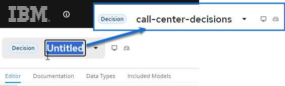
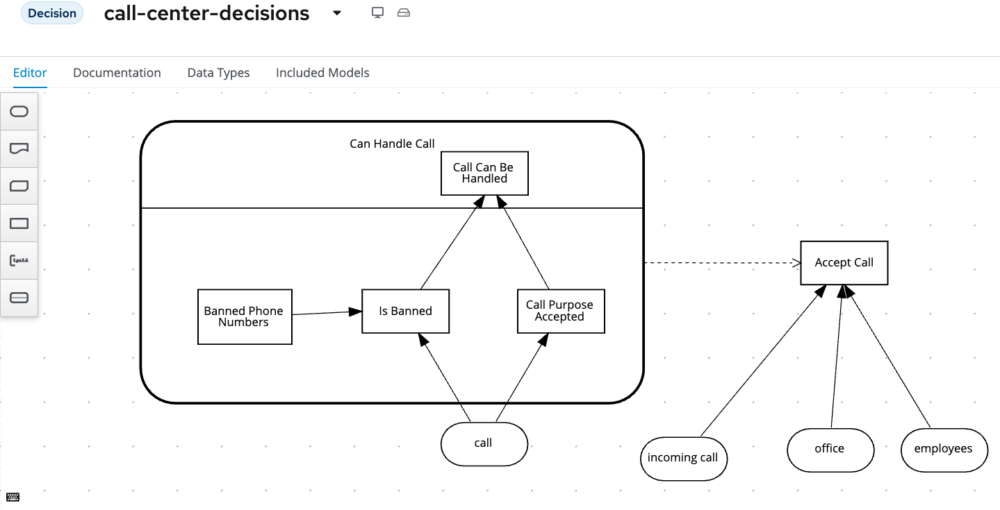

# Call Centre - Intro and Use Case

This is an advanced Decision Model & Notation lab that introduces DMN Decision Services, Relations, nested boxed expressions, etc. It also explores a number of different FEEL constructs and expressions like, for example, `list contains`.

## Goals

- Implement a DMN model using the {{product.canvas}} DMN editor
- Deploy the existing DMN project to OpenShift

## Problem Statement

In this lab we will create a decision that determines if a call-center can take an incoming call. Whether a call will be accepted by a certain office depends on:

- The office accepts the call.

- There are employees currently available at the office.

Whether the office can accepts a call depends on:

- whether the phone number has been banned

- the purpose of the phone call ("help" or "objection").

## Create a new DMN Decision

Similar to the first lab, we're going to use {{ product.canvas }} to define and deploy a DMN decision model, we first need to create a new model:

1. Navigate to [{{product.canvas}}](https://localhost:9090)

2. From the {{ product.canvas }} landing page, you can create and edit various types of open-standards models in BPMN, DMN and PMML using the editors here. We will be creating a DMN model for this lab, so to do this, you can click **New Decision** to create a new DMN model.

    

3. You will now have an empty canvas and can start working on your DMN model for designing the number of vacation days decision. Change the name at the top of the model from `Untitled` to `call-center-decisions` or whatever you want to call it.

    

1. In the next section we will start to create the decision. 

## Next Steps

You can do this lab in 2 ways:

1. If you already have (some) DMN knowledge, we would like to challenge you to build the solution by yourself. After you’ve built solution, you can verify your answer by going to the next module in which we will explain the solution and will deploy it onto the runtime.

1. Follow this step-by-step guide which will guide you through the implementation.

To do this on your own without the walk-through your model will ultimately end up looking like the below model with 5 Decision Nodes (*Banned Phone Numbers, Is Banned, Call Purpose Accepted, Call Can Be Handled, Accept Call*). Four of these are built in a Decision Service to control what parts of the decision are exposed when calling the service and ultimately a final decision to *Accept Call*.

   