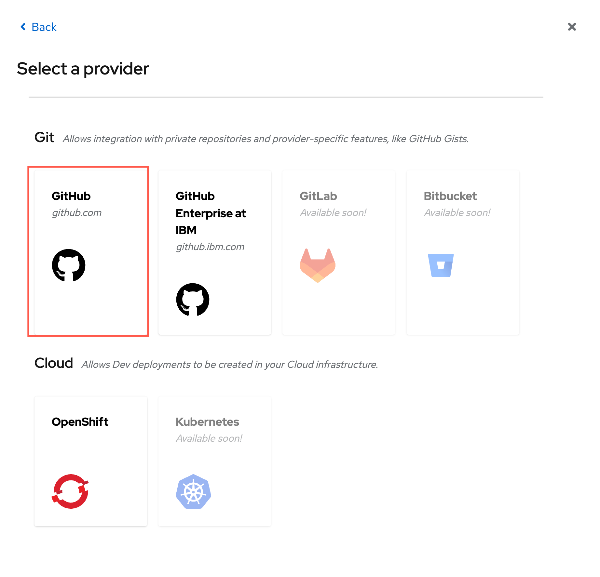
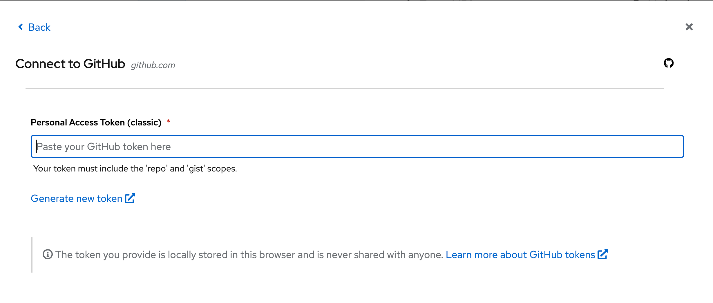
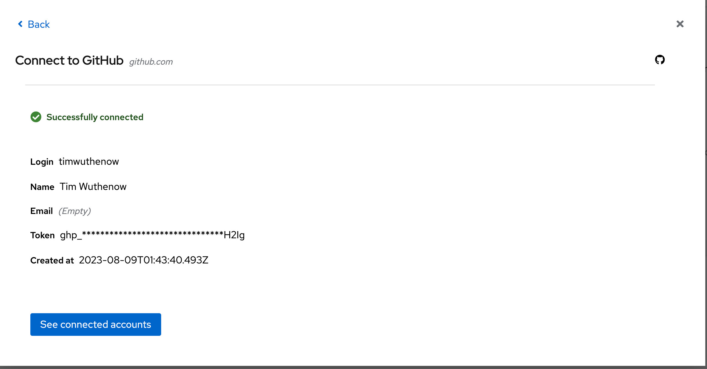
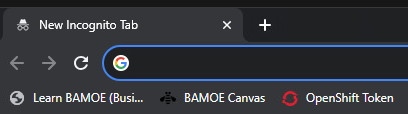
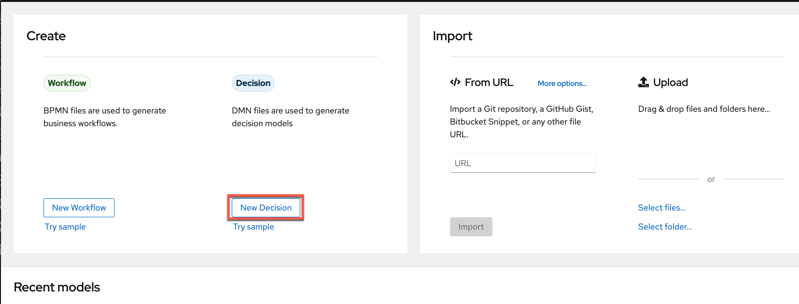
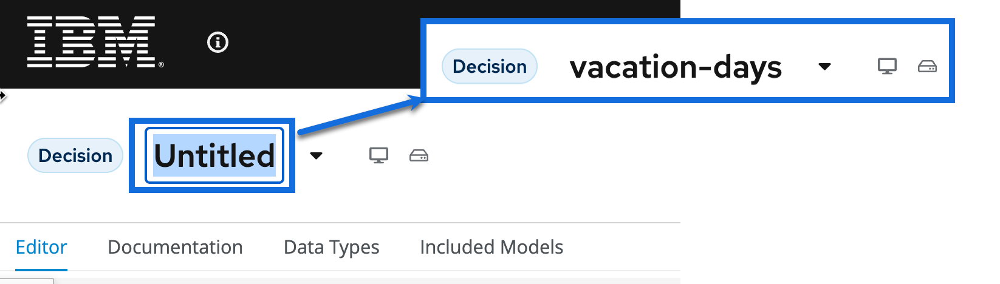

# Vacation Days - Use case and project creation

In this lab you'll try out the combination of DMN decision tables with literal expressions. You will also explore a number of different FEEL constructs and expressions like, for example, ranges. Finally, you'll learn how to deploy the solution as a sample to OpenShift.

## Goal

- Implement a DMN model using the {{ product.canvas }} DMN editor
- Deploy the existing DMN project to OpenShift
- Consume the DMN project using the REST API
<!-- - Consume the DMN project using a Java API -->

## Problem Statement

In this lab we will create a decision service that determines the number of vacation days assigned to a given employee. The number of vacation days depends on age and years of service.

- Every employee receives at least 22 days.

- Additional days are provided according to the following criteria which will be broken into separate decision nodes:

    1. Only employees younger than 18 or at least 60 years, will receive 5 days of vacation or employees with at least 30 years of service will receive an 7 extra days;

    1. Employees with at least 30 years of service get 4 more days and also employees of age 60 or more, receive 3 extra days, on top of possible additional days already given;

    1. If an employee has at least 15 but less than 30 years of service, 3 extra days are given. Two days are also provided for employees of age 45 or more. These extra days can not be combined with the 5 extra days.

## Link {{ product.canvas }} to your GitHub account and create a project in GitHub using {{ product.extended }}

When using {{product.canvas}} you can start from the decision model creation and work top-down to deliver your decision model. This is a feature that will enable you to create the decision model and publish a sample project to your Git provider. From here the project can be deployed in your traditional means or you can also utilize a sample service that {{product.canvas}} can create if you desire for _testing_ purposes.  To do this, you need to make sure your connection to GitHub is active with the token and from there you can jump right in!

### Link GitHub to your {{ product.canvas }}

In this section we will link your GitHub account to the {{ product.canvas }} so we can easily synchronize changes in DMN with GitHub and our tooling, in this case {{ product.canvas }}.

1. First click the User icon to connect your public GitHub account to the {{ product.canvas }}.

    

1. Click the **Connect to an account** button to add a new Git provider

    

2. Select the card for GitHub

    
    

3. Click _Generate new token_ to create a new token that will be used by {{ product.canvas }}

    

4. You can use similar properties to the token created below in the screenshot, but the main 2 to have right now are _repo_ and _gist_ - the others can be beneficial if you reuse this token for other purposes too, but are not required nor needed. You can change the date to never expiring or be as short as you want. Once the token is generated though, that is the only time you will see the actual token value.

    - _Name_: Name your token a unique name from any previously created
    - _Expiration_: This can either be a set time period, up to 1 year or never expiring
    - The checkboxes you need are **repo** and **gist** to get the full benefit of {{ product.canvas }}

    

5. Use the copy button that's created with the Token to use in {{ product.canvas }}.

    

6. Return to {{ product.canvas }} and insert the Token into the wizard.

    

7. When your token is pasted, the {{ product.canvas }} will return a similar screen to below towards your GitHub account signifying you've connected, your GitHub user ID and some extra details.

    

---------------

### Create a DMN Model and Create a Project in {{ product.canvas }}

Now that our account is linked, let's go ahead and create a new DMN model and then later produce a project for it that will reside in our GitHub repositories. {{ product.canvas }} provides an excellent way to both _push_ and _pull_ from your GitHub repositories. This methodology provides a true canvas over your process and decision models that sits on top of your artifact repositories as a means of seeing/creating/editing some of your most important assets for process and decision services.  From {{ product.canvas }}, you can create and edit various types of open-standards models in BPMN, DMN and PMML using the editors here. The editors are based on the standards, so if your model follows the standards, it will make a best effort representation of them to be able to edit. In theory a different DMN model written for another DMN platform would be editable if it follows the specification. In this lab you will see how we can use these editors to produce a model and a project that's ready to be deployable in OpenShift.

1. Navigate to {{ sandbox.production }}  and we will start creating a DMN model for a Vacation Days Decision. This will provide some of the basics of a DMN decision and start getting you acquainted to {{ product.canvas }} and DMN in general. This can either be done from the bookmark from Chrome on the desktop or by navigating to <https://localhost:9090/> on the provided image.

    

2. From the {{ product.canvas }} landing page, you can create and edit various types of open-standards models in BPMN, DMN and PMML using the editors here. We will be creating a DMN model for this lab, so to do this, you can click **New Decision** to create a new DMN model.

    

3. You will now have an empty canvas and can start working on your DMN model for designing the number of vacation days decision. Change the name at the top of the model from `Untitled` to `vacation-days` or whatever you want to call it.

    

1. In the next section we will start to create the decision. 
