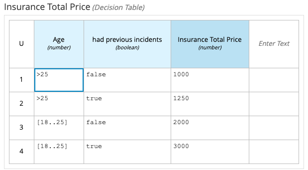

## Importing a DMN in Business Central

If you want to try this in Business Central, you can go through the following steps, but it is not required.

1. From the GitHub web page, click **Clone or download** on the right and then select **Download ZIP**:

1. Using your favorite file system navigation tool, locate the downloaded ZIP file and unzip it to a directory in your file system.

    - From this point forward, this location is referred to as `$PROJECT_HOME`.

1. Log in to Business Central. You can use either `{{ bamAdmin }}:{{ bamPass }}` to do so or whatever login you have created on your instance.

1. Create a project in Business Central called `policy-price`.

1. In the empty project library view for the `policy-price` project, click **Import Asset**.

    {:width="600px"}

1. In the **Create new Uploaded file** dialog, enter `insurance-pricing.dmn` in the **Uploaded file** field:

    {:width="600px"}

1. Using the browse button at the far right of the field labeled **Please select a file to upload**, navigate with the file browser to the `$PROJECT_HOME` directory where the unzipped Git repository is located.

1. Select the `$PROJECT_HOME\policy-price\insurance-pricing.dmn` file.

1. Click **Ok** to import the DMN asset.

1. The diagram will open and you will be able to see the DRD. Explore the diagram nodes to check the decision policies of this diagram. 

    {:width="600px"}

1.  Close the diagram. You should now be on the library view for the `policy-price` project.

8.  You should see the `insurance-pricing` asset is added to your project assets:

    {:width="600px"}

9.  From the `policy-price` project’s library view, click **Build**, then **Deploy** to deploy the project to the execution server.

10. After receiving the build confirmation, navigate to the container deployment list by clicking the "**View deployment details**" link in the confirmation pop-up, or by selecting **Menu → Deploy → Execution Servers**.

11. Verify that `policy-price_2.0.0` shows a *green* status:

    {:width="600px"}

## Testing the Decision Service on KIE Server

In this section, you test the DMN solution using the REST endpoints available in the Decision Server (a.k.a. KIE Server).

1. Open your Decision Server (a.k.a KIE Server) on the url "/docs". You should see something like this:

    {:width="600px"}

1. Next, under `DMN Models`, click on the `POST /server/containers/{containerId}/dmn"` and select "Try it out": 

   {:width="600px"}

1. Now use the following data:

   - Container ID: `policy-price`
   - Body (dmn context): `{"dmn-context": {"Age": 20, "had previous incidents": false}}`
   - Parameter content type: `application/json`

   {:width="600px"}

1. Click on the **execute** button. You should see the server response `200` and the results of the decision.

    {:width="600px"}

1. Try out the Decision with different values for the age and accident history, and compare the results with the decision table:

   {:width="600px"}