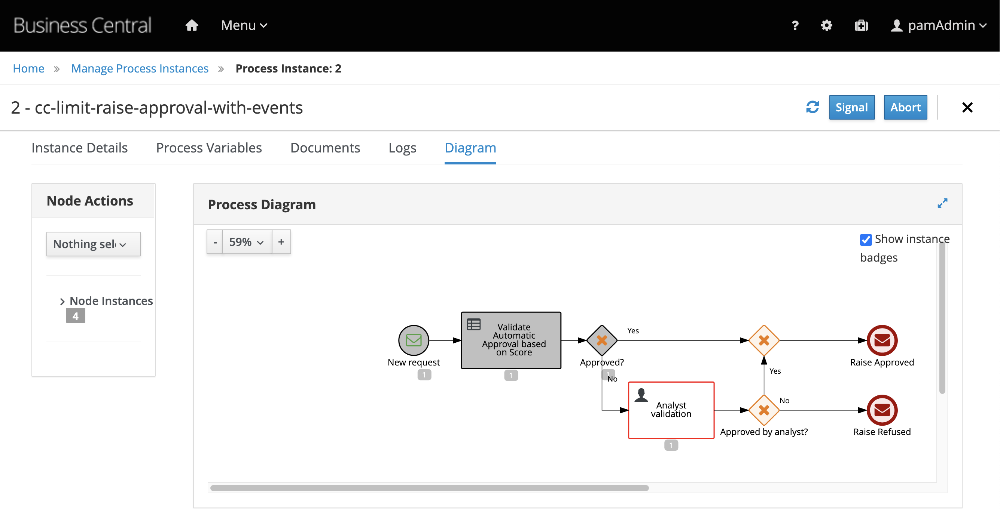

# Auditing with Kafka

When using the Kafka extension in {{ product.name }}, every transaction for processes, cases and tasks execution can be tracked via events. For each of these categories, we'll have an event emitted to a Kafka topic, in other words, we'll have three topics here: `jbpm-processes-events`, `jbpm-tasks-events`, `jbpm-cases-events`.

To enable this feature, you need to add the `jbpm-event-emitters-kafka` library to the engine, KIE Server. This can either be downloaded in the [community repository for jBPM](https://search.maven.org/artifact/org.jbpm/jbpm-event-emitters-kafka/) or via the Red Hat customer portal: [rhpam-7.10.0-maven-repository.zip](https://access.redhat.com/jbossnetwork/restricted/listSoftware.html?downloadType=distributions&product=rhpam&version=7.10.0).

The maven repository have ~1.5GB. In order to facilitate the execution of this lab, you can download the `jbpm-event-emmiters-kafka` for {{ product.short }} {{ version }} [here](https://drive.google.com/file/d/1kKnhGMj1Z691vXGanQkgLfGkfGXXmKa7/view?usp=sharing); **FIGURE OUT THE REPLACEMENT**

1. Stop {{ product.short }}.

2. Download the `jbpm-event-emitters-kafka`. It's name will be similar to `jbpm-event-emitters-kafka-7.x.x.Final-redhat-x.jar`.

3. Since this is a behavior only needed by the engine, place the library inside the `kie-server.war` folder, inside the `WEB-INF` directory.

    **TIP:** If you downloaded the maven repository zip file in the Red Hat Customer Portal, you can find the jar inside the folder `maven-repository/org/jbpm/jbpm-event-emitters-kafka/7.67.0.Final-redhat-00008/jbpm-event-emitters-kafka-7.67.0.Final-redhat-00008.jar`

    ~~~bash
    cp jbpm-event-emitters-kafka-7.67.0.Final-redhat-00008.jar $JBOSS_EAP/standalone/deployments/kie-server.war/WEB-INF/lib/
    ~~~

4. Next,start{{ product.short }} server.

Let's check the auditing behavior.

## Testing the feature

To check the auditing capabilities you can start new processes, interact with human tasks and track the events that are being published on the `jbpm-tasks-events` and `jbpm-processes-events` topics. The event tracking are active also for processes that doesn't use _message events_ elements.

In this example we will check the behavior for our event driven business application.

1. Start a new process by emitting an event. Let's start a process that will not be automatically approved. In this way, we will also have a human task created. You can emit the following event to the `incoming-requests` topic:

    ~~~json
    {"data" : {"customerId": 1, "customerScore":100, "requestedValue": 1200}}
    ~~~

1. You should be able to see a new process instance can be seen in Business Central in the following status:

 {:width="600px"}

1. You can use the kafka consumer CLI script to check the messages that were emitted on the topics: `jbpm-processes-events` and `jbpm-tasks-events`.

   * You should be able to see an event like this published on the `jbpm-process-events`:

     ~~~json
     {"specversion":"1.0","time":"2022-09-15T10:00:05.609-0300","id":"28e13bc0-1c92-42fd-8909-b48a206325d3","type":"process","source":"/process/cc-limit-approval-app.cc-limit-raise-approval-with-end-events/2","data":{"compositeId":"default-kieserver_2","id":2,"processId":"cc-limit-approval-app.cc-limit-raise-approval-with-end-events","processName":"cc-limit-raise-approval-with-events","processVersion":"1.0","state":1,"containerId":"cc-limit-approval-app_1.0.0-SNAPSHOT","initiator":"unknown","date":"2021-04-15T10:00:05.608-0300","processInstanceDescription":"cc-limit-raise-approval-with-events","correlationKey":"2","parentId":-1,"variables":{"request":{"customerId":1,"requestedValue":1200,"customerScore":100,"denyReason":null},"approval":false,"initiator":"unknown"}}}
     ~~~

   * You should be able to see an event like this published on the `jbpm-tasks-events`:

    ~~~json
    {"specversion":"1.0","time":"2022-09-15T10:00:05.612-0300","id":"2ac83d91-40d7-49f3-a114-2b72816a20a4","type":"task","source":"/process/cc-limit-approval-app.cc-limit-raise-approval-with-end-events/2","data":{"compositeId":"default-kieserver_2","id":2,"priority":0,"name":"Analyst validation","subject":"","description":"","taskType":null,"formName":"Task","status":"Ready","actualOwner":null,"createdBy":null,"createdOn":"2021-04-15T10:00:05.590-0300","activationTime":"2021-04-15T10:00:05.590-0300","expirationDate":null,"skipable":false,"workItemId":2,"processInstanceId":2,"parentId":-1,"processId":"cc-limit-approval-app.cc-limit-raise-approval-with-end-events","containerId":"cc-limit-approval-app_1.0.0-SNAPSHOT","potentialOwners":["kie-server"],"excludedOwners":[],"businessAdmins":["Administrator","Administrators"],"inputData":{"Skippable":"false","request":{"customerId":1,"requestedValue":1200,"customerScore":100,"denyReason":null},"TaskName":"Task","NodeName":"Analyst validation","GroupId":"kie-server"},"outputData":null}}
    ~~~

2. Using Business Central, tnteract with the human task `Analyst Validation`, and check the events emitted on the `jbpm-tasks-events`.

 {:width="600px"}

You should be able to see at every task change, a new event in the `jbpm-tasks-events`. Also, for every transaction commited for the process, you should see new events on the `jbpm-process-events`.

By now, you have an event-driven process, that can be integrated within an event driven architecture, and furthermore, can be tracked and monitored in an asyncronous way by the usage of events.

The complete project can be found at: <https://github.com/timwuthenow/cc-limit-approval-app>
