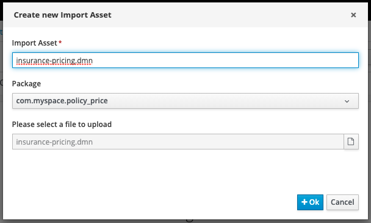
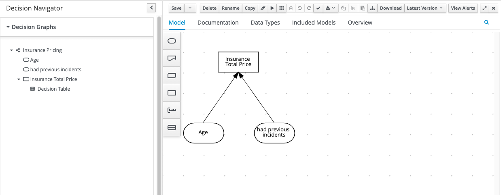
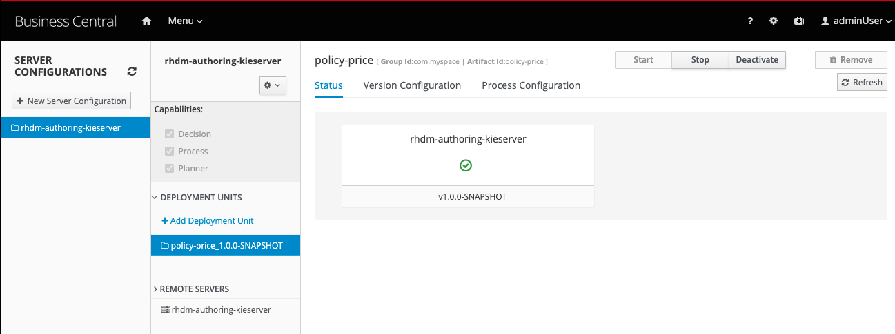
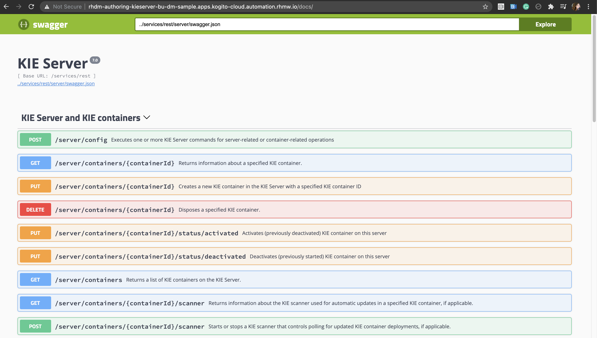
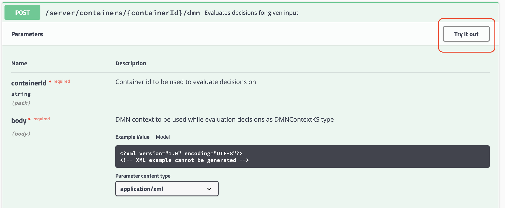
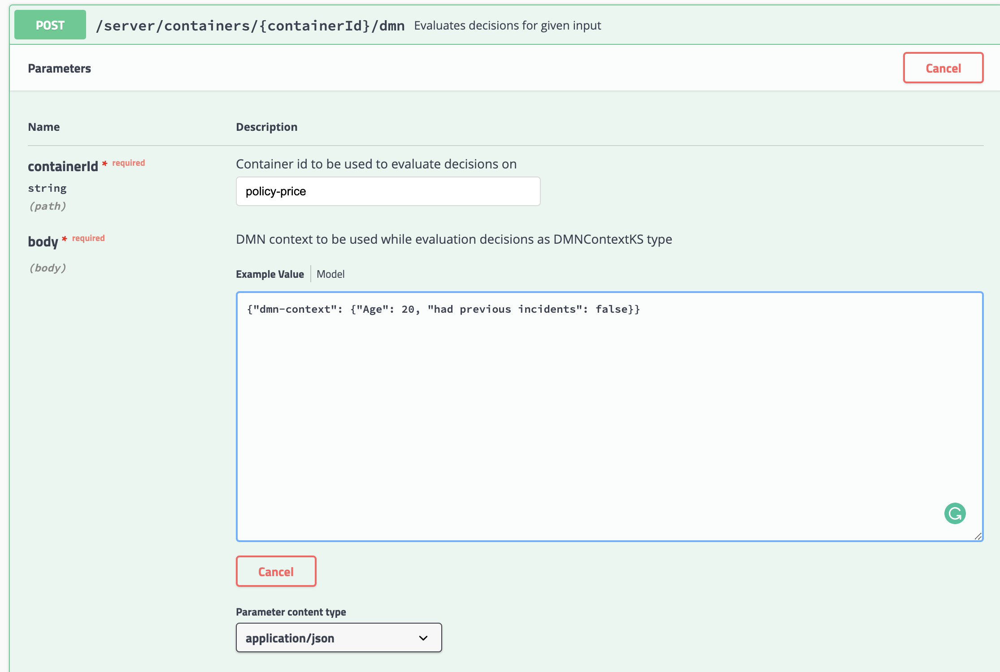
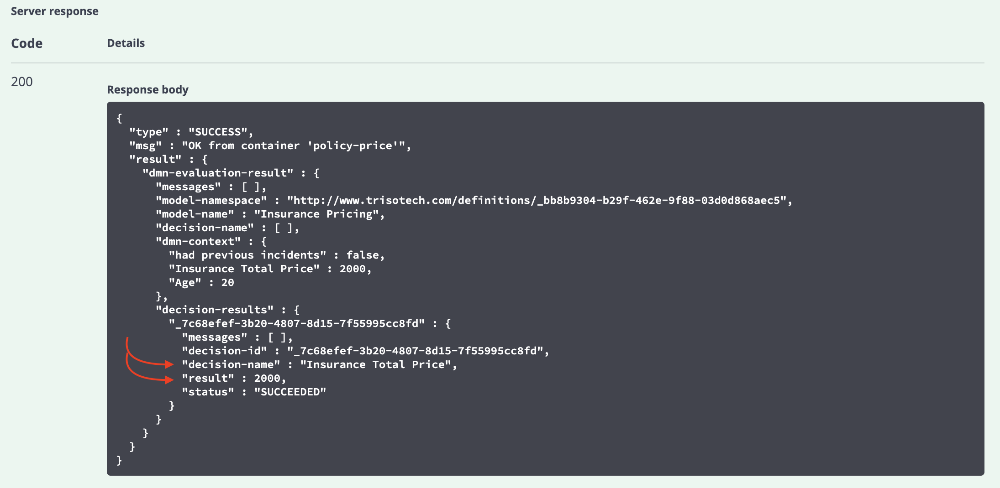

# Getting Started with Decision Model and Notation

This lab introduces you to the deployment of an existing Decision Model and Notation (DMN) and validation of it's decisions.

- Explore an existing DMN file created using Business Central
- Deploy the existing DMN project to Decision Server
- Test the deployed DMN

## Examine Existing DMN Diagram

The following example describes an *insurance* price calculator based on an applicant’s age and accident history. This is a simple decision process based on the following decision table:

**DMN Decision Table**

{:width="600px"}

- The decision table was designed without using Business Central tools, but could be imported seemlesly due to the conformity with DMN specification.

- The DMN decision table includes a *hit policy*, inputs, and outputs.

- Unlike the drl based decision tables that can be created in Business Central, input and output names in DMN decision tables accept spaces.

- The conditions for the `Age` input is defined using the Friendly Enough Expression Language (FEEL).

The *decision* can also be represented by the following decision requirements diagram:

{:width="600px"}

- In this decision requirements diagram, note that the applicant’s age and accident history are the required inputs for the decision table "Insurance Total Price".

- The DMN component is currently stored in the [DMN GitHub repository](https://github.com/kmacedovarela/dmn-workshop-labs).

## Download DMN File

In this section, you download the GitHub repository to an accessible directory in your file system.

1. Navigate to the [GitHub repository](https://github.com/kmacedovarela/dmn-workshop-labs/tree/master/policy-price).

1. From the GitHub web page, click **Clone or download** on the right and then select **Download ZIP**:

1. Using your favorite file system navigation tool, locate the downloaded ZIP file and unzip it to a directory in your file system.

    - From this point forward, this location is referred to as `$PROJECT_HOME`.

## Importing a DMN in Business Central

1. Log in to Business Central.

1. Create a project in Business Central called `policy-price`.

1. In the empty project library view for the `policy-price` project, click **Import Asset**.

    {:width="600px"}

1. In the **Create new Uploaded file** dialog, enter `insurance-pricing.dmn` in the **Uploaded file** field:

    {:width="600px"}

1. Using the browse button at the far right of the field labeled **Please select a file to upload**, navigate with the file browser to the `$PROJECT_HOME` directory where the unzipped Git repository is located.

1. Select the `$PROJECT_HOME\policy-price\insurance-pricing.dmn` file.

1. Click **Ok** to import the DMN asset.

1. The diagram will open and you will be able to see the DRD. Explore the diagram nodes to check the decision policies of this diagram. 

    {:width="600px"}

1. Close the diagram. You should now be on the library view for the `policy-price` project.

1. You should see the `insurance-pricing` asset is added to your project assets:

    {:width="600px"}

1. From the `policy-price` project’s library view, click **Build**, then **Deploy** to deploy the project to the execution server.

1. After receiving the build confirmation, navigate to the container deployment list by clicking the "**View deployment details**" link in the confirmation pop-up, or by selecting **Menu → Deploy → Execution Servers**.

1. Verify that `policy-price_2.0.0` shows a *green* status:

    {:width="600px"}

## Testing the Decision Service

In this section, you test the DMN solution using the REST endpoints available in the Decision Server (a.k.a. KIE Server).

1. Open your Decision Server (a.k.a KIE Server) on the url "/docs". You should see something like this:

    {:width="600px"}

1. Next, under `DMN Models`, click on the `POST /server/containers/{containerId}/dmn"` and select "Try it out": 

   {:width="600px"}

1. Now use the following data:

   - Container ID: `policy-price`
   - Body (dmn context): `{"dmn-context": {"Age": 20, "had previous incidents": false}}`
   - Parameter content type: `application/json`

   {:width="600px"}

1. Click on the **execute** button. You should see the server response `200` and the results of the decision.

    {:width="600px"}

1. Try out the Decision with different values for the age and accident history, and compare the results with the decision table:

   {:width="600px"}

## Conclusion

Congratulations, you've finished the getting started exercise. Next, you will have an intermediate level exercise that will guide you through the implementation, deployment and testing of the Vacation Days use case.
