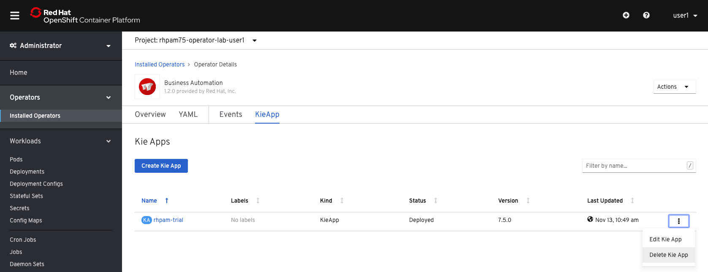

# ConfigMaps

The Operator stores its configuration in a number of *ConfigurationMaps*. These ConfigurationMaps can be used to change more advanced configurations that can not be configured in the KieApp YAML. In the case the Operator upgrades the version of your {{ product.short }} environment, the Operator is aware that one of the ConfigMaps has changed and will make a backup of it during the upgrade.

## Viewing and editing ConfigMaps

A powerful feature of OpenShift are ConfigMaps which provide mechanisms to inject containers with configuration data while keeping containers agnostic of OpenShift Container Platform. A ConfigMap can be used to store fine-grained information like individual properties or coarse-grained information like entire configuration files or JSON blobs. In this section, we will modify some of the default health properties that are different than the defaults provided with {{ product.short }} and we want them to roll out to every container that gets created with the operator.

1. In the OpenShift Console, open **Workloads → Config Maps**. {:width="650px"}

1. Note that the Operator keeps the current ConfigMaps, and the ones of the last 2 versions.

1. Click on the `kieconfigs-7.10.1` ConfigMap and open the YAML tab.

1. Explore the configuration options.

1. Set the `initialDelaySeconds` of the `livenessProbe` of the Business Central console from 180 to 240.

1. Click the **Save** button to save the configuration.

1. Go to "Workloads → Deployment Configs", open the `rhpam-trial-rhpamcentr` Deployment Config and open the YAML tab.

1. Find the LivenessProbe `initialDelaySeconds` configuration and notice that it’s still set to 180.

1. Delete the DeploymentConfig. This will have the Operator reconciliation recreate the DC.

1. Open the YAML configuation of this recreated DeploymentConfig.

1. Find the LivenessProbe `initialDelaySeconds` configuration and note that this time it has been set to 240, the value set in the ConfigMap.

## Deleting an application

Apart from provisioning an {{ product.short }} application, the Operator also allows us to easily delete an application.

1. Navigate to **Operators → Installed Operators → Business Automation → KieApp**.

1. Click on the kebab icon of the `rhpam-trial` KieApp and click **Delete**. {:width="650px"}

1. Navigate back to **Workloads → Deployment Configs** and note that the {{ product.short }} Deployment Configs have been removed. {:width="650px"}
