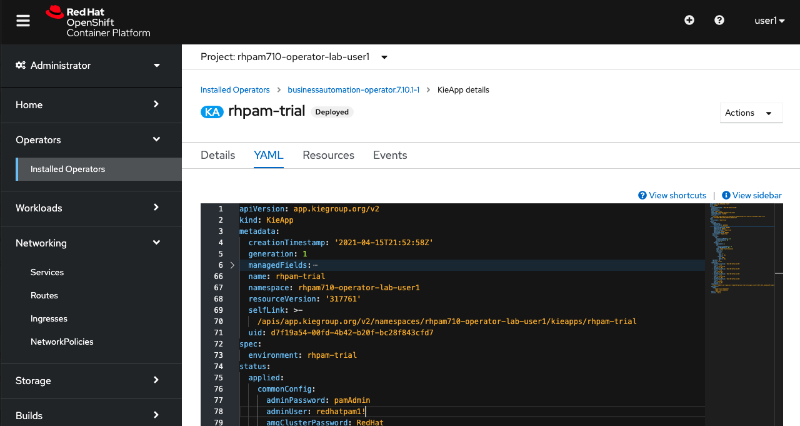

# KIE App Configuration

The definition of the expected state of KIE-App environment is defined in the YAML definition the KIE-App. In this section we will slightly change this configuration to see how the Operator applies changes in the configuration of your {{ product.name }} environment.

## Changing Credentials

1. Go back to the YAML definition of your `rhpam-trial` KieApp.

1. Add a `commonConfig` section, with the `adminUser` to the value `bamAdmin`, and the `adminPassword` to `ibmpam1!`. Click on the **Save** button.

    

    ~~~yaml
    spec:
      commonConfig:
        adminPassword: bamAdmin
        adminUser: ibmpam1!
    ~~~

1. Click the **Reload** button to reload the YAML view.

1. Click on the **Overview** tab. Notice the deployments re-deploying.

1. Click on the **Business/Central Central URL** to open the Business Central console.

1. Log in with the new username and password: `bamAdmin`/`ibmpam1!`.

## Adding a KIE-Server

Apart from changing some configuration parameters, we can also change the topology our deployment in the KieApp YAML file.

1. Go back to the YAML definition of your `rhpam-trial` KieApp.

1. Add a `servers` section and set the `replicas` parameter of the `rhpam-trial-kieserver` to **2**. {:width="650px"}

    ~~~yaml
    objects:
      servers:
        - deployments: 1
          name: rhpam-trial-kieserver
          replicas: 2
    ~~~

1. Click the **Save** button.

1. Go to **Workloads → Deployment Configs**. Note that there are now 2 KIE-Server Deployment Configs.

    {:width="650px"}

1. Go back to the YAML definition of your `rhpam-trial` KieApp.

1. Navigate to the `servers` section and add the property `deployments` with the value **2**.

    ~~~yaml
    objects:
      servers:
        - deployments: 2
          name: rhpam-trial-kieserver
          replicas: 2
    ~~~

1. Click the **Save** button.
