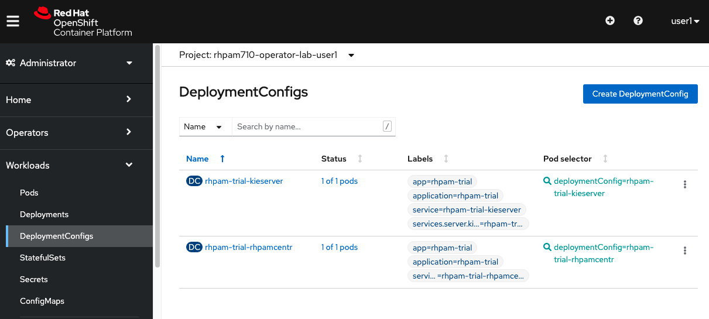
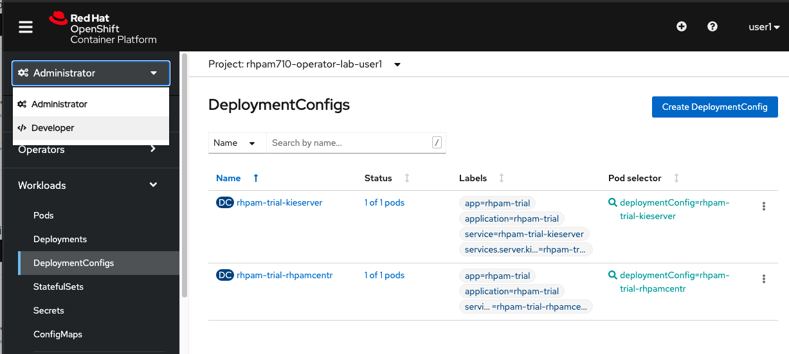
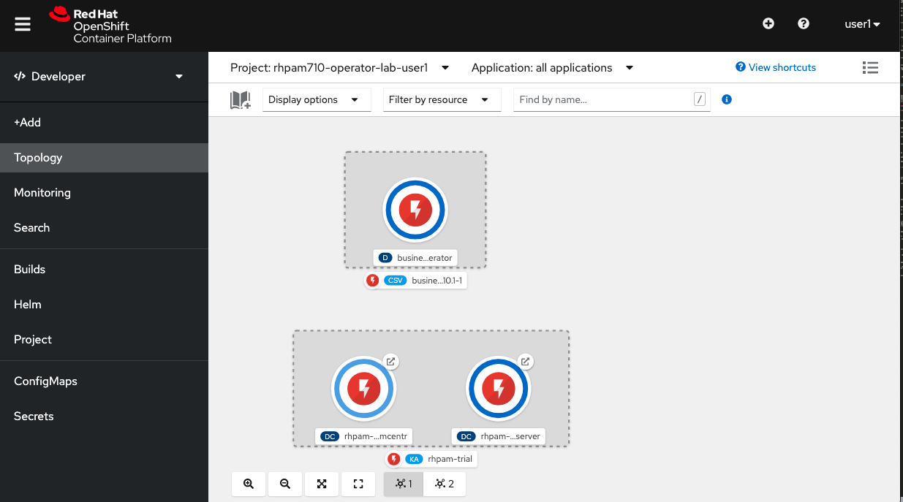
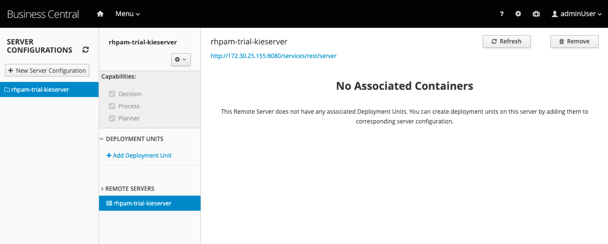

# Deploying an {{ product.short }} Trial Environment

1. From the **Business Automation** page in your OpenShift Console, open the **KieApp** tab and click on **Create KieApp**.

    {:width="650px"}

1. A form will be displayed for you to choose which instalation option you want to have. notice the `environment` field. In this field we define the type of the environment we want to provision. In this case we want to provision the **Trial** environment, so we accept the default values.

    {:width="650px"} **TIP:** You also have the YAML definition option if you want to do customizations that are not available in the form above.

1. Click on the **Create** button at the bottom of the page.

1. In the **KieApp** tab, we can see our new **rhpam-trial** environment being listed.

    {:width="650px"}

1. Expand the **Workloads** menu on the left side of the screen. Click on **Deployment Configs**. Observe that the Operator has created 2 Deployment Configs, one for Business Central and one for KIE-Server.

    {:width="650px"}

1. Open the **Developer Console** by clicking on the link in the dropdown box at the top left of the screen.

    {:width="650px"}

1. Click on the **Topology** link to show a graphical representation of the topology of our namespace, which includes an Operator DC, a Business Central DC, and a KIE-Server DC.

    {:width="650px"}

1. Go back to the **Adminstrator** console.

1. Open **Networking → Routes** menu to see all the available routes to our KIE application deployed in this namespace.

    {:width="650px"}

1. Identify the **Business/Decision Central URL** link to navigate to the {{ product.short }} Business Central workbench. It should be named `rhpam-trial-rhpamcentr-http` for the http option, or `rhpam-trial-rhpamcentr` for https.

1. As the Operator is responsible for deployment and configuration of the {{ product.short }} environment, we can find the details if this deployment in the **KieApp** instance details screen. Open your KieApp in **Operators → Installed Operators → Business Automation  → KieApp  → rhpam-trial**, and click on the **YAML** tab.
    {:width="650px"}

1. We can see in the YAML description that the **adminPassword** has been set to `RedHat`. Navigate back to the **Business Central** workbench and login with u: `adminUser` p: `RedHat`.

1. Explore the **Business Central** application. In particular, go to **Menu → Deploy → Execution Servers** to see the **Execution Server** connected to the workbench.

    {:width="650px"}
