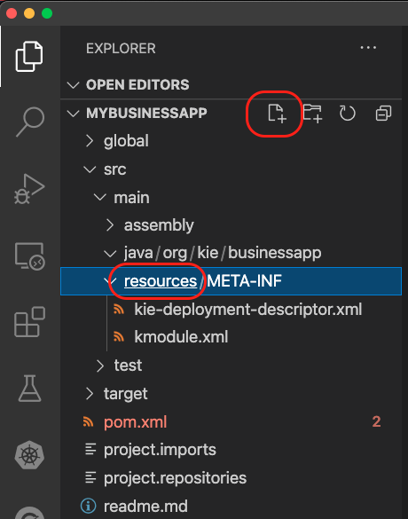
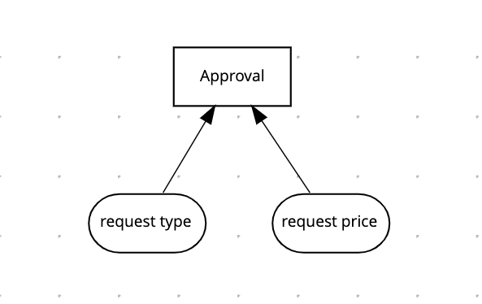
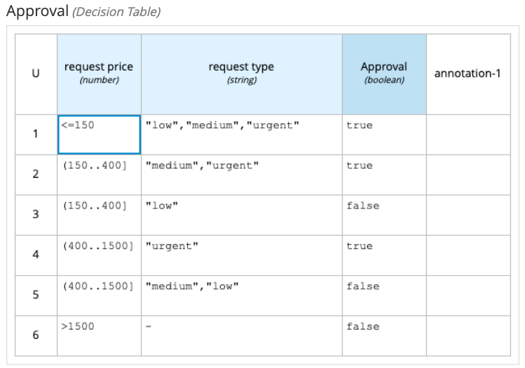
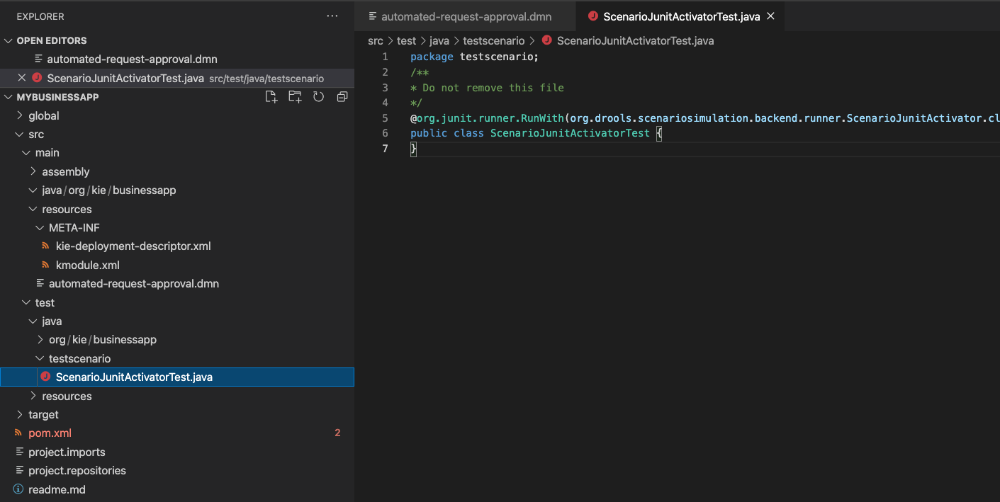
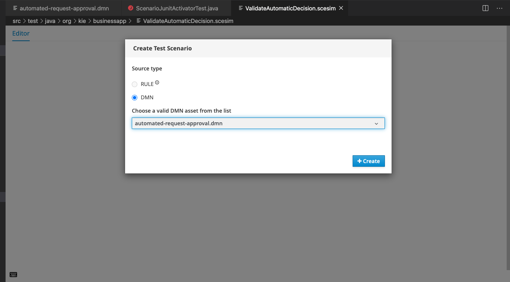
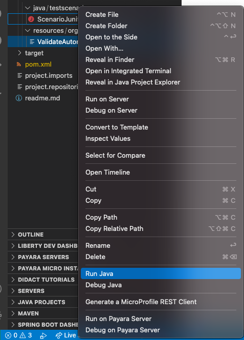
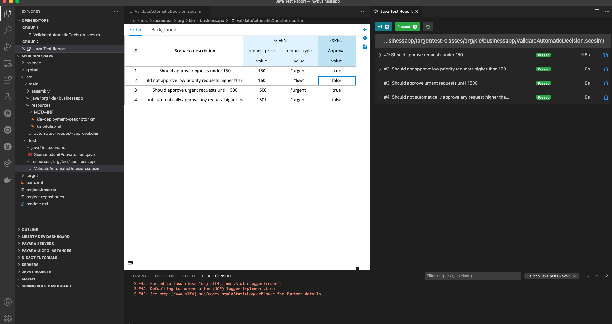

# Authoring a Decision

Let's author a simple decision and test it.

The use case we'll try out is the automation of a repeated decision for requests approval.

## Create a new Decision

In the project we've just created:

1. Select the folder where you want to create the new file. Click on `resources`. Next, click on the *new folder* icon:
  {:width="600px"}

2. Name the file `automated-request-approval.dmn` and press enter. The file should open in the DMN Editor.

3. Create the following DMN:
  {:width="600px"}
  
  * This DRD contains:
    * A decision node `Approval` of type `boolean`;
      * Two inputs:
        * A `request type` , which is `string`
        * A `request price`, that is a `number`.

4. Implement the following decision table, in the decision node:
  {:width="600px"}

5. Save the diagram

## Testing the decision

Before deploying the decision service in KIE Server, let's do some unit testing using the Test Scenario Simulation tooling. 

### Configuring the project

In order to use test scenarios, you need to add at least three dependencies to your project:

  * `junit:junit`
  * `org.drools:drools-scenario-simulation-backend`
  * `org.drools:drools-scenario-simulation-api`

Open the `pom.xml` file and add the following dependencies:

~~~
  <dependencies>
    <dependency>
      <groupId>org.drools</groupId>
      <artifactId>drools-scenario-simulation-api</artifactId>
      <version>${version.org.kie}</version>
      <scope>test</scope>
    </dependency>
    <dependency>
      <groupId>org.drools</groupId>
      <artifactId>drools-scenario-simulation-backend</artifactId>
      <version>${version.org.kie}</version>
      <scope>test</scope>
    </dependency>
    <dependency>
      <groupId>junit</groupId>
      <artifactId>junit</artifactId>
      <version>4.12</version>
      <scope>test</scope>
    </dependency>    
  </dependencies>
~~~

### Adding the JUnit Runner

In this scenario, the `version.org.kie` should be compatible with the product version you want to use. In this scenario, we are using {{ product.short }} 7.10, which would be `<version.org.kie>7.48.0.Final-redhat-00006</version.org.kie>`.

1. Create a new folder testscenario: `/src/test/java/testscenario`

2. In the folder you just created, add a file and name it `ScenarioJunitActivatorTest.java`

3. In this class, you should add a the Scenario Activator. This class allows the test scenarios to run along with the junit tests. 

~~~
  package testscenario;
  /**
  * Do not remove this file
  */

  @org.junit.runner.RunWith(org.drools.scenariosimulation.backend.runner.ScenarioJunitActivator.class)
  public class ScenarioJunitActivatorTest {
  }
~~~

It should look like this:

  {:width="600px"}

### Creating the test scenario

5. On the folder `src/test/resources/org/kie/businessapp` create a new file named `ValidateAutomaticDecision.scesim`. 

6. The editor should open up with the option to choose the **Source type**. This is the type of rule you want to test. 
7. Select DMN, next, choose your DMN file and click on the **create** button.
  {:width="600px"}

8. The tool will already bring the inputs and expected result columns based on your DMN. Now, implement the following test:
  {:width="600px"}

### Runing the tests

You can run the tests in two ways: using maven or the JUnit activator class. To run the test with maven you can for example run:

~~~
mvn test
~~~

If you want to run the tests using the activator class:

1. Right click the `ScenarioJunitActivatorTest.java` file and select `Run Java`:
  {:width="600px"}

2. The execution results should show up:
  {:width="600px"}

3. Try changing the line one expected result from `true` to `false`. Click on the re-run button to see the results.
  {:width="600px"}

----------

Finally, adjust the tests and make sure that your project can compile when you run:

~~~
mvn clean install
~~~

## Next Steps

Now it's time to deploy our project to KIE Server and test it out.
