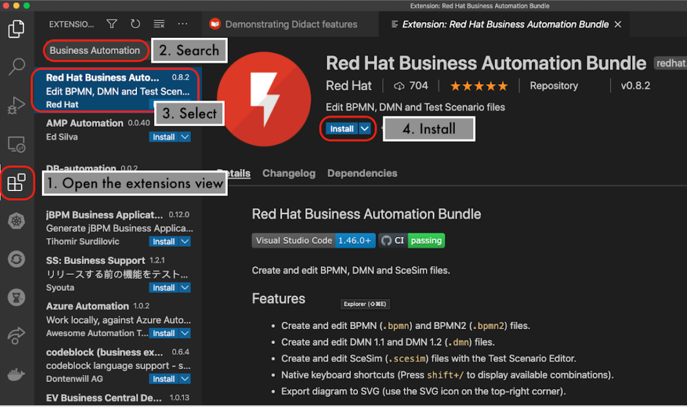
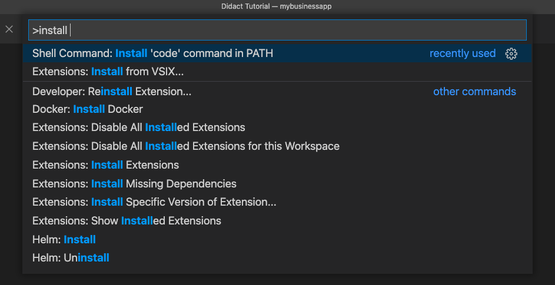
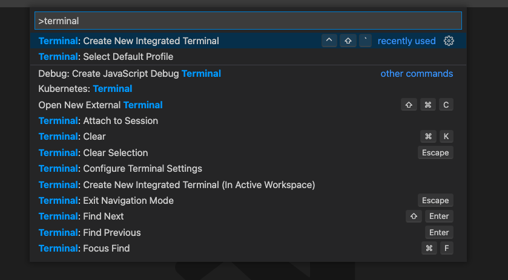
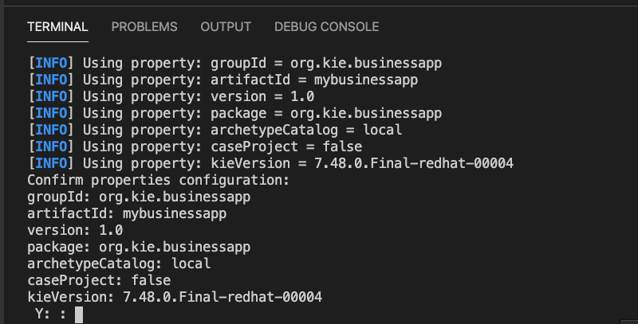

# Business Automation projects in VSCode

To start working with business automation projects in VSCode, you'll need to install the VSCode Extension that allows you to work with BPMN, DMN and Test Scenarios through graphical editors.

## Installing the VSCode extension

To install the extension in VSCode, open the extensions menu, and search for Business Automation. 

You should find the Red Hat Business Automation Bundle.

{:width="600px"}

Click on install.

If this is the first time you are using VSCode, it would be interesting to also install the `code` command in path, so that you can open projects directly from the terminal. To do so, press `cmd+shift+p` (or `ctrl+shift+p`) to launch `VSCode Quick Open` menu. And next, search for **Instal code command in PATH**:

{:width="600px"}

## Create new a project

Let's create a new project using the maven archetype. This project should contain the structure and files that Business Central expects, so this project should be editable and authored in both VScode and Business Central. 

1. Now we will use the terminal. You can either use your terminal or use the built-in terminal In VScode. To use the terminal in VSCode you can press `cmd+shift+p` (or `ctrl+shift+p`) to launch `VSCode Quick Open` menu. And next, open a `new intergrated terminal`:

{:width="600px"}

2. Next, in the terminal navigate to the directory where you would like to create the new project. Let's call it $PROJECT_DIR from now on. Create a new folder named `tooling-labs`.

~~~
$ cd $PROJECT_DIR
$ mkdir tooling-labs
$ cd tooling-labs
~~~

3. Now, use the maven archetype to create a new project in the `tooling-labs` directory:

~~~
mvn archetype:generate \
    -DarchetypeGroupId=org.kie \
    -DarchetypeArtifactId=kie-kjar-archetype \
    -DarchetypeVersion=7.67.0.Final-redhat-00008
~~~

{:width="600px"}

**TIP:** If you need to create a case project, you can use the parameter `-DcaseProject=true`. 

1. Maven will download the libraries, and once it finishes, it will confirm if you want to create the project using the default GAV (group:artifact:version). Type "Y" and press enter.

{:width="600px"}

5. You should get a new project named `mybusinessapp`. If you are in VSCode built-in terminal, you can open the project with:

```
$ code -r mybusinessapp/
```

6. In VSCode, navigate through the project structure and confirm that it has a `kie-deployment-descriptor.xml` and a `kmodule.xml`. These are the files that Business Central needs to understand that this is a business project that should be packaged in a kjar. These files are also needed by KIE Server.

## Next Steps

Now, let's author a DMN file, test it and deploy it to KIE Server.
